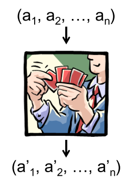
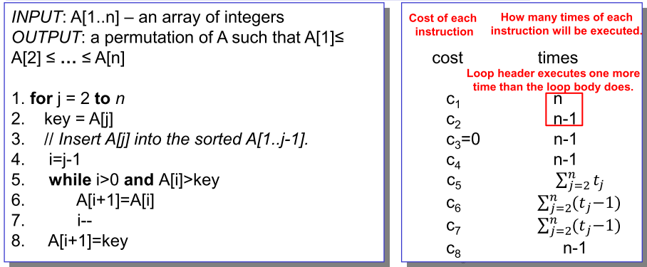
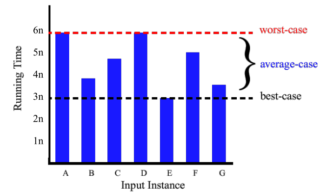

# Insertion Sort

**Input**: a sequence of n numbers $(a_1, a_2,...,a_n)$ 

**Output**: a permutation (reordering) $(a'_1, a'_2 ,...,a'_n)$ of the input sequence such that $a'_1\leq a'_2\leq...\leq a'_n$

### Strategy

* Start with an "empty hand", say left hand.
* Insert a card in the correct position of left hand, where the numbers are already sorted
* Continue until all cards are inserted/sorted

# The RAM Model

* #### Instructions

  * Primitive or atomic operations
  * Each takes constant time, depending on the machine
  * Instructions are executed one after another

* #### We consider instructions commonly found in real computers

  * Arithmetic (add, subtract, multiply, etc.)
  * Data movement (assignment)
  * Control (branch, subroutine call, return)
  * Comparison

* #### Data types - integers, characters, and floats

  ## Analysis of Insertion Sort

  

* $t_j$ is the number of times of the **while** loop test in line 5 is executed for a specific value of j.

  * $t_j$ is the number of elements in $A[1...j-1]$ which need to be checked in the j-th iteration of the **for** loop in line 5

* $t_j$ may be different for different j.

* $t_j$ may be different for different input instances, e.g., best case or worst case

# Best/Worst/Average Case

* #### Worst case time complexity: $W(n)=max_{1\leq i\leq k}T_i(n)$ 

  * The ***maximum*** running time over all *k* inputs of size *n*
  * It is the most interesting/important!

# Comparing Algorithms’ Efficiencies

**Question**: How to compare two algorithms in terms of efficieny?

​	E.g. linear search (linear) vs. binary search (logarithm)

**Answer**: Look at how fast *T(n)* grows as *n* grows to a very large number (to the limit)

**Asymptotic complexity!** 

## Asymptotic Analysis

**Goal:** To simplyfy analysis of running time by getting rid of “details”, which may be affected by specific implementation and hardware

* “rounding” for numbers: $1.000.001 \approx 1.000.000$

* “rounding” for functions $3n^2\approx n^2$

### SE CLRS, p 56,Eq. 3.15
