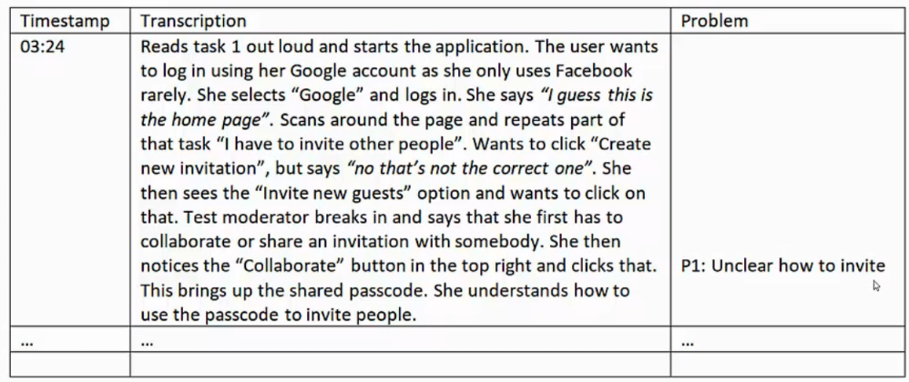
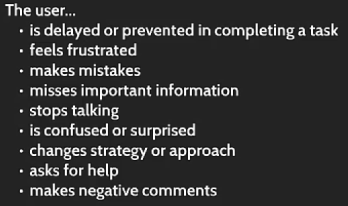

# After usability test

A usability test has been conducted, what to do now:

## Transcription of log files

Have to transcribe what the user does. Catches the user interaction in textual form. Provides an overview and shows problems with 

Can be done live, by a test logger, and then finished afterwards by looking at videos.

Above shows an example of a transcript. First column shows a timestamp, middle shows the transcription, and right column shows the exact problem, interpreted by who ever writes the transcript. No interpretation in the transcript

## Data summary

Main outcome is list of problems, but also want a summary of user performance. Information like how long time tasks generally took, if all tasks were solved, how much stress etc, how many problems in each category, how many unique problems (unique problem is only experienced by a single user. Need to decide if they should be dealt with, as only one user encounters them)

## Data analysis

### What is a usability problem

When talking user-based evaluation, a usability problem is a problem experienced by a specific user while interacting with a specific system. Can be observed if:

 Not always clear why the problem is. Often clear what the problem is, but not why the user has the problem

### Problematic behavior from test moderator

- Don't tell the user to not click something, as they can get nervous about breaking the test
- Don't take control over mouse to remove notification
- Support rather than control. Remember to wait before taking control
- (Lecturer thinks non-condescending tone is very important, has two examples where the moderator doesn't sound condescending, but rather makes normal conversation with the test user. Just something to be aware of, if a question about speaking tone appears)

### Describing usability problems

The **problem list** is the primary outcome of a evaluation. It is:

Produced by looking at the transcript. Example below shows a problem list, a typical layout

Might need more detail, if test done for others. Can be done providing extra document with extra details, describing the problems in more detail. Sometimes extra details can be for serious problems

### Categorizing problems

Users may experience different level of severity. When making the problem list, use most critical level

#### Critical

- The user is unable to continue
- Feels the system behaves strongly irritating
- Critical difference between believed and actual state of system

#### Critical (Added by Nielsen)

- More than one user experiences one critical problem, independently of each other

#### Serious

#### Cosmetic

Image above shows schema a decide on a problem category. Again, pick the most severe/critical category. Not set in stone, but guidelines

## Documentation (report)

(This is an entry in the lecture, but not talked about, other than mentioned at the start)

