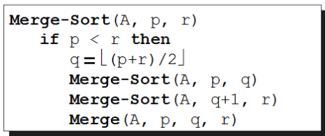
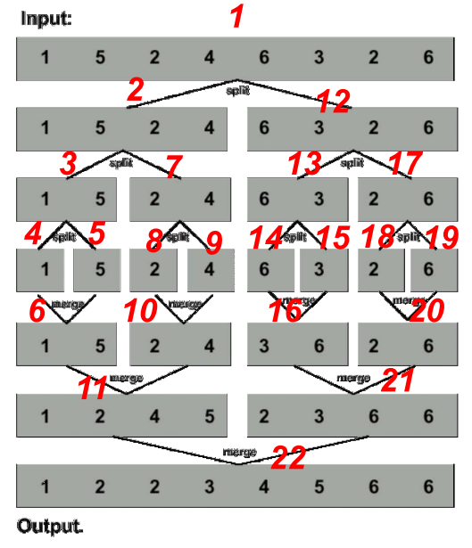

# Divide-and-Conquer (DaC)

## Basic Idea

* A problem with **very small problem size** can be solved trivially
  * Sorting an array with only one single element is trivial
* Break the original **big** problem into several sub-problems, that are similar ti the original problem but **smaller** in size.
* Solve the sub-problems recusively unitl the sub-problem is with very small problem size that can be solved trivially.

* **Combine** the solutions to sub-problems to create a final solution to the original problem.

## Example: Factorial n!

**Recursive**

**Non-recursive** 

## Divide-and-conquer method for algorithm design

* If the problem size is small enough to solve it in a straightforward manner, solve it. Otherwise do the following:
  * **Divide**: Divide the problem into a number of disjoint sub-problems
  * **Conquer**: Use divide-and-conquer recursively to solve the sub-problems.
  * **Combine**: Take the solutions to the sub-problems and combine these solutions into a solution for the original problem

## Analyzing divide-and-conquer algorithms

### Recurrences

* Running times of algorithms with **recursive calls** can be desribed using recurrences

* A **recurrence** is an equation or inequality that describes a function in terms of its value on smaller inputs

* Assume that:

  * If the problem size is smalle enough, the problem can be solved in constant time, i.e., $\Theta(1)$
  * the division of problem yields **a** sub-problems and each sub-problem is **$1/b$** the size of the original

  We have:

  

#### Example: Binary Search

$a=1,b=2$, having one sub-problem with half elements in the array

$D(n)=\Theta(1)$, computing the middle index, constant time.

$C(n)=0$, no need to combine

## Merge sort

An algorithm that can solve the sorting problem and uses the DaC technique

Assume that we are going to sort a sequence of numbers in array A:

**Divide**

If A has at least two elements, remove all the elements from A an put them into 2 sequences, $A_1$ and $A_2$, each containing about half of the elements (i.e. $A_1$ contains the first $\lceil n/2 \rceil$ elements and $A_2$ contains the remaining $\lfloor n/2 \rfloor$ elements)

**Conquer**

Sort sequences $A_1$ and $A_2$ using Merge Sort.

**Combine** 

Put back the elements into A by merging the sorted sequences $A_1$ and $A_2$ into one sorted sequence

### Running Example

### Running Time

<u>Analysis in lecture-3 slide 53-55</u>

images/

images/

images/

