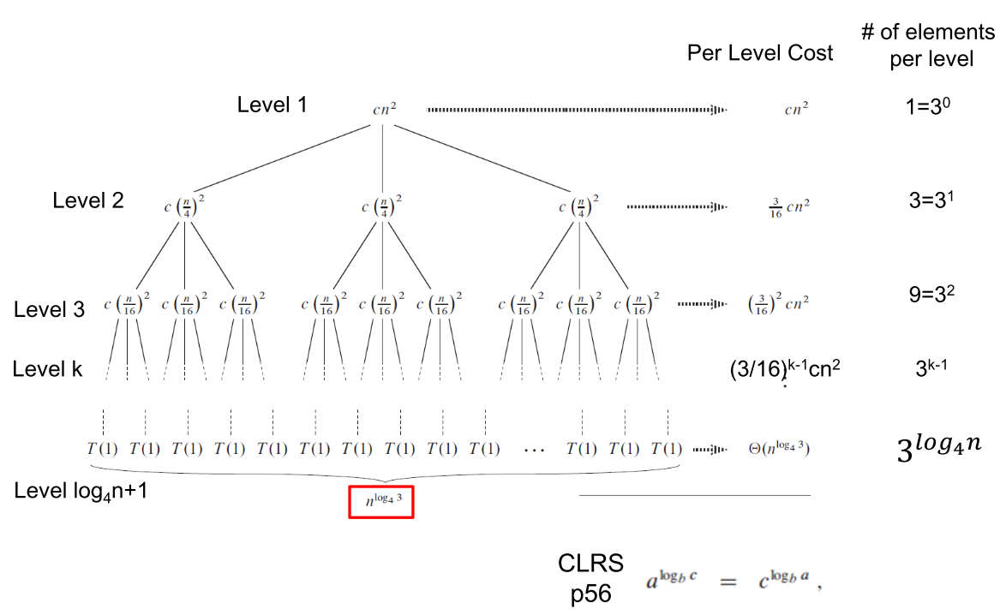

# Solving Recurrences

* Repeated substitution method
  * Expanding the recurrence by substition and noticing a patteren w.r.t. the step i.
  * Identifying an appropriate i such that the base case can be plugged in.
* Recursion-trees
  * Draw a tree to visualize what happens when a recurrence is iterated
* Master method
  * Templates for different classes of recurrences

## Repeated Substitution

* Substitute
* Expand
* Substitute
* Expand
* ...

Observe a **pattern** and write how your expression looks after the i-th substitution

Find out what the value of i should be to get the base case of the recurrence T(1)

Insert the value of T(1) and the expression of i into your expression.

### Example 1

### Example 2

## Recursion Tree

A way to conveniently visualize what happens when a recurrence is iterated.

* Each node represents the cost of a single sub-problem.
* Sum the costs within each level of the tree to obtain a set of **per–level costs**.
* Sum all the per-level costs to determine the **total cost** of all levels of teh recursion.

### Example

$$
T(n)=3*T(n/4)+\Theta(n^2)=3*T(n/4)+c*n^2
$$

Lower bound - $\Omega(n^2)$

We have to at least do level 1, so the lower bound is  $\Omega(n^2)$.

### Key steps

$$
T(n)=aT(n/b)+D(n)+C(n)
$$

* How many levels in the tree?
  * $log_bn+1$
* What is the cost per non-leaf level?
  * Depends on the cost of dividing and combining
* What is the cost for the leaf level?
  * Depends on how many leave nodes there are: $n^{log_ba}$
  * Each leave node has constant cost
* Sum the per-level costs into the final cost

## The Master Method

Providing a template method for solving recurrences _**of the form**_: 

$$
T(n)=a*T(n/b)+f(n),
$$

​	where $a\geq 1$ and $b>1$ are constant,
​	and $f(n)$ is asymptotically positive.

$T(n)$ is the runtime for an algorithm and we know that:

* a subproblems of size n/b are solved recursively, each in time $T(n/b)$ 
* $f(n)$ is the cost of dividing the problem and combining the results
  * $f(n)=D(n)+C(n)$

#### First case:

​	if $f(n)=O(n^{log_ba-\epsilon})$ for some constant $\epsilon>0$, then

$$
T(n)=\Theta(n^{log_ba})
$$

#### **Second case**:

​	if $f(n)=\Theta(n^{log_ba})$, then
$$
T(n)=\Theta(n^{log_ba}lg(n))
$$

#### **Third case**:

​	if $f(n)=\Omega(n^{log_ba+\epsilon})$ for some constant $\epsilon>0$, and the regularity condition is also satisfied, then
$$
T(n)=\Theta(f(n))
$$
Regularity condition:

* $a*f(n/b)\leq c*f(n)$ for some constant $c<1$ and all sufficiently large n

### How to use

* Extract a, b, and f(n) from a given recurrence
* Determine $n^{log_ba}$
* Compare f(n) and $n^{log_ba}$ asymptotically
  * f(n) increases polynomially slower, case 1
  * The increase similarly, case 2
  * f(n) increases polynomially faster, case 3
* Determine appropriate MM case and apply.

# Correctness of Algorithms

The algorithm is **correct** if for any legal input it terminates, and produces the desired output

## Loop invariants

Invariants - assertions (i-e, statements about the states of the execution) that are valid any time they are reached ( many times during the execution of an algorithm, e.g. in loops)

We must show three things about loop invariants:

* **Initialization** - it is true prior to the first iteration
* **Maintenance** - if it is true before an iteration, *then* it remains true before the next iteration
* **Termination** - when loop terminates the invariant gives a useful property to show the correctness of the algorithm

### Example - Insertion Sort

**Invariant**

At the start of each for loop, $A[1...j-1]$ consists of elements originally in $A[1...j-1]$ but in sorted order.

**Initialization**

j = 2, the invariant trivially holds because A[1] is a sorted array

**Maintenance**

The inner while loop moves elements $A[j-1],A[j-2],...,A[j-]$ by one position to the right without chaning their order until it finds the proper position for $A[j]$.

Then, $A[j]$ is inserted into k-th position such that $A[k-1]\leq A[k]\leq A[k+1]$.

Thus, $A[1...j]$ consists of the elements originally in $A[1...j]$ but sorted order.

**Termination**

The loop terminates, when $j=n+1$.

Then the invariant states:

​	$A[1...j-1]$ consists of elements originally in $A[1...j-1]$ but in sorted order.

