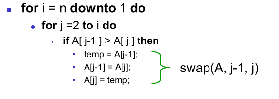
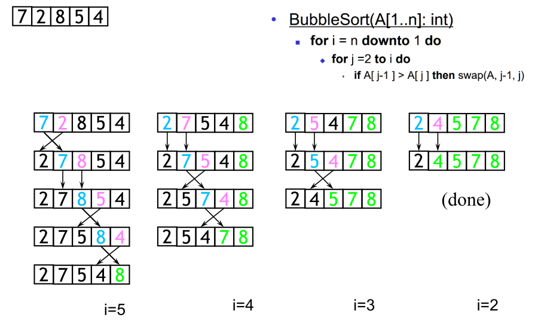
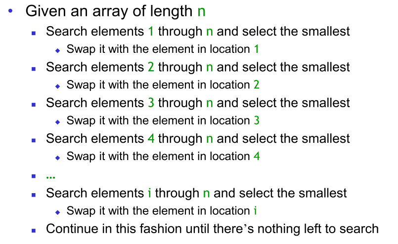
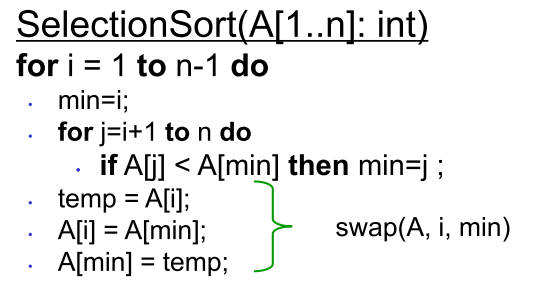
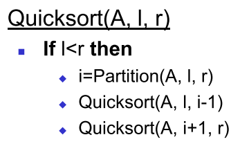

# Sorting Algorithms

**Sorting:**

Input: A sequence of n numbers

Output: A permutation (reordering) of the input sequence

(slide 8)

> When in doubt, sort!

\- One of the principles of algorithm design.

**Insertion sort**

* *In-place*[^in-place] sorting algorithm
* Worst case complexity $\Theta(n^2)​$

**Merge sort**

* Uses the [DaC](./AD1 - Divide-and-Conquer.md#divide-and-conquer) technique
* Not *in-place*[^in-place] sorting, which requires additional storage with the size of the input array
* Worst case complexity $\Theta(n\cdot lg(n))$

**Important properties**

* Whether a sorting algorithm is in-place?
* What is the worst case complexity  $\Theta(n^2)$ or $\Theta(n\cdot lg(n))$?

[^in-place]: **In-place**: Only a constant number of elements of the input array are ever stored outside the array. 

## Bubble Sort

* Popular but inefficient.
* Repeatedly swapping adjacent elements that are out of order.

### Example

## Selection Sort

**Pseudo Code**:

### Example

## Quick Sort

A DaC algorithm.

Does not require additional array like [Merge Sort](./AD1 - Divide-and-Conquer.md#merge-sort) 

* Sorts in-place [^in-place]

### Example

