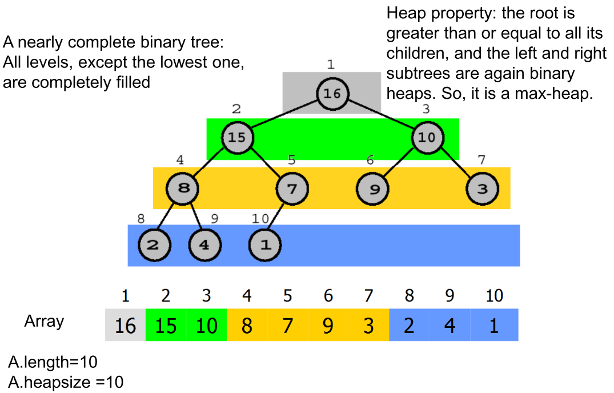
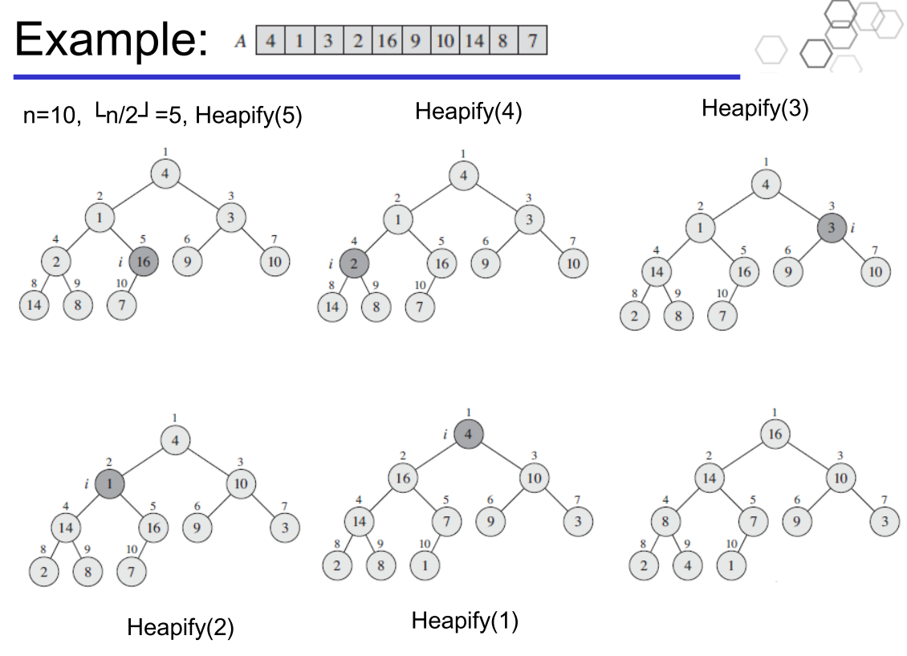

# Heap Sort

Heapsort can be regarded as a selection sort with the help of a heap data structure.

## Heap 

**Binary heap data structure** ***A***

* Array

* Can be viewed as a nearly complete binary tree
  * All levels, except the lowest one, are completely filled

* Heap property
  * Max-heap
    * The root is greater than or equal to all its children, and the left and right subtrees are again binary heaps.

  * Min-heap
    * The root is less than or equal to all its children, and the left and right subtrees are again binary heaps


**Two attributes:**

* **A.length**: number of elements in the array

* **A.heapsize**: number of elements in the heap that is stored in the array
  * $1 \leq A.heapsize \leq A.length$

  * $A[1 ... A.length]$ may contain many elements, but only the elements in $A[1 ... A.heapsize]$ are valid elements of the heap

<div style="page-break-after: always;"></div>

### Example




### Parent, Left Child, Right Child

```pseudocode
PARENT(i)
	return Floor(i/2)
	
LEFT(i)
	return 2*i
	
RIGHT(i)
	return 2*i+1
```

Heap property:

$A[Parent(i)] \ge A[i]$

The value of the node is at most the value of the parent.

<div style="page-break-after: always;"></div>

### Maintaining the Heap Property (Heapify)

**Heapify**

Input: 

* Array A and an index *i* into the array

Assume: 

* Binary trees rooted at Left(i) and Right(i) are heaps

But, A[i] might be smaller than its two children, thus violating the heap property.

The method Heapify makes A a heap by moving A[i] down the heap until the heap property is satisfied again.

#### Pseudocode


#### Example: Heapify(A,2)


<div style="page-break-after: always;"></div>

#### Analysis of Heapify

* Is Heapify recursive algorithm or not
  * If yes, write down the recurrence and solve the recurrence
  * If no, use the RAM model

Identifying the recurrence for Heapify

* Dividing (lines 1-3):
  * Figuring out the relationship among the elements A[i], A[l], and A[r].
  * Can be done in constant time, i.e., Θ(1).
* Conquer (lines 4-6):
  * Case 1: If A[i] is the largest among A[i], A[l], A[r] already, do nothing.
  * Case 2: Otherwise, conquer the same problem (i.e., Heapfiy) on one of the subtree of node i.
  * How many subproblems are you going to solve for each case?
    * Case 1: 0
    * Case 2: 1
    * We at most need to solve 1 subproblem.

#### Notes

* Sometimes, it is more important to write down a correct recurrence than solving the recurrence
* How many subproblems and what is the size of each subproblem
  * Quick sort: best case v.s worst case
  * Heapify: the largest size subproblem
* What is the cost of dividing and combining
  * Quicksort: partition, dividing phase
  * Merge sort: merge, combining phase


### Building a heap from an array

Convert an array $A[1 ... n]$ into a heap.

Notice that the elements in the subarray $A [(└n/2┘+1)...n ]$ are already 1-element heaps to begin with

* These elements have no children

Call heapify from the └n/2┘-th element down to the first element.

```pseudocode
00 	Build-Heap(A)
01		for i = floor(n/2) downto 1 do
02			Heapify(A,i)
```

<div style="page-break-after: always;"></div>

#### Example



## Sorting


<div style="page-break-after: always;"></div>

### Running time

Running time is

​	$O(n*lg(n))$ 

**like** merge sort, but **unlike** selection-, insertion- or bubble-sorts.

Sorts in-place - **like** insertion-, selection- or bubble-sorts, but **unlike** merge-sort.