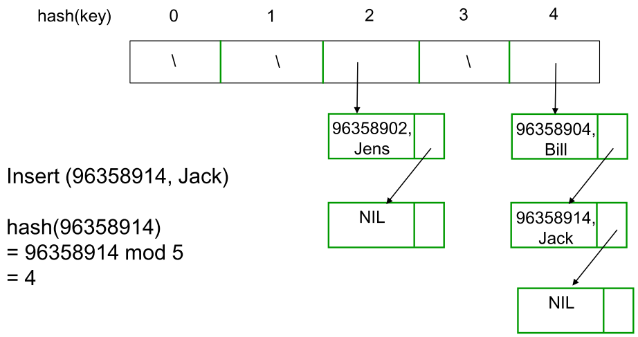

# Dictionaries

An element has a *key* part and a *sattelite data* part.

Dictionaries store elements so that they can be located quickly using **keys**.

**Dictionary ADT**

```pseudocode
Search(S, k):
	access operation that returns an element where x.key = k

Insert(S, x):
	a manipulation operation that adds element x to S.

Delete(S, x):
	a manipulation operation that removes element x from S.	
```


# Hash tables

Like an array, but come up with a *<u>Hash function</u>* to map the large range (eg. 0 to 9999999) into a small one which we can manage. (eg. 0 to 4)

**Eg.** Take the original key, modulo the (relatively small) size of the array, and use that as an index.


**Example**:

(96358904, Bill) into a hashed array with, say, 5 slots:

```pseudocode
hash(96358904) = 96358904 mod 5 = 4
hash(96358902) = 96358902 mod 5 = 2
```


Lookup:

```pseudocode
Search("96358904"), hash(96358904)=4, then "Bill"
Search("96358900"), hash(96358900)=0, then "\"
```

<div style="page-break-after: always;"></div>

## Collisions

When to elements has the same hashed key.

### Chaining

Each entry in the table is pointer to a linked list.

Elements with same hashed key are placed into a linked list.

images/

### Linear Probing

If the current location is used, try the next table location.

Lookups walk along the table until the key or an empty slot is found.

images/


### Open addressing

Step i from 0, 1, 2, ..., m-1


**Linear probing**:
$$
h(k,i)=(h'(k)+i)\space mod\space m
$$
**Quadratic probing**:

(c1 and c2 are constant)
$$
h(k,i)=(h'(k)+c_1i+c_2i^2)\space mod\space m
$$
**Double hashing:**
$$
h(k,i)=h_1(k)+ih_2(k))\space mod\space m
$$
