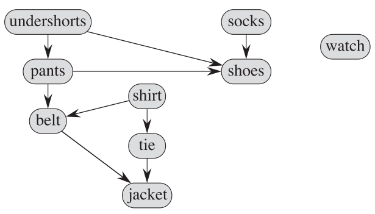
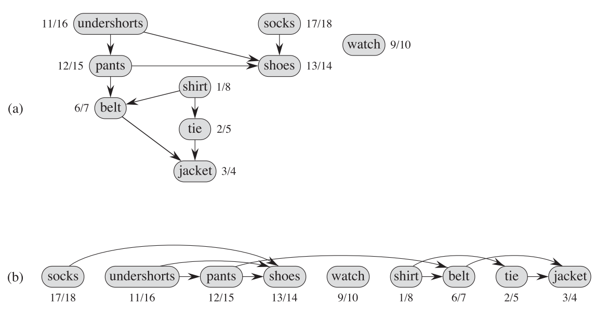

# Directed Acyclic Graph (DAG)

A DAG is a directed graph with no cycles.


**Applications:**

* Indicate precedence relationships
  * An edge e=(*a, b*) from *a* to *b* means that event *a* must happen before event *b*.
* Dependency Graphs


**Example** - Professor gets dressed in the morning.

The professor must put on certain garments before others

images/

<div style="page-break-after: always;"></div>

## How to check DAG

A directed graph is acyclic if and only if the graph has no back edges.

images/


# Topological Sort

<u>CLRS page 612.</u>

**Input:**

* DAG G = (V, E)

**Aim:**

* Introduce a linear ordering of all its vertices, such that for any edge (*u, v*) in the DAG, event *u* appears before event *v* in the ordering.

**Output**:

* Topologically sorted DAG, ie. a linked list of vetices, showing an order.


Reversely sort vertices according to the finishing times obtained from a DFS.

* If $v.f < u.f$

images/

* Event *u* happens before event *v*


## Algorithm

```
Topological-Sort(G)
01	call DFS(G) to compute finishing times v.f for each vertex v
02	as each vertex is finished, insert it onto the front of a linked list
03	return the linked list of vertices
```

<div style="page-break-after: always;"></div>

## Example

images/


## Running Time

* DFS takes $\Theta(|V|+|E|)$
* It takes constant time $\Theta(1)$ to insert a vertex onto the front of a linked list.
  * In total, |V| vertices. Thus, $\Theta(|V|)$
* In total:

$$
\Theta(|V|+|E|)
$$


<center><u>See Proof of correctness on lecture-10 slides, slide 47-48</u> </center>


