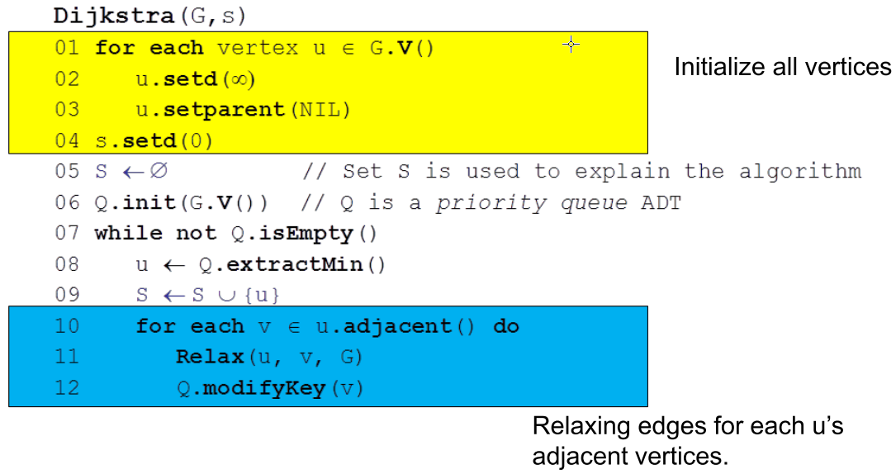
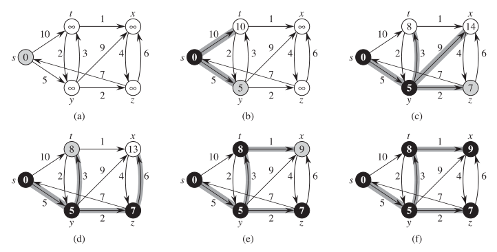
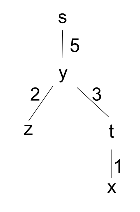
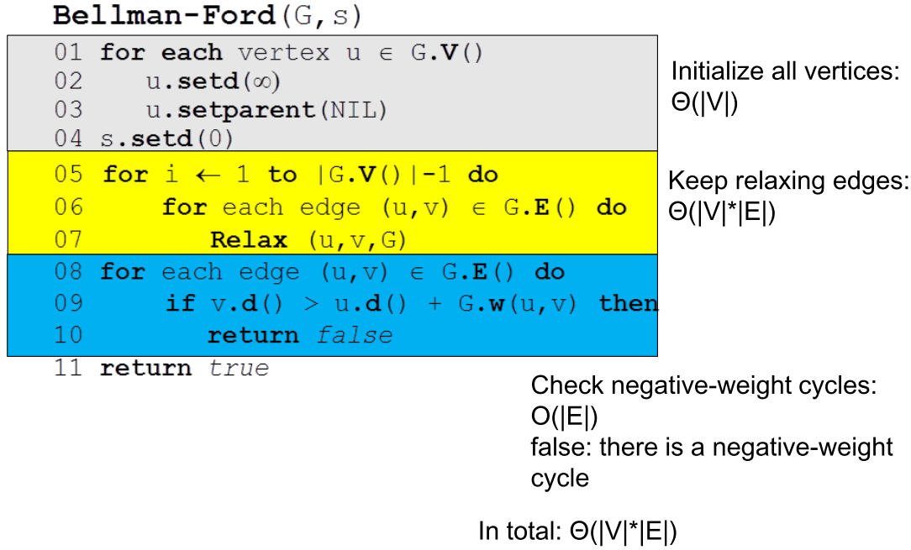
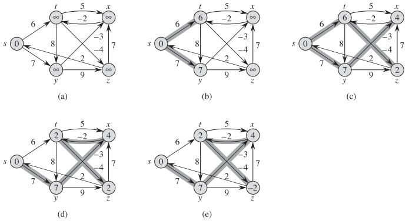
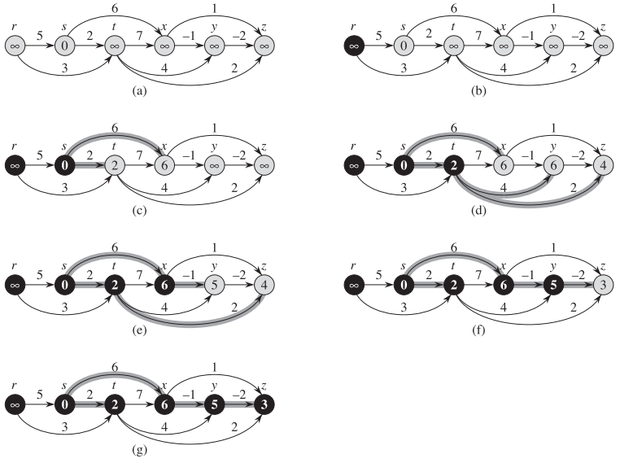

# The Shortests Path Problem

Lars plans to go from Aalborg to Aarhus and he wants to save fuel.

* Assuming fuel consumption is prorpotional to travel distance

One possible solution is:

* Model road network as weighted graph
* Enumerate all paths from Aalborg to Aarhus
* Add upp the lengths of roads in each path and selected the paht with shortest sum of lengths

This is verty ineffecient because it examines a lot of paths that are note worth considering.


---

Weighted, directed graph G = (V, E) with a weight function $w:E\rarr \R$

A path on G: 

​	$p=<(v_0,v_1),(v_1,v_2),...,(v,_{k-1},v_k)>$

​		$w(v_0,v_1)\space w(v_1,v_2)\space\space w(v,_{k-1},v_k)$

Weight of a path is:

​	$w(p)=\Sigma^{k-1}_{i=0}w(v_i,v_{i+1})$

Given two vertices u and v in V,

* More than one path exists to go from u to v, eg. $p_1,p_2,...,p_n$
* Each path has a weight $w(p_1),w(p_2),...,w(p_n)$

The shortests-path weight, denoted as $\delta(u, v)$, from u to v:

* $min(w(p_1),w(p_2),...,w(p_n))$

* defined as: 

  

The shortest path between u and v is a path p with the short-path weight $w(p)=\delta(u,v)$


## Problems

**Single-source**

Find a shortest path from a given source (vertex s) to each of the vertices that are reachable from s.

**Single-pair**

Given two vertices, find a shortest path between them.

* Solution to single-source also solves this.

**All-pairs**

Find shortest-paths for every pair of vertices.

* Running a single-source algorithm once from each vertex
* More efficient method: Not covered in AD1

**Shortest-paths for *un-weighted* graphs**.

* BFS, lecture 10.


## Negative weights

If weights are non-negative, shortest paths are well-defined.

Negative weights effect shortest-path weights?


## Cycles

A path $<v_0,v_1,...,v_i,...,v_j,...,v_k>$ forms a cycle, if $v_i=v_j$

Shortest paths have **NO** cycles.

* Negative-weight cycles
  * No. Otherwise, shortest paths are not well-defined anymore.
* Positive-weight cycles
  * No. Otherwise, we could get shorter paths by removing the cycles.
* 0-weight cycles
  * No. We can just repeatedly remove the 0-weight cycles to form another shortest path, until the path becomes cycle free.

Any acyclic path in a graph G = (V, E) contains at most |V| distinct vertices and at most |V|-1 edges.

* This is used by Bellman-Ford algorithm


## Shortest Paths Tree

The result of shortest path algorithms.

A **shortest paths tree**.

* The shortest paths tree is a tree with the source vertex s as the root
* It records a shortest path from the source vertex s to each vertex v that is reachable from s.

Each vertex v

* **v.parent()** records the predecessor of v in its shortest path
* **v.d()** records a shortest-path weight from s to v.


## Relaxation Technique

For each vertex v in the graph, we maintain v.**d()**:

* Estimate the weight of a shortest path from s to v.
* Initialize v.d() to $\infin$ in the beginning.
* Update, ie. **decrease** the value of v.d() during the search.

**Intuition**

* Check whether a new path from s, via u, to v, can **improve** the existing shortest path from s to v.
* $w(s,u)+w(u,v)$ vs $w(s,v)$
* is $u.d +w(u,v)<v.d$ ?


```pseudocode
Relax(u,v,G)
01	if v.d > u.d + G.w(u,v) then
02		v.d = u.d + G.w(u,v)
03		v.parent = u
```

<div style="page-break-after: always;"></div>

## Dijkstra's Algorithm

Works fro graphs with **non-negative** edge weights

**Input**

* Directed, weighted graph G = (V, E)
* A weight function $w:E\rarr\R$
* A source vertex s.

**Output**

* A set of vertices S, |S|=|V|
  * Each vertex $u\in S$ has a value for **u.d()** and for **u.parent()**
  * If u is not reachable from s, u.d() = $\infin$

**Intuition**

* Maintain a set S of visited vertices, and each time
  * 1) select a vertex u that is the "closest"* from s, and add it to S
  * 2) relax all edges from u, 
    ie. check whether going through u can improve the shortest-path weight of u's neighbours.

\* "Closest" = Least shortest-path weights **(a priority queue prioritized on u.d())**


### Pseudocode

<u>A little different from book in syntax, see CLRS p. 658</u>




### Running Example

<u>Explained in Lecture-12 slide 18-21</u>






### Running Time

<u>Analysis in Lecture-12 slide 23-24</u>


### Correctness

<u>Analysis in Lecture-12 slide 25-28</u>

<div style="page-break-after: always;"></div>

## Bellman-Ford Algorithm

Dijkstra's doesn't work when there are negative edges.

* Intuition - We cannot guarantee that the length of a path increases when more edges are included.

Bellman-Ford alg. can handle a graph where edges have negative weights (but no negative-weight cycles)

**Input**

* Directed, weighted graph G = (V, E)
* A weight function $w:E\rarr\R$
* A source vertex s.

**Output**

* Boolean value:
  * False = detects negative-weight cycles
  * True = returns the shortest path-tree

* If Boolean value = true, a set of vertices S, |S|=|V|
  * Each vertex $u\in S$ has a value for u.d() and for u.parent()
  * If u is not reachable from s, u.d() = $\infin$


### Pseudocode



<div style="page-break-after: always;"></div>

### Running Example

<u>Explained in Lecture-11 slide 30-34</u>




### Correctness

Based on Path Relaxation Property

​	<u>Analysis in lecture-12 slide 35-37</u>

<div style="page-break-after: always;"></div>

## Shortest Path in DAGs

* Topologically sort the DAG
* Relax the edges of vertices according to the topologically sorted order of vertices.


### Running Example




### Correctness

Based on Path Relaxation Property

​	<u>Analysis in lecture-12 slide 41 + 35-37</u>

