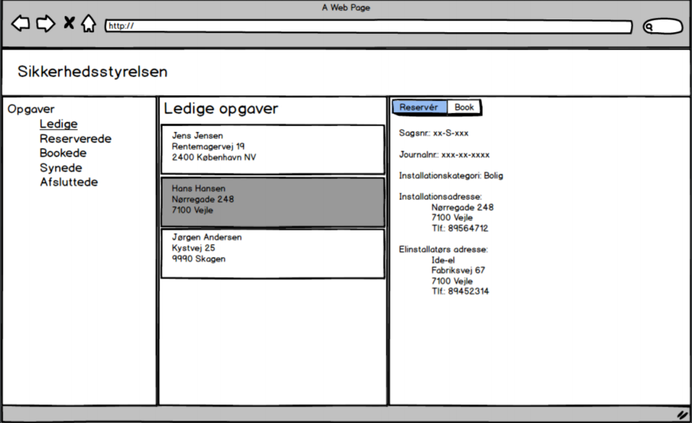
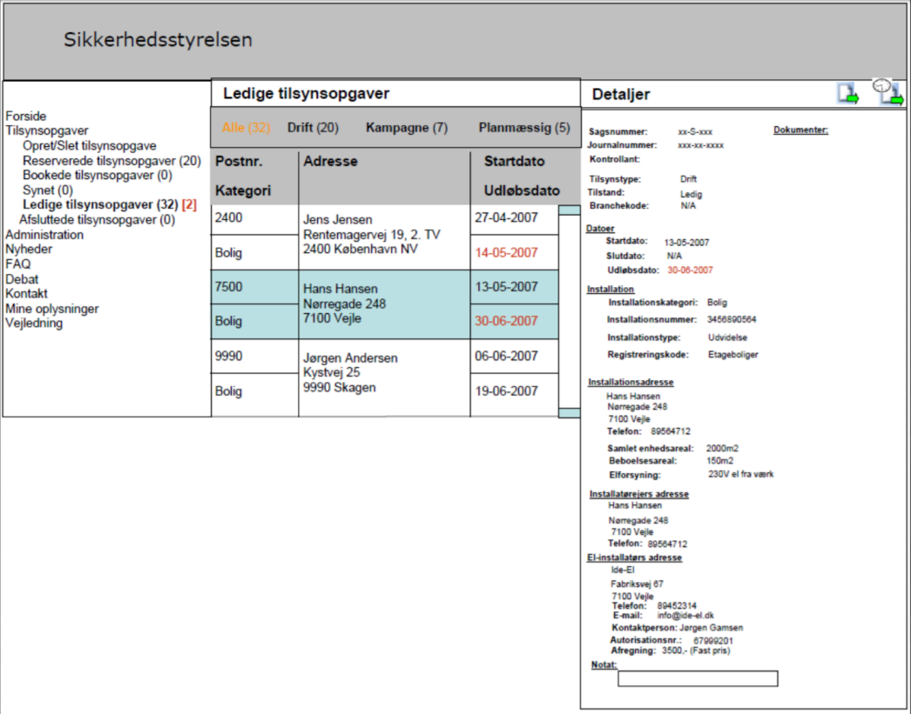
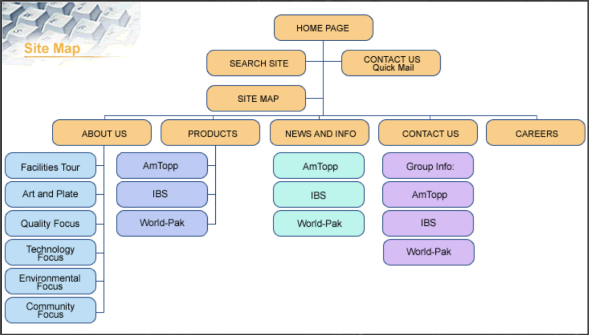

# Envisionment

* Making ideas visible

* Representing design products to ourselves and others

* Generation, communication and evaluation of ideas

**Types of representations**:

Exploration

* e.g. sketches and wireframes

Accuracy

* e.g. prototypes

Needs to be accurate enough, but not confusing (main features must stand out)

## Basic Techniques

### Sketch and Wireframe Examples

Two examples from the same example project

#### Sketch

#### Wireframe

A wireframe is a step up from a sketch

### Navigation maps

## Prototypes

A prototype is something you can interact with.

Sketch/wireframe provides a static view while a prototype provides an interactive view.

There are two types of prototypes: 

Lo-fi prototypes and Hi-fi prototypes.

### Lo-fi prototypes

AKA “paper prototypes”

More explorative.

Quick to produce (throw-away)

Broad emphasis on:

* Content
* Structure
* Key functions
* Navigation

### Hi-fi prototypes

"Plug in the power cord".

High level of detail (layout and graphics).

Useful for evaluating specific design elements and features.

Interactive.

Used when design ideas are stabilizing.

### Hi-fi vs Lo-fi

**Lo-fi**

* Cheap
* Lack of detail
* Not realistic
* Low level of validity when testing

**Hi-fi**

* Expensive
* Realistic
* High level of validity when testing
* Testing is done at a later stage
* Clients believe they are real!
* Premature commitment
  * Reluctance in making radical changes, because you as a designer has spend time on the prototype.

Be careful with making prototypes too real. The clients can think that the system is done, and wonder why you need to spend more time. 

That's why the sketch example looks like a drawing. It is made in a tool, but made to look like a drawing, so that there is no doubt that it is not a finished product.

### Tools

**Exploration**: Balsamiq

**Accuracy**: Axure

Power Point

More tools: http://wiki.c2.com/?GuiPrototypingTools

