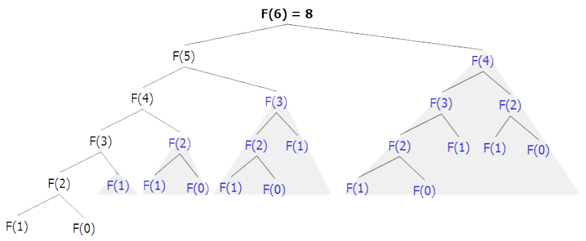
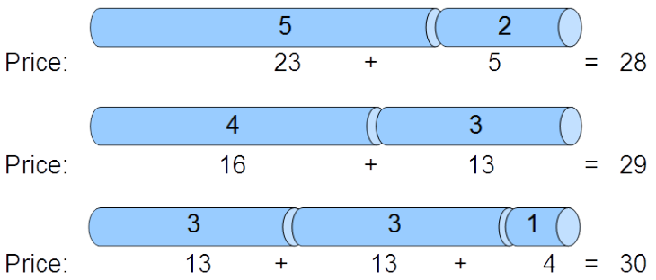

# Dynamic Programming

What if the sub-problems overlap?

* Sub-problems share sub-sub-problems.

A DaC algorithm would do more work than necessary, because it needs to **repeatedly** solve the overlapped sub-sub-problems.

A **Dynamic Programming** algorithm solves each sub-sub-problem only once and then saves its result (in array or hash table), **thus avoiding** the work of repeatedly solving the common sub-sub-problems.


## Example - Fibonacci Numbers

A rabbit was born in the beginning.

A rabbit starts producing offspring on the second generation after its birth and produces one child each generation.

How many rabbits will there be after *n* generations?


### Straightforward Recursive

$$
F(n)=F(n-1)+F(n-2)
$$

$F(0)=0,\space F(1)=1$	

$0,1,1,2,3,5,8,13,21,34,...$

```pseudocode
FibonacciR(n)
01	if n <= 1 then return n
02	else return FibonacciR(n-1) + FibonacciR(n-2)
```

This is slow!

Here's why:



The same value is calculated over and over!

* Sub-problems are overlapping – they share sub-sub-problems.


## Solution

Dynamic Programming!

We can calculate F(n) in linear time, by remembering solutions to the solved sub-problems.

Compute solution in a **bottom-up fashion**.

```pseudocode
Fibonacci(n)
01	F[0] = 0
02	F[1] = 1
03	for i = 2 to n do
04		F[i] = F[i-1] + F[i-2]
05	return F[n]
```


# Optimization Problems

DP is typically applied to **optimization problems**.

Optimization problems can have many possible solutions, each solution has a value, and we wish to find a solution with the optimal value (e.i. minimum or maximum).

An algorithm should compute the optimal value plus, if needed **an** optimal solution.


## Example - Rod Cutting

Problem:

* A steel rod of length *n* should be cut and sold in pieces.
* Pieces sold only in integer sizes according to a price table $P[1..n]$

Goal:

* Cut up the rod to maximize profit.





$r_n$: the maximum profit of cutton a rod with length *n*.
$$
r_n=max(P[1]+r_{n-1},P[2]+r_{n-2},...,P[n-1]+r_1,P[n]+r_0)
$$

* Having a rod with length 1, i.e., P[1], and the maximum profit of the
  remaining rod with length n-1, i.e., $r_{n-2}$

* Having a rod with length 2, i.e., P[2], and the maximum profit of the
  remaining rod with length n - 2, i.e., $r_{n-2}$
* …
* Having a rod with length n, i.e., P[n], and the maximum profit of the
  remaining rod with length 0, i.e., $r_=0$

We say that the rod cutting problem exhibits **optimal substructure**.

```pseudocode
Rod-Cut(P, n) //P: Price table as array, n: rod length as integer.
01	if n = 0 then return 0
02	q = -infinity
03	for i=1 to n do
04		q = max(q, P[i] + Rod-Cut(P, n-1))
05 	return q
```

Running time is ***Exponential***!

​	<u>See analysis on lecture 9 slides, slide 28-30</u>


### Memoization - Top-Down

Remember the solutions in an array or a hash-table.

```pseudocode
Rod-Cut-M(P, n)
01	for i = 1 to n do
02		R[i] = -infinity
03	return Rod-Cut-M-Aux(P, n, R)

Rod-Cut-M-Aux(P, n, R)
01	if R[n] >= 0 then return R[n]
02	if n = 0 then q = 0
03	else
04		q  = -infinity
05		for i = 0 to n do
06			q = max(q, P[i]+Rod-Cut-M-Aux(P, n-1, R))
07		R[n] = q
08	return q
```


#### Running Example

​	<u>See on lecture 9 slides, slide 35-46</u>

Run time is **Quadratic**.


