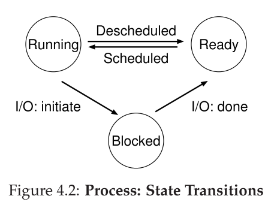

# Processes and Threads

## Learning Goals

After lecture 1 you can:

* :heavy_check_mark: Define and explain the concept of a **process **
* :heavy_check_mark: ​Explain what a **process image** is. 
* :heavy_check_mark: Explain what a **process control block** is, what it is used for and why it is needed.
* :heavy_check_mark: Explain in general terms, how process creation, switching and termination works
* Define and discuss **process states**
* Define and explain the concept of a **thread**
* Discuss when, where and how (multi-)threads are usefull
* Explain what a **thread control block** is, what it is used for and why it is needed
* Discuss **implementation strategies** for thread support and explain the associated **trade-offs**

## Noter

### Process

En **process** er kørende program med alt tilhørende data.

Et program er bare data på disken.

#### Process Image

Et **process image** er en samling af process relateret data. Det består af:

* **Process control block (PCB)**
* Program (code)
* **Stack**
* **Heap** (user data)

#### Process Control Block (PCB)

PCB er en datastruktur der indeholder data om en process.

Indeholder ting som:

* Identifier
* State (tilstand)
* Prioritet
* Program Counter (PC)
* Memory counter
* I/O Status

* Context (gemte registre til hvis processen skal køre igen)

!!! snippet "XV6"
	Implementering i xv6 kan findes i filen ``proc.h``

En PCB bruges til at kunne skifte mellem processer.  

Task listen, eller process tabellen i operativsystemet er en liste over PCB'er. Den har dermed al den information den skal bruge om de processer den skal skifte imellem.

#### Process creation, switching and termination

!!! snippet "XV6"
	Implementering i xv6 kan findes i filen ``proc.c``

##### Creation

Når en process bliver oprettet, læses programmet og program data ind i memory. 

* I simple operativsystemer, gøres dette **eagerly**, hvilket betyder at al data læses ind inden programmet starter.

* I mere moderne systemer gøres dette **lazily**, hvilket betyder at data læses ind når det skal bruges.

Herefter allokeres memory til stakken (**runtime-stack**) og eventuelt **heap**. 

* Stakken bruges i C til lokale variable, funktionsparametre, return adresser.
* Heapen bruges i C til explicit requested, dynamisk allokeret memory, som ved ``malloc()`` kald. 

##### Switching

Når en process bliver scheduled, skifter dens tilstand fra ready til running. 

Først bliver PCB for den kørende process oprettet, og information lagres.

Derefter udpakkes PCB for den skiftede til process. Registre sættes, dette kaldes context switch.

Den nye process køres, via den nyindstillede PC (program counter)

### Thread

En tråd (**thread**) er den mindste eksekverbare del af en process.

En process kan have 1 eller flere tråde.

