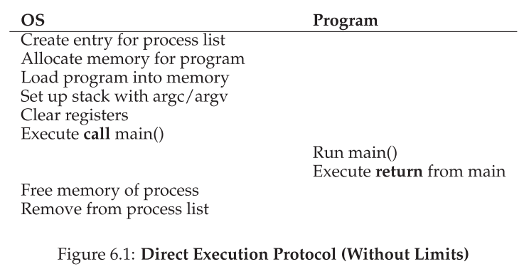

# 2 - Scheduler

*Keywords*: Metrics for scheduling (turnaround time, response time), simple process
model, scheduling policies (FIFO, SJF, STCF, Round Robin, MLFQ, lottery
scheduler).

## Litterature

OSTEP Chapters 6, 7, 8, 9

## Learning Goals

After lecture 2 you:

* :heavy_check_mark: Can explain the notion of **limited direct execution** and how it relates to scheduling
* Will know the **simplified process model**
* Will know and can explain important **metrics** for measuring a scheduling policy:
  * Fairness
  * Turnaround time
  * Response time
* Can explain important **scheduling policies** and their pros and cons:
  * FIFO
  * SJF
  * STCF
  * Round Robin
  * MLFQ
  * Lottery scheduling

## Noter 

### Limited Direct Execution (LDE)

The direct execution part: Run the program directly on the CPU

Direct execution is fast, running directly on the CPU. 

How do allow a process to perform restricted operations without giving complete control?

For at undgå malicious processer, findes 2 modes. **User**- og **kernel-mode**.

Restriktede operationer, kan kun laves i kernel mode. **System kald**, er kald som user-processer kan eksekvere, der kan eksekvere kode i kernel mode.

For at eksekvere system kald, eksekvere programmer en **trap** instruktion.

Når systemet er færdig, eksekveres en **return-from-trap** instruktion, der returnerer til det kaldende bruger-program.

#### Trap

Når et trap eksekveres, gemmes kalderens registrer, så den kan returnere igen. x86 pusher PC, flags og andre registre til en **kernel stack**. Som så bliver popped igen når return-from-trap eksekveres.

#### Trap Table

For at kernel ved hvad der må eksekveres under et trap, opsættes et **trap-table** under boot. 

Trap table fortæller hardware hvilket kode der skal eksekveres under hvilke events (**trap handlers**).

Et **system-call number** er assigned til hvert system kald. User programmet placerer dette nummer i et bestemt register, eller bestemt sted i stakken.

OS tjekker dette nummers validitet og kører det tilsvarende kode. Denne indirekthed fungerer som besykttelse.

!!! snippet "xv6"
	System call numbers i xv6 kan ses i ``syscall.h``. De gemmes i %eax. Og kaldes ved at eksekvere trap med ``T_SYSCALL``. 

#### Switching Process (Scheduling)

2 method: **cooperative approach** og **non-cooperative**. 

##### Cooperative Approach

Processer står selv for at overgive kontrollen til OS. Eksempelvis gennem system kald eller **yield** kald.
Overgiver også kontrollen ved fejl, ex divide-by-zero. Generer trap.

##### Non-Cooperative

**Timer-interrupts**: en timer kører i hardware og interrupter. Under interrupt, pauses den kørende process, og OS's **interrupt-handler** kører. 

Hvilket kode der skal køre (interrupt-handler) meddeles til hardware under boot. Timer startes under boot.

##### Context Switch

**Scheduler** bestemmer om der skal skiftes process. Hvis der skiftes process udføres **context switch**.

Registre **gemmes** fra kørende process (til **kernel stack**), og registre **genoprettes** fra soon-to-be-running process (fra **kernel stack**).

Når return-from-trap udføres, returneres til process B.