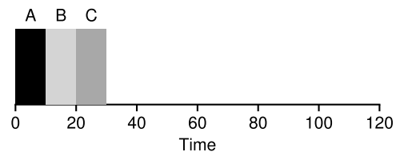
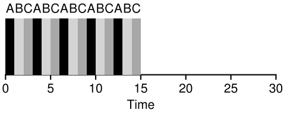

# 2 - Scheduling

*Keywords*: Metrics for scheduling (turnaround time, response time), simple process model, scheduling policies (FIFO, SJF, STCF, Round Robin, MLFQ, lottery scheduler).

## Litterature

OSTEP Chapters 6, 7, 8, 9

## Learning Goals

After lecture 2 you:

* :heavy_check_mark: Can explain the notion of **limited direct execution** and how it relates to scheduling
* :heavy_check_mark: Will know the **simplified process model**
* :heavy_check_mark: Will know and can explain important **metrics** for measuring a scheduling policy:
    * :heavy_check_mark: Fairness
    * :heavy_check_mark: Turnaround time
    * :heavy_check_mark: Response time
* :heavy_check_mark: Can explain important **scheduling policies** and their pros and cons:
    * :heavy_check_mark: FIFO (First In First Out)
    * :heavy_check_mark: SJF (Shortest Job First)
    * :heavy_check_mark: STCF (Shortest Time-to-Completion First)
    * :heavy_check_mark: Round Robin
    * :heavy_check_mark: MLFQ
    * :heavy_check_mark: Lottery scheduling

## Noter 

### Limited Direct Execution (LDE)

The direct execution part: Run the program directly on the CPU

Direct execution is fast, running directly on the CPU. 

How do allow a process to perform restricted operations without giving complete control?

For at undgå malicious processer, findes 2 modes. **User**- og **kernel-mode**.

Restriktede operationer, kan kun laves i kernel mode. **System kald**, er kald som user-processer kan eksekvere, der kan eksekvere kode i kernel mode.

For at eksekvere system kald, eksekvere programmer en **trap** instruktion.

Når systemet er færdig, eksekveres en **return-from-trap** instruktion, der returnerer til det kaldende bruger-program.

#### Trap

Når et trap eksekveres, gemmes kalderens registrer, så den kan returnere igen. x86 pusher PC, flags og andre registre til en **kernel stack**. Som så bliver popped igen når return-from-trap eksekveres.

#### Trap Table

For at kernel ved hvad der må eksekveres under et trap, opsættes et **trap-table** under boot. 

Trap table fortæller hardware hvilket kode der skal eksekveres under hvilke events (**trap handlers**).

Et **system-call number** er assigned til hvert system kald. User programmet placerer dette nummer i et bestemt register, eller bestemt sted i stakken.

OS tjekker dette nummers validitet og kører det tilsvarende kode. Denne indirekthed fungerer som besykttelse.

!!! snippet "xv6"
	System call numbers i xv6 kan ses i ``syscall.h``. De gemmes i %eax. Og kaldes ved at eksekvere trap med ``T_SYSCALL``. 

#### Switching Process (Scheduling)

2 method: **cooperative approach** og **non-cooperative**. 

##### Cooperative Approach

Processer står selv for at overgive kontrollen til OS. Eksempelvis gennem system kald eller **yield** kald.
Overgiver også kontrollen ved fejl, ex divide-by-zero. Generer trap.

##### Non-Cooperative

**Timer-interrupts**: en timer kører i hardware og interrupter. Under interrupt, pauses den kørende process, og OS's **interrupt-handler** kører. 

Hvilket kode der skal køre (interrupt-handler) meddeles til hardware under boot. Timer startes under boot.

##### Context Switch

**Scheduler** bestemmer om der skal skiftes process. Hvis der skiftes process udføres **context switch**.

Registre **gemmes** fra kørende process (til **kernel stack**), og registre **genoprettes** fra soon-to-be-running process (fra **kernel stack**).

Når return-from-trap udføres, returneres til process B.

### Simplified Process Model

1. Each job runs for the same amount of time
2. All jobs arrive at the same time
3. Once started each job runs to completion
4. All jobs only use the CPU (no I/O)
5. The run-time of each job is known

Terminologi: $job==process\ |\ job == thread$

### Scheduling Metrics

**Turnaround time**: Tid fra arrival til færdiggørrelse
$$
T_{turnaround}=T_{complition}-T_{arrival}
$$
Dette er en **performance** metric.

**Response time:** Tid fra arrival til første schedule
$$
T_{response}=T_{firstrun}-T_{arrival}
$$

### First In, First Out (FIFO)

AKA **First Come, First Served (FCFS)**

* Nem at implementere

Average turnaround time:

​	$\frac{10+20+30}{3}=20$

Men hvis vi relaxer assumtion 1:

**Convoy effect**: Korte jobs bliver sat i kø bag store jobs.

Average turnaround time høj:

​	$\frac{100+110+120}{3}=110$

Dårlig response time

### Shortest Job First (SJF)

Average turnaround time:

​	$\frac{10+20+120}{3}=50$

Givet vores assumptions om at alle jobs ankommer på samme tid, kan SJF bevises til at være **optimal** scheduling algoritme.

Men hvis vi relaxer assumption 2.

Hvis A ankommer før B og C vil den få høj turnaround time igen. 

​	($103.33$)

Skidt for response time

### Shortest Time-to-Completion First (STCF)

AKA Preemptive Shortest Job First (PSJF)

Vi relaxer assumption 3. 

Giver os bedre average turnaround time: $50$

Givet vores nuværende assumptions er STCF beviseligt optimal.

Skidt for response time

### Round Robin (RR)

RR kører jobs for en **time slice** (også kaldt **scheduling quantum**)

Time slices skal være dividerbar med timer-interrupt perioden.

Jo kortere time slice, jo bedre response time.

MEN: Hvis time slice bliver så kort, at kosten ved context switching dominerer overall performance.

**Armortization**: hvis noget har en fixed cost, så kald denne operation så få gange som muligt. 

Average turnaround time: 14, rimelig skidt.

* RR er en af de værste policies set fra Turnaround time

Generalt, policies, som RR, som er **fair** (deler cpu ligeligt bland aktive processer i lille tidsscala) performer dålrigt på metrics som turnaround time.

### Multi Level Feedback Queue (MLFQ)

**Goal:**

Optimer turnaround time og minmer response time

Hver process får en priorietet

Hvert prioritet level har sin egen process kø (queue)

**Basic rules:**

$$
\begin{equation}
\text{if } Pri(A)>Pri(B) \text{ run } A
\tag{Rule 1}\label{rule1}
\end{equation}
$$

$$
\begin{equation}
\text{if } Pri(A)=Pri(B) \text{ use RR for } A \text{ and } B
\tag{Rule 2}
\end{equation}
$$

Handler om hvordan scheduleren sætter prioriteter.

Et program der ofte giver afkald på CPU for at vente på I/O får høj prioritet.

**Regler for prioritetsændring**

**Rule 3:**
	Nye processer starter på højeste prioritet

**Rule 4a:**
	Prioritet af process der bruger al sin time-slice bliver reduceret

**Rule 4b:**
	En process der slipper CPU før tid, bliver på samme prioritet

#### Problemer

**Starvation:** Hvis der er for mange interaktive jobs, tager de al CPU-tid, og starverer de lange jobs.

En smart bruger kan rewrite et program til at **game the scheduler**

Et lang job kan ændre sin behavior og blive interaktiv efter noget tid. Dette bliver ikke rewardet i nuværende system.

#### Ny regel

**Rule 5:**
	Efter noget tid *S*, **boostes** alle jobs til øverste prioritet (kø)

**Rule 4 (samling af 4a og 4b):**
	Altid reducer prioriteten på et job, når den bar brugt alt tildelt (alloted) tid.

Så vi ender ud med:

### Proportional Share (Lottery Scheduling)

AKA **fair-share** scheduler

**Princip:** Et antal **tickets** er i spil. Efter hver time slice, holdes lotteri. Processen, der ejer den ticket der bliver trukket, bliver kørt.

#### Ticket Mechanics

**Ticket currency**: Lader brugeren allokere tickets mellem dens egen jobs.
Currency converteres til rigtige tickets.

**Ticket transfer:** En process kan midlertidigt give sine tickets til en anden process.

Ex en client/server struktur. Klienten kan give serveren sine tickets når den beder den om noget arbejde.

**Ticket inflation**: En process kan midlertidigt hæve eller sænke dets antal tickets. 

Giver ikke mening i et kompetitativt miljø.

#### Unfairness Metric

$U$, tiden det første job er færdigt divideret med tiden det andet job er færdigt.

Hvis job A er færdig efter 10 og job B efter 20: 
$$
U=\frac{10}{20}=0.5
$$
Når jobs bliver færdigt næsten sammentidigt vil $U$ nærme sig 1.
En perfectly fair scheduler har $U=1$