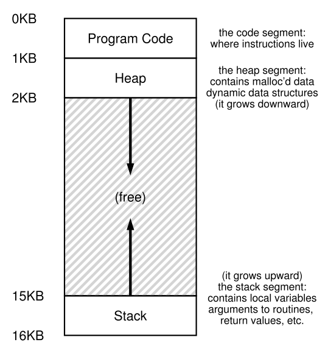

# 1 - Memory Management

*Keywords*: Memory hierarchy, goals for memory management (transparency, efficiency, isolation), address space, challenges for memory management, features (relocation, protection, and sharing), virtual addresses vs. physical addresses, address translation, base and bound registers, simple allocation, static allocation (nonuniform), dynamic allocation, virtual memory, segmentation.

## Litterature

OSTEP Chapter 12, 13, (14), 15, 16, 17

Kapitler med parenteser skimmes: (x)

## Learning Goals

After Lecture 5 you:

* ... will know and can discuss the **three goals** of memory management:
  *  Transparency 
  * Efficiency 
  * Protection (isolation)
* ... can explain what an **address space** is 
* ... define and explain the notion of **virtual memory** 
* ... perform simple **address translation** from virtual to physical 
* ... can explain the need for and use of **base/bound registers** 
* ... define and explain the use of **segmentation**

## Noter

### Adress Space

**Addres space** er en abstraktion af den fysiske hukommelse. Så ser det ud fra hver process' synspunkt at de har det plads.

Dette kaldes **virtualizing memory**.

Hvis eksempelvis process A vil læse fra adresse 0 (**virtual address**), så vil OS i samarbejde med hardware oversætte til den fysiske (virkelige) adresse.