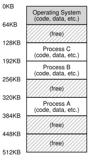
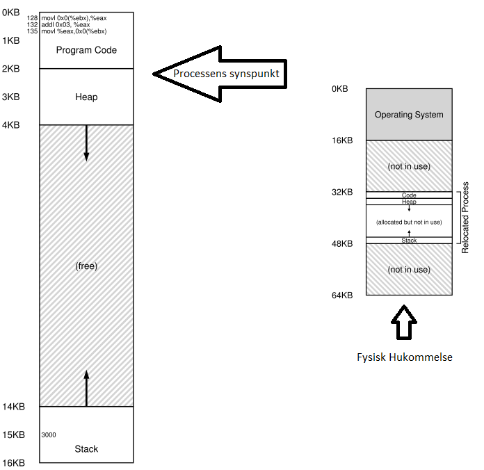
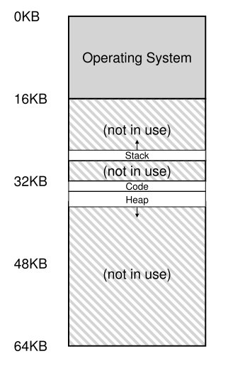
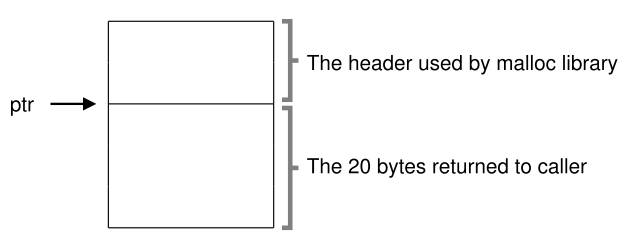
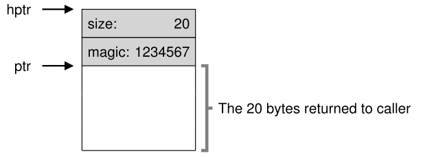
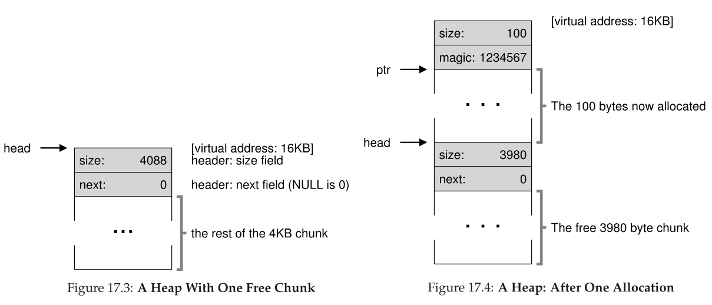

# 3 - Memory Management

*Keywords*: Memory hierarchy, goals for memory management (transparency, efficiency, isolation), address space, challenges for memory management, features (relocation, protection, and sharing), virtual addresses vs. physical addresses, address translation, base and bound registers, simple allocation, static allocation (nonuniform), dynamic allocation, virtual memory, segmentation.

## Litterature

OSTEP Chapter 12, 13, (14), 15, 16, 17

Kapitler med parenteser skimmes: (x)

## Learning Goals

After Lecture 5 you:

* :heavy_check_mark: ... will know and can discuss the **three goals** of memory management:
  * :heavy_check_mark: Transparency 
  * :heavy_check_mark: Efficiency 
  * :heavy_check_mark: Protection (isolation)
* :heavy_check_mark: ... can explain what an **address space** is 
* :heavy_check_mark: ... define and explain the notion of **virtual memory** 
* :heavy_check_mark: ... perform simple **address translation** from virtual to physical 
* :heavy_check_mark: ... can explain the need for and use of **base/bound registers** 
* :heavy_check_mark: ... define and explain the use of **segmentation**


## Noter

!!! snippet "XV6"
	XV6 memory management i `vm.c` `memlayout.h` `mmu.h` `kalloc.c`

### Adress Space


**Addres space** er en abstraktion af den fysiske hukommelse. Så ser det ud fra hver process' synspunkt at de har det plads.



Dette kaldes **virtualizing memory**.

Hvis eksempelvis process A vil læse fra adresse 0 (**virtual address**), så vil OS i samarbejde med hardware oversætte til den fysiske (virkelige) adresse.

### Mål med Memory Management

**Transparency**:

OS skal implementere virtuel memory så det er usynligt for det kørende program. (Programmet skal ikke vide at det er virtuel hukommelse)

**Efficiency:**

Virtualizeringen skal være så effektiv som muligt.

* Tid og plads

Udnytter hardware support som TLB'er

**Protection:**

Beskyt processer fra hinanden, og OS fra processer.

* De skal ikke kunne skrive og læse uden for deres egen adress space.
* **Isolation** processer er isoleret fra hinanden


### Adress Translation

AKA **hardware-based address translation**

Hardware oversætter hver memory adresse, **virtuel** $\rightarrow$ **physical**.

OS **manages memory**.

#### Antagelser

* Sammenhængende allokation (Contiguous allocation)
* Lille address space (mindre end fysisk hukommelse)
* Fixed størrelse address space

#### Eksempel




#### Base and Bounds

AKA **dynamic relocation**

2 Hardware registre: **base**- og **bounds**- (også kaldt **limit**) register.

* Lader os placere adress space hvor vi vil i fysisk.

Memory referancer oversættes nu med:
$$
Address_{physical}=Address_{virtual}+base\\
\textbf{address translation}
$$
Teknikken kaldes ofte **dynamic relocation**.

**Bounds** bruges til **protection**. Undgå at process læser uden for address space.

Delen af CPU der hjælper med adress translation kaldes **memory management unit (MMU)**.

**Eksempler:**


**Hardware Requirements**


##### OS Problemer

* OS har en **free list**, en liste over ledigt hukommelse.

* Under **context-switch** skal base og bounds registre gemmes og læses.


### Segmentation

Base og bounds par pr **segment** address space.

Et segment er et sammenhængende portion address space.

Logisk: code, stack og heap.

Segmentation lader os placere dem forskellige steder i fysisk.




Ubrugt address space kaldes **sparce address space**

En referance til en adresse uden for segmentet -> **segmentation violation** eller **segmentation fault**

Vi kan bruge bits i virtuelle adresse til at præcisere segment (**explicit approach**)


```c
Segment = (VirtualAddress & SEG_MASK) >> SEG_SHIFT
Offset	= VirtualAddress & OFFSET_MASK
if (Offset >= Bounds[Segment])
    RaiseException(PROTECTION_FAULT)
else
    PhysAddr = Base[Segment] + Offset
    Register = AccessMemory(PhysAddr)
```

```c
SEG_MASK 	= 0x3000
SEG_SHIFT	= 12
OFFSET_MASK	= 0xFFF
```

**Implicit approach:** Hardware bestemmer segment ved at se på hvor addressen blev dannet. (Eks. fra PC, så er addr. fra code segment)

#### The Stack

Stack vokser bagud. Vi tilføjer bit til hardware der fortæller om adresser vokser fremad.


#### Sharing

Noget hukommelse kan deles mellem address spaces.

* **code sharing**.

Vi tilføjer **protection bits** til hukommelse.


#### Fine- vs Coars-grained Segmentation

Det vi har ovenover kaldes **coarse-grained** segmentation.

**Fine-grained** segmentation: Mange små segments.
Kræver et **segment table** i memory.

* OS kan lære hvordan de forskellige segments bruges. Og derved optimere.


#### OS Support

Problem: **external fragmentation**: fysisk hukommelse bliver fyldt med små huller af ubrugt plads, som er for små til et segment.

* Løsning kan være at **compact** fysisk memory.
  * Dyrt,  memory-intensivt at kopiere segments.
  * Kan gøre segment-growing requests svære at servere.

* Simplere løsning: **free-list** management algoritme.
  * **best-fit** holder liste af frit lager, og giver den der passer bedst i størrelse.
  * **worst-fit**
  * **first-fit**

Modsat **internal fragmentation**: Allokeret lager, er for stort og meget ubrugt.


### Free Space Management


**Free-list**


!!! snippet "XV6"
	Se `line 22 in kalloc.c`

**Splitting:**

Request for 1 byte. Allocator finder free chunk, splitter den op. Returnerer den ene del, og anden del bliver i listen.


**Coalescing:**

Der kaldes `free(10)`. List vil se ud som følger:


Vi samler frie segmenter der er sammenhængende:


#### Header

Bruges til at holde styr på størrelsen på allokerede regioner.





!!! snippet "XV6"
	kan ses i `umalloc.c`

#### Embed Free List

Listen laves i det frie hukommelse

```c
typedef struct __node_t {
	int				 size;
	struct __node_t *next;
} node_t
```




#### Basic Strategies

##### Best Fit

* Find de chunks der er så stor eller større end det ønskede.
* Returner det mindste af dem.

Kan koste meget performance når den skal søge efter den bedste frie blok.

##### Worst Fit

* Find den største chunk og returner den ønskede størrelse.
* Behold resten på free-list

Kan være dyr i performance. Studier viser at den performer dårligt. 

Leder til excess fragmentation, mens den stadig har høj overheads.

##### First Fit

* Finder den første blok der er stor nok.
* Returnerer den ønskede størrelse.

Hurtig metode.
Fylder dog nogen gange starten op med små objekter.

* Hvordan allocator manager free-listens rækkefølge betyder noget.

En løsning er **address-based ordering**

* Gør det nemmere at coalesce, og fragmentering er reduceret.

##### Next Fit

Ligesom first-fit, men algoritmen holder en pointer til der hvor den ledte sidst.

* Spreder søgningen mere uniformt.
* Høj performance, som first-fit.

