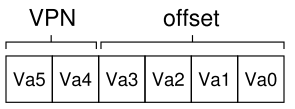
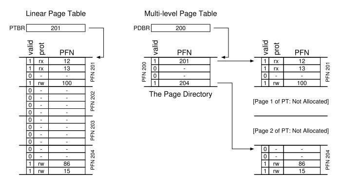

# 4 - Paged Memory

*Keywords*: Address types (physical, relative, virtual), address translation (page tables), virtual memory, swapping, paging, shared memory, memory use for OS, page replacement algorithms (OPT, LRU, FIFO, CLOCK).

## Litterature

OSTEP Chapter 18, 19, 20, 21, 22, (23), 24

Kapitler med parenteser skimmes: (x)

## Learning Goals

After Paged Memory you can:

* ... define and explain **paging** and how **paged memory** works
* ... perform simple **address translation** from paged (virtual) memory to physical memory
* ... explain how paged memory supports **shared memory**
* ... explain organisation of **page tables** (direct, two-level)
* ... define, explain, and discuss various **page replacement algorithms** and their pros and cons

## Noter

### Paging

Chopping up space into fixed size pieces.

Simple example:


For at holde styr på virtual pages, OS holder en per-process data struktur kaldet **page table**.

* Holder **address translations** for hver virtual page

Virtuel adresse splittes op i **virtual page number (VPN)** og **offset**



16 bit page. 2 bit vpn.

Vi indexer nu page table.  Page 1 ligger i page frame 7 i ovenstående billede.

Dette er **physical frame number (PFN)** aka **physical page number (PPN)** 7.


### Page Tables

Page tables kan blive meget store. 32-bit adresse, 4KB pages.

Virtuel adresse splittes til 20-bit VPN og 12-bit offset.

20-bit VPN betyder $2^{20}$ translations. 4 bytes per **page table entry (PTE)** giver 4MB per page table!

Derfor er page tables ikke i MMU (hardware memory management unit)

* Vi holder page tables i memory.


#### Linear Page Table

Simpelt array af page table entries (PTE). Indexes med VPN, for at finde PFN.

##### Page table entry

En **valid bit** er normalt. Indikerer om translation er valid.

* Eksempel, stack og heap der vokser mod hinanden. Alt imellem er **invalid**.
* Access af invalid lager generer trap.

**Protection bits** indikerer om page må læses fra, skrives til eller executes fra.

**Present bit** indikerer om denne page er i fysisk memory eller på disk.

* **swapped out**

**Dirty bit** indikerer om den er ændret siden den blev bragt til hukommelse.

**Reference bit** aka **accessed bit**: indikerer om en page har været tilgået

* buges i **page replacement**


(P) present bit, (R/W) read/write, (U/S) user/supervisor, (PWT, PCD, PAT, G) bruges i hardware caching system, (A) accessed, (D) dirty bit, (PFN).

##### Translation

Lad os sige at **page-table base register** indeholder den fysiske adresse på start lokationen for page table. Giver os:

```C
VPN			= (VirtualAddress & VPN_MASK) >> SHIFT
PTEAddr		= PageTableBaseRegister + (VPN * sizeof(PTE))
    
VPN_MASK 	= 0x30
SHIFT		= 4

 
offset		= VirtualAddress & OFFSET_MASK
PhysAddr	= (PFN << SHIFT) | offset

```


### Translation Lookaside Buffer (TLB)

For at gøre translation hurtigere tilføjes **tanslation-lookaside buffer (TLB)** til hardware (MMU).

* En hardware **cache** af populære v2p translations.
* Kunne kaldes **address-translation cache**

Ved hver virtual memory referance, tjekkes TLB for at se om den indeholder translation'en.

Hvis TLB indeholder translation, har vi **TLB hit**.

* Hvis ikke, har vi **TLB miss**

Simpelt algoritme indsætter translation i TLB ved TLB miss.

Det er vigtigt at vi oftest får TLB hit.

#### **Locality**

* **Spacial locality**: access af elementer der ligger tæt på hinanden giver højere **hit rate**
* **Temporal locality**: hurtig re-referencing af elementeri tid giver højere hit rate.


#### TLB Miss Handling

Kan håndteres af Hardware eller OS.

Eksempel på **hardware-managed TLB** er Intel x86. Bruger **multi-level page table**.

* Current page table bliver pointed på af CR3 register.

**Software-managed TLB**: Hardware raiser exception, og **trap handler** håndtere TLB miss

* **Return-from trap** er anderledes end ved system call, da vi skal kalde den foråsagende instruktion. Denne gang med TLB hit.
* Man skal sørge for at undgå infinite loop, eksempelvis ved at holde TLB miss handlers i fysisk memory.
  * Eller reservere entries i TLB for permanente translations.
* Software-managed løsning giver *flexibilitet* og *simplicitet*


#### TLB Indhold

Typisk TLB har 32, 64 eller 128 entries, og er **fully associative.**

* En translation kan være overalt i TLB
* Hele TLB søges i parallel.

En entry kan se ud som:
$$
\text{VPN}\ |\ \text{PFN}\ |\ \text{other bits}
$$
**Other bits**:

* **valid bit**: har entry en valid translation
* **protection bit**: hvordan kan page tilgås (som i page table)
* **address-space identifier**, **dirty bit** osv.


#### TLB Problemer

**TLB indeholder v2p translations kun gyldige for nuværende process.**

* Når der skiftes process skal hardware, OS eller begge sikre sig at den næste process ikke bruge forkeret translations.

En mulig løsning er at **flush** TLB ved context switch.

* Sætter alle valid bits til 0

* Kan være kostbart, da der vil være TLB miss'es efter hver context switch.

Nogle systemer har **address space identifer (ASID)** felt i TLB.

* Kan tænkes som **process identifer (PID)** men ofte færre bits


### Formindsk Page Tables

En løsning er **større pages**.

32-bit addresser igen. Denne gang 16KB pages. Giver 18-bit VPN plus 14-bit offset. PTE (4 bytes) giver: $2^{18}$ entries, derfor 1MB per page table.

* Leder til **internal fragmentation**


**Hybrid apporach**

Et page table per logisk segment (code, heap og stack).

Vi bruger **base** til holde fysisk adresse på page table. Og **bound** til at holde slutningen på page table.

Eksempel:

32-bit adress space, 4KB pages, adress space splittet i 4 segments.


Registers skal skiftes ved context-switch.

```c
SN				= (VirtualAddress & SEG_MASK) >> SN_SHIFT
VPN				= (VirtualAddress & VPN_MASK) >> VPN_SHIFT
AddressOfPTE 	= Base[SN] + (VPN * sizeof(PTE))
```

Eksempel: Hvis code kun bruger første 3 pages, vil code page table kun have 3 entries, og bounds er sat til 3.

**Fordele:**

* Ubrugte pages mellem stack og heap fylder ikke i page table.

**Ulemper**:

* Kræver at segmentation brgues.
* Giver **external fragmentation**


#### Multi-Level Page Tables

Skær page table op i page-sized stykker.

Hvis en hel page af PTE (page-table-entries) er invalid, allokeres ikke plads.

Ellers bruges en ny struktur: **page directory**.



Page directory (i 2-level) indeholder et antal **page directory entries (PDE)**.

En PDE har som minium en **valid bit** og **page frame number (PFN)**.

* Hvis PDE er valid, er mindst en af pages valid.
* Hvis PDE ikke er valid, er resten af PDE ikke defineret.

**Fordele:**

* Allokerer kun page table space i proportion til antal adress space brugt.
* Hvis carefully constructed, passer hver portion i en page, hvilket gøre det nemmere at manage memory.
* Lader os placere page-table pages hvor vi vil i memory.

**Ulemper**

* Performance cost: ved TLB miss, kræves 2 loads. 1 for page directory og 1 for PTE.
* **time-space trade-off**
* *complexity*: Mere complex at implementere.

