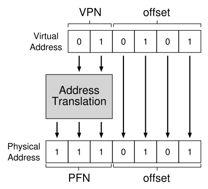
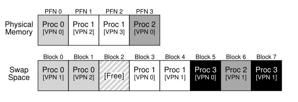
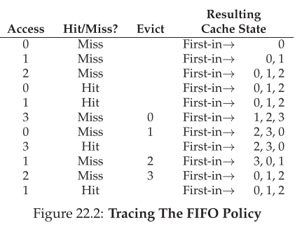
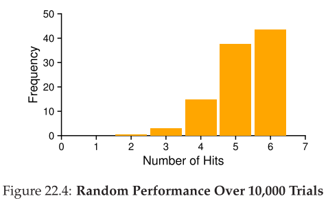
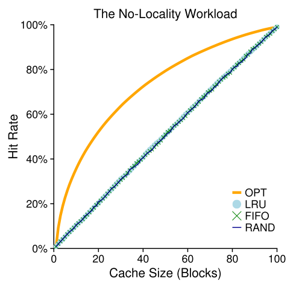
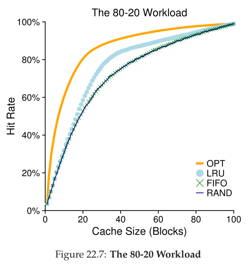

# 4 - Paged Memory

*Keywords*: Address types (physical, relative, virtual), address translation (page tables), virtual memory, swapping, paging, shared memory, memory use for OS, page replacement algorithms (OPT, LRU, FIFO, CLOCK).

## Litterature

OSTEP Chapter 18, 19, 20, 21, 22, (23), 24

Kapitler med parenteser skimmes: (x)

## Learning Goals

After Paged Memory you can:

* ... define and explain **paging** and how **paged memory** works
* ... perform simple **address translation** from paged (virtual) memory to physical memory
* ... explain how paged memory supports **shared memory**
* ... explain organisation of **page tables** (direct, two-level)
* ... define, explain, and discuss various **page replacement algorithms** and their pros and cons

## Noter

### Paging

Chopping up space into fixed size pieces.

Simple example:


For at holde styr på virtual pages, OS holder en per-process data struktur kaldet **page table**.

* Holder **address translations** for hver virtual page

Virtuel adresse splittes op i **virtual page number (VPN)** og **offset**


16 bit page. 2 bit vpn.

Vi indexer nu page table.  Page 1 ligger i page frame 7 i ovenstående billede.

Dette er **physical frame number (PFN)** aka **physical page number (PPN)** 7.



### Page Tables

Page tables kan blive meget store. 32-bit adresse, 4KB pages.

Virtuel adresse splittes til 20-bit VPN og 12-bit offset.

20-bit VPN betyder $2^{20}$ translations. 4 bytes per **page table entry (PTE)** giver 4MB per page table!

Derfor er page tables ikke i MMU (hardware memory management unit)

* Vi holder page tables i memory.


#### Linear Page Table

Simpelt array af page table entries (PTE). Indexes med VPN, for at finde PFN.

##### Page table entry

En **valid bit** er normalt. Indikerer om translation er valid.

* Eksempel, stack og heap der vokser mod hinanden. Alt imellem er **invalid**.
* Access af invalid lager generer trap.

**Protection bits** indikerer om page må læses fra, skrives til eller executes fra.

**Present bit** indikerer om denne page er i fysisk memory eller på disk.

* **swapped out**

**Dirty bit** indikerer om den er ændret siden den blev bragt til hukommelse.

**Reference bit** aka **accessed bit**: indikerer om en page har været tilgået

* buges i **page replacement**


(P) present bit, (R/W) read/write, (U/S) user/supervisor, (PWT, PCD, PAT, G) bruges i hardware caching system, (A) accessed, (D) dirty bit, (PFN).

##### Translation

Lad os sige at **page-table base register** indeholder den fysiske adresse på start lokationen for page table. Giver os:

```C
VPN			= (VirtualAddress & VPN_MASK) >> SHIFT
PTEAddr		= PageTableBaseRegister + (VPN * sizeof(PTE))
    
VPN_MASK 	= 0x30
SHIFT		= 4

 
offset		= VirtualAddress & OFFSET_MASK
PhysAddr	= (PFN << SHIFT) | offset

```


### Translation Lookaside Buffer (TLB)

For at gøre translation hurtigere tilføjes **tanslation-lookaside buffer (TLB)** til hardware (MMU).

* En hardware **cache** af populære v2p translations.
* Kunne kaldes **address-translation cache**

Ved hver virtual memory referance, tjekkes TLB for at se om den indeholder translation'en.

Hvis TLB indeholder translation, har vi **TLB hit**.

* Hvis ikke, har vi **TLB miss**

Simpelt algoritme indsætter translation i TLB ved TLB miss.

Det er vigtigt at vi oftest får TLB hit.

#### **Locality**

* **Spacial locality**: access af elementer der ligger tæt på hinanden giver højere **hit rate**
* **Temporal locality**: hurtig re-referencing af elementeri tid giver højere hit rate.


#### TLB Miss Handling

Kan håndteres af Hardware eller OS.

Eksempel på **hardware-managed TLB** er Intel x86. Bruger **multi-level page table**.

* Current page table bliver pointed på af CR3 register.

**Software-managed TLB**: Hardware raiser exception, og **trap handler** håndtere TLB miss

* **Return-from trap** er anderledes end ved system call, da vi skal kalde den foråsagende instruktion. Denne gang med TLB hit.
* Man skal sørge for at undgå infinite loop, eksempelvis ved at holde TLB miss handlers i fysisk memory.
  * Eller reservere entries i TLB for permanente translations.
* Software-managed løsning giver *flexibilitet* og *simplicitet*


#### TLB Indhold

Typisk TLB har 32, 64 eller 128 entries, og er **fully associative.**

* En translation kan være overalt i TLB
* Hele TLB søges i parallel.

En entry kan se ud som:
$$
\text{VPN}\ |\ \text{PFN}\ |\ \text{other bits}
$$
**Other bits**:

* **valid bit**: har entry en valid translation
* **protection bit**: hvordan kan page tilgås (som i page table)
* **address-space identifier**, **dirty bit** osv.


#### TLB Problemer

**TLB indeholder v2p translations kun gyldige for nuværende process.**

* Når der skiftes process skal hardware, OS eller begge sikre sig at den næste process ikke bruge forkeret translations.

En mulig løsning er at **flush** TLB ved context switch.

* Sætter alle valid bits til 0

* Kan være kostbart, da der vil være TLB miss'es efter hver context switch.

Nogle systemer har **address space identifer (ASID)** felt i TLB.

* Kan tænkes som **process identifer (PID)** men ofte færre bits


### Formindsk Page Tables

En løsning er **større pages**.

32-bit addresser igen. Denne gang 16KB pages. Giver 18-bit VPN plus 14-bit offset. PTE (4 bytes) giver: $2^{18}$ entries, derfor 1MB per page table.

* Leder til **internal fragmentation**


**Hybrid apporach**

Et page table per logisk segment (code, heap og stack).

Vi bruger **base** til holde fysisk adresse på page table. Og **bound** til at holde slutningen på page table.

Eksempel:

32-bit adress space, 4KB pages, adress space splittet i 4 segments.


Registers skal skiftes ved context-switch.

```c
SN				= (VirtualAddress & SEG_MASK) >> SN_SHIFT
VPN				= (VirtualAddress & VPN_MASK) >> VPN_SHIFT
AddressOfPTE 	= Base[SN] + (VPN * sizeof(PTE))
```

Eksempel: Hvis code kun bruger første 3 pages, vil code page table kun have 3 entries, og bounds er sat til 3.

**Fordele:**

* Ubrugte pages mellem stack og heap fylder ikke i page table.

**Ulemper**:

* Kræver at segmentation brgues.
* Giver **external fragmentation**


**Multi-Level Page Tables** kan løse problemet.

### Multi-Level Page Tables

Skær page table op i page-sized stykker.

* Hver page table passer i en enkelt page.

Hvis en hel page af PTE (page-table-entries) er invalid, allokeres ikke plads.

Ellers bruges en ny struktur: **page directory**.


Page directory (i 2-level) indeholder et antal **page directory entries (PDE)**.

En PDE har som minium en **valid bit** og **page frame number (PFN)**.

* Hvis PDE er valid, er mindst en af pages valid.
* Hvis PDE ikke er valid, er resten af PDE ikke defineret.

**Fordele:**

* Allokerer kun page table space i proportion til antal adress space brugt.
* Hvis carefully constructed, passer hver portion i en page, hvilket gøre det nemmere at manage memory.
* Lader os placere page-table pages hvor vi vil i memory.

**Ulemper**

* Performance cost: ved TLB miss, kræves 2 loads. 1 for page directory og 1 for PTE.
* **time-space trade-off**
* *complexity*: Mere complex at implementere.


Eksempel med 256 entry page table


#### More Than 2 Levels

Hvad hvis page directory bliver for stor?

Eksempel:

30-bit virtual address space, 512 byte page. PTE 4 bytes.

Giver:

* 21-bit VPN og 9-bit offset

* 128 PTE's per page.
* 7 bits til index


14 bits PDI: $2^{14}$ entries. Fylder 128 pages.

Vi bygger endnu et niveau på.


### Inverted Page Tables

Her holder vi ét page table, der har en entry for hver fysisk page.

Hver entry fortæller os hvilken process der bruger denne page, og hvilken virtuel page der mapper til denne fysiske page.

* Søg gennem den struktur for at finde den korrekte.
* Bruger ofte hash-tables, da linear search er dyrt.


### Swapping

Vi tænker nu på at alle address spaces tilsammen kan være større end fysisk memory.

Vi bruger et ekstra level i **memory hierarchy**

Et eksempel på memory hierarchy:


Vi bruger **hard disk** til at opbevare portioner af adress spaces, der ikke er i great demand.

* Før i tiden brugt man, **memory overlays**, hvor programmører selv skulle flytte data ind og ud af memory.


#### Swap Space

Vi reservere noget plads på disk, til at flytte pages frem og tilbage imellem. Vi kalder dette for **swap space**.

* Vi **swap**per pages ud af memory til det, og memory ind i memory fra det.

Derfor skal OS huske **disk address** for en given page.



Hver page table entry (PTE) får en **present bit**.

* Siger om page er i fysisk memory.

#### Page Fault

Accessing af en page der ikke er i fysisk kaldes **page fault** aka page miss.

* Kalder **page-fault handler **i OS

Disk adresse kan stores i PTE.

* OS finder adresse, og requester disk fetch.
* Opdaterer page table (markerer present)
* Prøver instruktion igen.

Dette kan generere TLB miss.

* Alternativt kan man opdatere TLB under page fault

(Under I/O vil processen være i **blocked state**, og andre processer kan køre)


##### Hvad Hvis Memory Er Fyldt?

Hvis der ikke er plads til at **page in** en page, vil OS først **page ud** en eller flere pages.

Dette styres af **page-replacement policy**

For at holde en lille smule memory frit, bruger de fleste OS: HW og LW

* **Low watermark (LW):** His der er færre end *LW* pages tilgængelige, kaldes en baggrundstråd til at frigøre memory.
* **High watermark (HW)**: Dette gøres indtil der er *HW* pages ledige.

Denne baggrundstråd kaldes ofte **swap daemon** eller **page daemon**.


### Swapping Policies

Vi kan kalde main memory for **cache** for virtual memory.

Vores mål er at minimere **cache misses**.

* Samme som at maximere **cache hits**


**Average memory access time (AMAT)**

$$
\begin{align*}
AMAT &= T_M+(P_{Miss}*T_D),\\\\
&\text{hvor } T_M : \text{cost of accessing memory}\\
&\text{and } T_D : \text{cost of accessing disk}\\
&\text{and } P_{Miss} :\text{chance of cache miss } (0.0<P_{Miss}<1.0)
\end{align*}
$$


#### Optimal Replacement Policy

(Impossible to implement)

* Udskifter den page der vil bliver accessed længst ude i fremtiden

Bruges til at sammenligne med.


#### FIFO (First In First Out)

* Simpelt at implementere

Kan ikke bestemme vigtigheden af en page



#### Random

* Simpel at implementere




#### Least-Recently-Used (LRU)

Bruger history. (**frequency** eller **recency**)

Replaces the least-recently-used page.

Som **Least-Frequently-Used (LFU)**


#### Workload Eksempler

##### Ingen lokalitet:

100 unikke pages, vælger random. 10k gange.



* Ingen lokalitet: Ligegyldigt hvilken policy.


##### 80-20 workload:

80% af referancer er til 20% af pages.



* LRU er den bedste.


##### Looping Sequential Workload

Referencer til 50 pages i sekvens startende fra 0.


* Random er den bedste op til når cache bliver 50 eller mere.

Worst-case for både LRU og FIFO.

Random har ingen "wierd" corner cases.


##### Aproximating LRU

For at undgå at kigge en hel liste igennem for at finde least-recently-used page, kan man aproximere LRU.

* Bruger en **use bit** aka **reference bit**. 1 per page.
* Når en page bliver referenced sættes use bit til 1 af hardware.

**Clock algorithm**

* Forestil alle pages i en cirkulær liste.

* En **clock hand** peger på en page.
* Når replacement sker tjekker OS om den pegede på page P har use bit 1 eller 0.
* Hvis use bit er 1, er det ikke en god replacement kandidat. Use bit sættes til 0 (cleared) og clock hand incrementes.
* Fortsætter til en page med use bit 0 findes.


Tilføjelse: **dirty bit**.

* Man kan tilføje dirty bit, som fortæller om page er **modified** (**dirty**).
* Dette betyder at der skal skrives til disk hvilket er dyrt.


#### Thrashing

Hvis memory er oversubscribed, og memory demand er over fysisk memory, vil systemet konstant page, kaldet **thrashing**.

