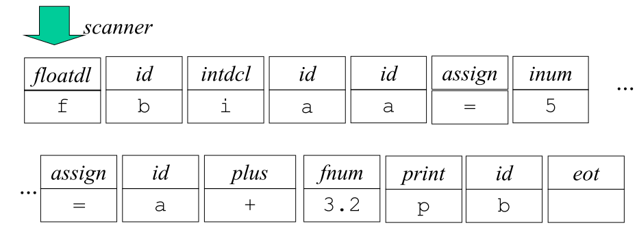
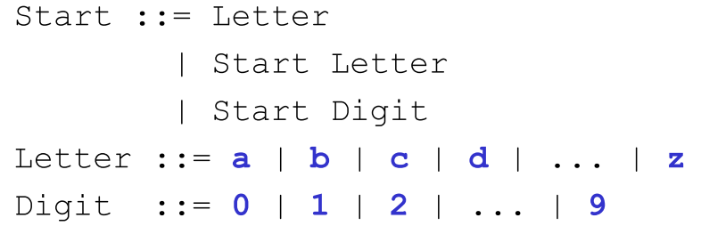
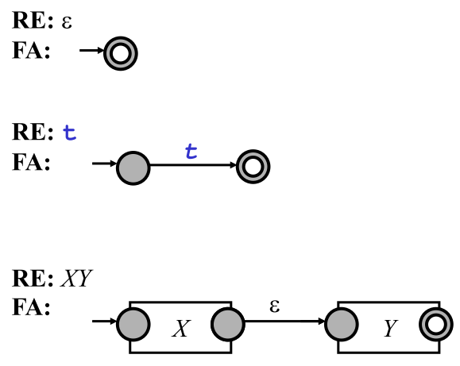
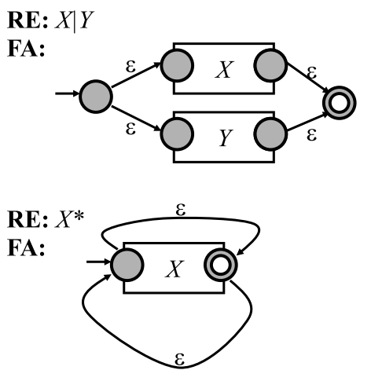

# Lexical Analysis

We are looking at the scanner


**Lexemes** are "words" in the input, for example keywords, operators, identifiers, literals, etc.

**Tokens:** a data structure for lexemes and additional information. 


Example ac source program:

```
f b
i a
a = 5
b = a + 3.2
p b
```



Turned into tokens by the scanner.

We may choose to contain different amount and types of operation of different types of lexemes.


This can be done to reduce the amount of memory used.

## Lexical Elements

You need to decide what to use

!!! warning
    slide 8


## Lexemes

The Lexem structure can be more detailed and subtle than one might expext.

!!! tip "Rule of thumb"
    If the lexem structure is complex then examine the language for design flaws!!


### Simple Grammar for Identifiers



Can be transformed to a regular expression:

```regex
[a-z]([a-z]|[0-9])*
```

### Regular Expressions

| Regular Expression | Meaning                                                      |
| ------------------ | ------------------------------------------------------------ |
| $\varepsilon$      | The empty string                                             |
| t                  | Generates only the string t                                  |
| X Y                | Generates any string xy such that x is generated by X and y is generated by Y |
| X \| Y             | Generates any string which generated either by X or by Y     |
| X*                 | The concatenation of zero or more strings generated by X     |
| (X)                | Parentheses are used for grouping                            |
| P+                 | **positive-closure**, strings consisting of one or more strings in P catenated together |

A **meta-character** is any punctuation char or regular expression operator. A meta-character must be quoted when used as an ordinary char to avoid ambiguity. 

### Regular Grammars

!!! warning
    slide 15


## The ac Language

[Remember the ac language](03b-the-ac-language-and-compiler.md)


!!! warning
    slide 17-19


## Implement Scanner Based on RE by Hand

!!! warning
    slide 25

## Developing a Scanner

Lexical grammar of Mini-Triangle

!!! warning
    slide 26-

### Developing a Scanner by Hand

*  Hard and error prone.
* Can be automated
* Programming scanner generator is an example of declarative programming
  * What to scan, not how to scan
* Most compilers are developed using a generated scanner


Slide 35 - Finite Automata and implementation of Scanners


### Generating Scanners

Based on:

* Regular Expressions
  * To describe the tokens to be recognized
* Finite State Machines
  * An execution model to which RE's are "compiled"


Regular Expressions can be recognized by a finite state machine (FA)

[Finite State Automaton](../SS/01b-endelige-automater.md)

#### Converting a RE Into an NDFA-epsilon






### Implementing a DFA

Slide 46-47

Algorithm on slide 48

### Implementing a Scanner as a DFA

Slide 49


### JLex Lexical Analyzer Generator for Java

Slide 51-52

#### JLex Regular Expressions

Slide 53-55-


...

