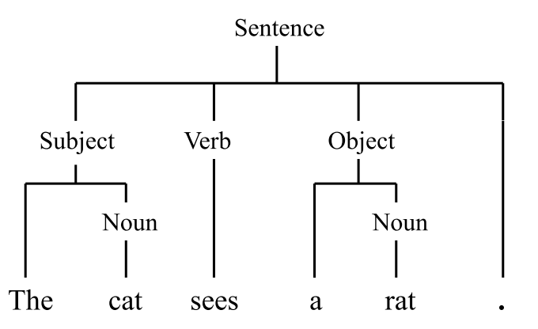
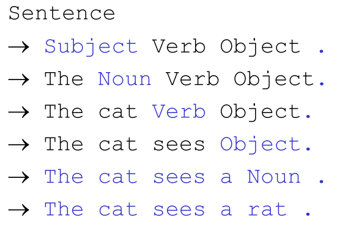
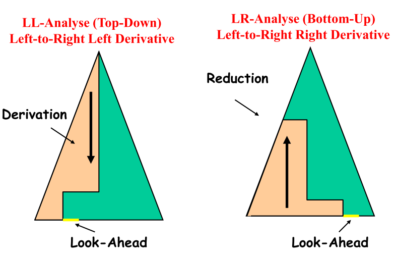
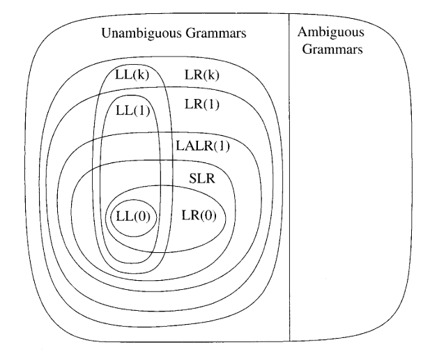
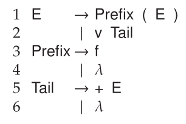
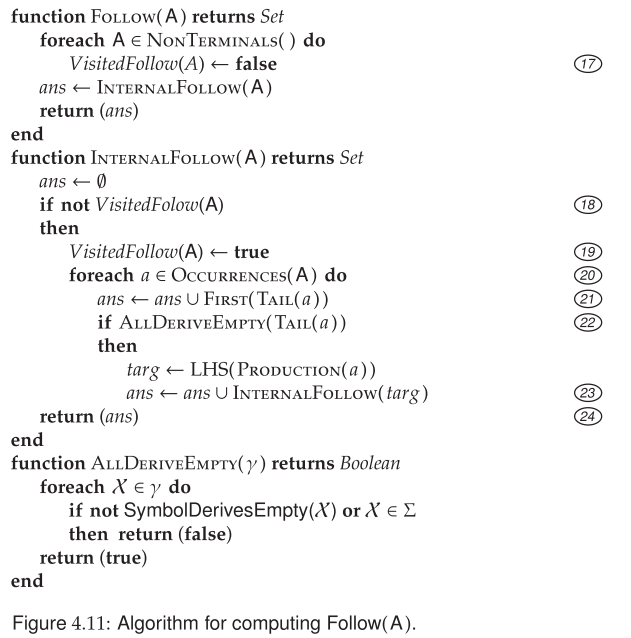

# From tokens to parse trees

The process of finding the structure in the flat stream of tokens is called **parsing**, and the mudule that performs this task is called **parser**.

Two well-known ways to parse.

1. top-down
   * **L**eft-scan, **L**eftmost derivation (**LL**)
     * Constructs the parse tree in pre-order
2. bottom-up
   * **L**eft-scan, **R**ightmost derivation in reverse **(LR)**
     * Constructs the parse tree in post-order


## Example parsing of Micro-English:


### Top-down parsers

Tree is grown from the root (top)



Corresponds to a left derivation



### Bottom-up parser

Tree grows from the leaves (bottom) up to the root (top).

Just read right derivations backwards. (Rightmost derivation in reverse)


### Top-Down vs. Bottom-Up parsing




## Hierachy



## Formal Definition of LL(1)

Properties of the grammar that determines if it is LL(1) or not:

A grammar G is LL(1) if for each set of productions $M::=X_1|X_2|...|X_n:$

1. $first[X_1], first[x_2],...,first[x_n]$ are all pairwise disjoint
2. If $X_i\Rightarrow^*\lambda$ then $first[X_j]\cap follow[X]=Ø$, for $1\leq j\leq n. i\neq j$

If G is $\lambda$-free then (1) is sufficient


### First Sets

The set of all terminal symbols that can begin a sentential form derivable from the string $\alpha$

​	$First(\alpha)=\{a\in\Sigma \mid \alpha \Rightarrow^*a\beta\}$

We never include $\lambda$ in First($\alpha$) even if $\alpha \Rightarrow \lambda$

#### Example



```
First(Tail) 	= { + }
First(Prefix) 	= { f }
First(E)		= { v, f, ( }
```

#### Algorithm for Computing First(alpha)


### Follow Sets

The set of terminals that can follow a nonterminal A in some sentential form.

​	For $A\in N$

​		$Follow(A)=\{b\in \Sigma \mid S\Rightarrow^+ \alpha A b \beta\}$

The right context associated with A

#### Example

Using the same example as in First Sets

```
Follow(Tail)	= { ) }
Follow(Prefix)	= { ( }
Follow(E)		= { $, ) }
```

#### Algorithm for Computing Follow(A)




### Provable Facts About LL(1) Grammars

* No left-recursive grammar is LL(1)
* No ambiguous grammar is LL(1)
* Some languages have no LL(1) grammar
* A $\lambda$-free grammar, where each alternative $X_j$ for $N::=X_j$ begins with a distinct terminal, is a simple LL(1) grammar


## LR Grammars

A Grammar is an LR Grammar if it can be parsed by a LR parsing algorithm.

Harder to implement LR than LL parsers.

* Tools exists though (JavaCUP, Yacc, C#CUP, SableCC)

Can recognize LR(0), LR(1), SLR, LALR grammars.

* Bigger class of grammars than LL

* Can handle left recursion!

* Usually more convenient because less need to rewrite grammar

Most commonly used for automatic tools today (LALR in particular)


## Tools for designing CFG's

* kfG Edit
* [Contex Free Grammar tool (Grammophone)](http://mdaines.github.io/grammophone/)
* [ACLA](http://services2.brics.dk/java/grammar/demo.html)


!!! warning "Udvid"
	Kig på predictset! Side 176 i Fisher et. al. PDF