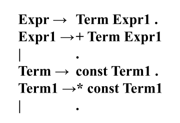
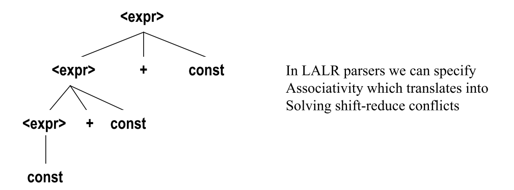

# Language Design and Control Structures

* Language Design Criteria
* Evaluation of expressions
* Explicit sequence control vs. structured sequence control
* Loop constructs
* Subprograms
* Parameter mechanisms

## Sequence Control

Implicit and explicit sequence control

* Expressions
    * Precedence rules
    * Associativity
* Statements
    * Sequence
    * Conditionals
    * Loop Constructs
    * Unstructured vs structured sequence control

### Expressions

* Operator evaluation order
* Operand evaluation order

Operators

* Most operators are infix or prefix
* Order of evaluation determined by operator precedence and associativity

 

The following grammar is ambiguous

The grammar can express operator precedence:

In LL(1)

Gives us:

Association can be expressed with grammar also:

### Statements

* Sequential
* Conditional
* Looping Construct

Must have all three to provide full power of a Computing Machine!

#### Sequential

* Skip
* Assignments
    * Most languages treats assignments as a basic operation
    * Some languages have derived assignment operators such as:
        * `+=` and `*=` in C
* I/O
    * Some languages treat I/O as basic operations
    * Others treat I/O as functions/methods
* Sequencing
    * `C;C`
* Blocks
    * `begin...end`, `{...}`, `let...in...end`

#### Conditional

* Single-way
    * `IF...THEN...`
    * Controlled by boolean expression
* Two-way
    * `IF...THEN...ELSE...`
    * Controlled by boolean expression
    * `IF...THEN` is usually treated as degenerate of `IF...THEN...ELSE...`
* Multi-way
    * `SWITCH`

#### Loops

* Counter-controlled iterators
    * `For-loops`
* Logical-iterators
* Iterations based on data structures
* Recursion

##### For-loops

Controlled by loop variable of scalar type with bounds and increment size.

##### Logic-Test

* While-loops
    * Test performed before entry
* `repeat...until` and `do...while`
    * Test performed at end
    * Always executed at least once

## Subprograms

1. A subprogram has a single entry point
2. The caller is suspended during execution of the called subprogram
3. Control always returns to the caller when the called subprogram's execution terminates

<u>Functions vs Procedures</u>

* **Procedures** provide user-defined **statements**
    * Abstractions over statements
* **Functions** provide user-defined **operators**
    * Abstraction over expressions
* **Methods** used for both functions and procedures

**Specification**:

* Name
* Signature
    * Number and types of input arguments, number and types of output results
* Actions
    * Direct function relating input values to output

## Tennent's Language Design Principles

**The Principle of Abstraction**

* All major syntactic categories should have abstractions defined over them.
    For example, functions are abstractions over expressions.

**The Principle of Correspondence**

* Declarations $\approx$ Parameters

**The Principle of Data Type Completeness**

* All data types should be first class without arbitrary restriction on their use

\- Originally defined by R.D.Tennent

### Abstraction

Nearly all programming languages support **process (or command) abstractions** with subprograms (procedures)

Many programming languages support **expression abstraction** with functions.

Nearly all programming languages designed since 1980 have supported **data abstraction**

* Abstract data types
* Objects
* Modules

