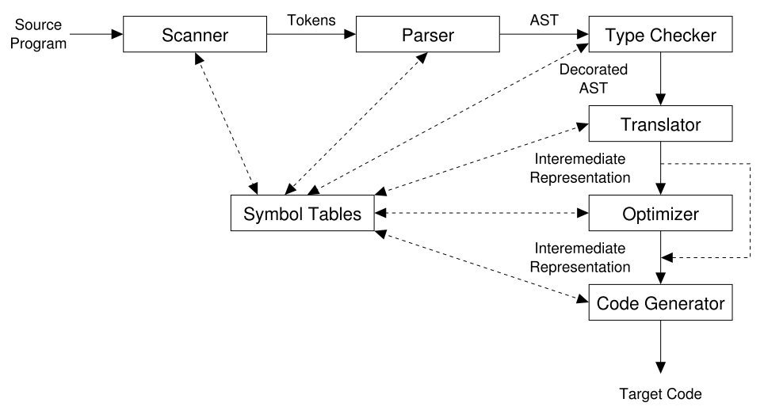

# Structure of the Compiler

* Describe the phases of the compiler and give an overall description of what the purpose of each phase is and how the phases interface
* Single pass vs. multi pass compiler
    * Issues in language design
    * Issues in code generation

## Phases of a Compiler

The different phases can be seen as different transformation steps to transform source code into object code.

The different phases correspond roughly to the different parts of the language specification:

* Syntax analysis $\Leftrightarrow$ Syntax

    * Lexical Analysis $\Leftrightarrow$ Regular Expressions

    * Parsing $\Leftrightarrow$ Context Free Grammar

        

* Contextual Analysis $\Leftrightarrow$ Contextual Constraints

    * Scope Checking $\Leftrightarrow$  Scope rules (static semantics)

    * Type Checking $\Leftrightarrow$ Type rules (static semantics)

        

* Code Generation $\Leftrightarrow$ Semantics (dynamic semantics)

## Organization of the Compiler

Næsten alle moderne compilere er **syntax-directed**.

* Compileringsprocessen er drevet af den syntaktiske struktur.

De fleste compilere laver et **AST** (abstract syntax tree).

### Scanner

**Scanneren** læser input texten, karakter efter karakter.

* Grupperer karakterer i **tokens**
    * Som eks. identifiers, integers, reserved words, delimiters.
* Eliminerer unødvendig information som comments.

Laver en stream a tokens.

Drevet af **regular expressions**

### Parser

**Parseren** er baseret på en formel syntax specifikation, så som CFG'er.

* Læser tokens og grupperer dem i phrases ifølge syntax specifikationen.
* Typisk drevet af tabeller lavet fra en CFG af en **parser generator**

Parseren verificerer korrekt syntax.

* Hvis en fejl findes laver den en fejlmeddelelse

Parsers genererer ofte et AST.

### Type Checker

Tjekker **static semantics** for hver AST node.

* The construct is legal and meaningful
* Variabler er deklareret, typer er korrekte osv.

Type checker **decorates** AST noden ved at tilføje type information.

Hvis en semantisk fejl findes, laves en fejlmeddelelse.

### Translator

Hvis en AST node er semantisk korrekt, kan den *translates* til IR kode.

I simple ikke-optimerende compilere, kan translatoren generere target code uden at bruge explicit IR.

* Gør retargeting mere besværligt.

### Symbol Tables

En **symbol table** er en mekanisme der bruges til at associere information med identifiers delt mellem compiler-phases.

* Bruges gennem type checking, men kan også bruges i andre faser.

### Optimizer

IR kode analyseres og laves til funktionel identisk men optimeret kode af **optimizeren**.

* Kan være kompleks og indeholde flere underfaser.

De fleste compilere lader dig slukke for optimizer.

Kan også gøres efter code generation.

* Eksempel: **peep-hole optimization**.
    * Undersøger kode få instruktioner af gangen.
    * Kan optimere ting som:
        * Eleminering af gange med 1 eller addition med 0.
        * Lad af værdi til register når værdi er i andet register.
        * Sekvens af instruktioner til single instruktion med samme effekt.

### Code Generator

Mapper IR code til target code.

* Kræver maskin specifik information
* Laver maskinspecifik optimering

Er normalt hand-coded da de er meget specifikke og komplekse.

## Example

!!! example
	As an example see the notes on the [ac language and compiler](../03b-the-ac-language-and-compiler.md)

