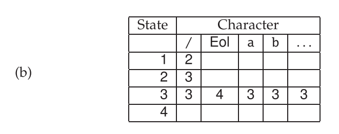
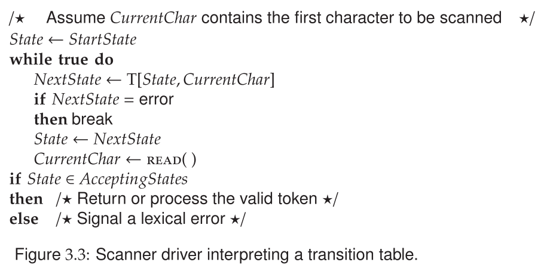

# Lexical Analysis

* Describe the role of the lexical analysis phase
* Describe how a scanner can be implemented by hand or auto-generated
* Describe regular expressions and finite automata


## The Scanner

The scanner is sometimes called **lexical analyzer** or **lexer**.


**Lexemes** are "words" in the input, for example keywords, operators, identifiers, literals, etc.

**Tokens:** a data structure for lexemes and additional information. 


### Lexical Elements

* Character set
    * ASCII vs Unicode
* Identifiers
* Operators
    * +, -, /, *, ...
* Keywords
    * `if, then, while`
* Noise words
* Elementary data
    * Numbers (integers, floats)
    * Strings
    * Symbols

* Delimiters
    * `begin...end` vs `{...}`

* Comments
    * `/*...*/` vs `#` vs `!` vs `//`
*  Whitespace
* Layout


### Lexemes

Can be detailed and subtle

* String constants:
    * Escape sequence: `\", \n, ...`
    * Null strings
* Rational constants:
    * $0.1, 10.01$
    * $.1,\ 10.,\ $ vs $1..10$

!!! tip "Rule of Thumb"
    If the lexem structure is complex then examine the language for design flaws!!


### Regular Expressions

Tokens can be "scanned" with regular expressions.

| Regular Expression | Meaning                                                      |
| ------------------ | ------------------------------------------------------------ |
| $\varepsilon$      | The empty string                                             |
| t                  | Generates only the string t                                  |
| X Y                | Generates any string xy such that x is generated by X and y is generated by Y |
| X \| Y             | Generates any string which generated either by X or by Y     |
| X*                 | The concatenation of zero or more strings generated by X     |
| (X)                | Parentheses are used for grouping                            |
| P+                 | **positive-closure**, strings consisting of one or more strings in P catenated together |

A **meta-character** is any punctuation char or regular expression operator. A meta-character must be quoted when used as an ordinary char to avoid ambiguity. 


#### Identifier Grammar to RE

Elimination of Left Recursion

```
N	::=	X | N Y 	=>		N	::= X Y*
```

Left factorization:

```
X Y | X Z			=>		X ( Y | Z )
```


### Regular Grammars

A grammar is regular if by substituting every nonterminal (except the root one) with its righthand side, you can reduce it down to a single production for the root, with only terminals and operators on the righthand side.

This grammar is regular:

```
Identifier	::=	Letter
			|	Identifier Letter
            |	Identifier Digit
```

Because it can be reduced to:

```
Identifier	::= Letter (Letter | Digit)*
```

Or rather

```
(a|b|c|...|z)((a|b|c|...|z) | (0|1|2|...|9))*
```

Called a regular expression often reduced to:

```
[a-z]([a-z]|[0-9])*
```


### Implementing

A DFA can be implemented with a transition table:




Can be coded in one of two forms:

1. **Table-driven**
    * The table is explicitly represented in a runtime table, interpreted by the program
    * Often used by **scanner generators**
    * Token independent
2. **Explicit control**
    * The table appears implicitly through the control logic of the program.


#### Pseudocode

The DFA from above implemented:

##### Table-driven



##### Explicit Control


#### Transducers

It is smart to associate a **semantic value** with the token, such as the value of an integer constant.
An FA that does this is called a **transducer**.


### Scanner Generator

The scanner is often generated by a tool, such as **Lex**


The tokens are specified in a **scanner specification** that is fed to the generator tool.


### Performance Considerations


