# Runtime Organization

* Data representation (direct vs. indirect)
* Storage allocation strategies: static vs. stack dynamic
* Activation records (sometimes called frames)
* Routines and Parameter passing

$$
\newcommand{\bits}{\text{ bits}}
\newcommand{\bit}{\text{ bit}}
\newcommand{\size}[1]{\text{size}[\mathtt{#1}]}
$$

## Data Representation

**Data representation:** how to represent values of the source language on the target machine.


Important properties of a representation schema

* **Non-confusion**
    * Different values of a given type should have different representations
* **Uniqueness**
    * Each value should always have the same representation


Important issues

* **Constant-size representation**
    * The representation of all values of a given type should occupy the same amount of space
* **Direct** vs **indirect** representation


### Indirect Representation

Why chose indirect representation?

* Make the representation "constant size" even if representation requires different amounts of memory for different values.

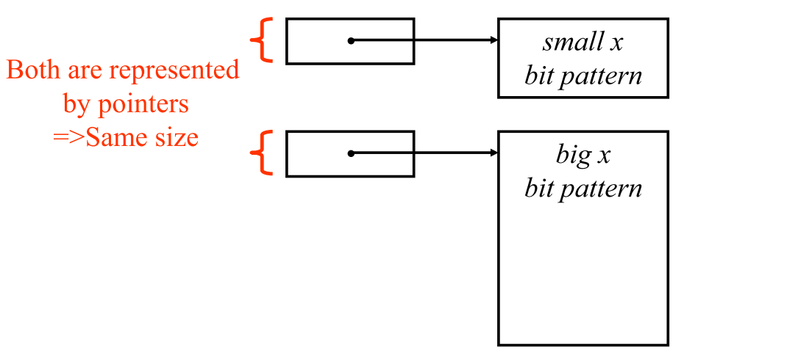

### Indirect vs Direct

* Direct representations are often preferable for efficiency
    * More **efficient access** (no need to follow pointers)
    * More **efficient "storage class"** (e.g stack- rather than heap allocation)
* For types with widely varying size of representations, it is almost **a must** to use indirect. 


### Notation

If $T$ is a type then:

* $\#[T]$ is the cardinality of the type (the number of possible values)
* $\text{size}[T]$ is the size of the representation (in number of bits/bytes)

In general: if $\#[T]=n$ then $\text{size}[T]=\log_2n \text{ bits}$


### Primitive Types

Types that cannot be decomposed into simpler types. For example:

* `integer`,`boolean`, `char` etc.


#### Boolean 

2 values: `true` and `false`

$\Rightarrow \#[\mathtt{boolean}]=2$

$\Rightarrow \text{size}[\mathtt{boolean}]=1 \text{ bit}$


Possible representations


#### Integer

Typically uses one word (16, 32 or 64 bits).

$\Rightarrow \#[\mathtt{integer}]=\leq 2^{16}=65536$

$\Rightarrow \text{size}[\mathtt{boolean}]=word\ (=16 \bits)$


Modern processors use two's complement representation of integers:


### Composite  Types

* Records
* Arrays
* Variant Records or Disjoint Unions
* Pointers or References
* (Objects)
* Functions


#### Records

Example: Triangle Record Representations

```pascal
type Date = record
	y : Integer,
	m : Integer,
	d : Integer
end;
type Details = record
	female 	: Boolean,
	dob		: Date,
	status	: Char
end;
var today 	: Date;
var my		: Details
```


$\Rightarrow \text{size}[\mathtt{Date}]= 3*\size{integer}=3\ words$ 

$\text{address}[\mathtt{today.y}]=\text{address}[\mathtt{today}]+0\\
\text{address}[\mathtt{today.m}]=\text{address}[\mathtt{today}]+1\\
\text{address}[\mathtt{today.d}]=\text{address}[\mathtt{today}]+2$

$\text{address}[\mathtt{my.dob.m}]=\text{address}[\mathtt{my.dob}]+1=\text{address}[\mathtt{my}]+2$


#### Disjoint Unions

Example: Pascal variant records

```pascal
type Number = record
	case discrete: Boolean of
		true: (i: Integer);
		false: (r: Real)
end;
var num: Number
```


Assuming $\size{Integer}=\size{Boolean}=1$ and $\size{Real}=2$ then

$\size{Number}=\size{Boolean}+ \max{(\size{Integer}, \size{Real})}=1+\max{(1,2)}=3$


### Arrays

Two kinds of arrays

* **Static** arrays: **size** is known at **compile time**
* **Dynamic** arrays: Number of elements is computed at run-time and sometimes may vary at run-time (Flex-arrays)

#### Static Arrays

```pascal
type Name = array 6 of Char;
var me: Name;
var names: array 2 of Name
```

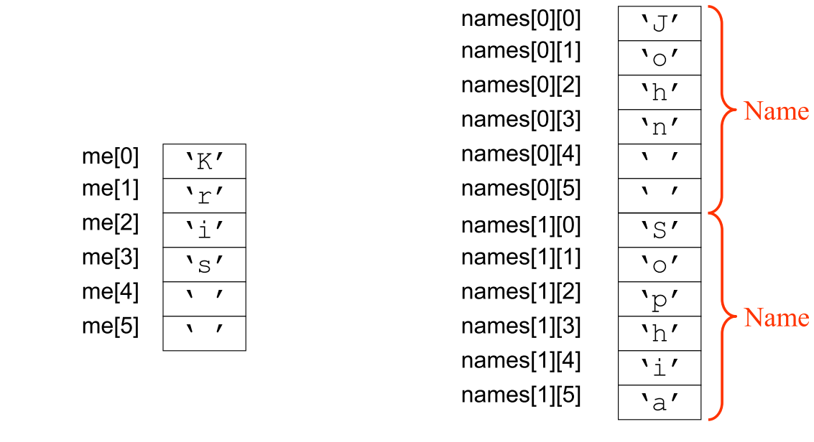

```pascal
type Coding = record
	Char c, Integer n
end
var code: array 3 of Coding
```


#### Dynamic Arrays

Example: Java arrays

```java hl_lines="4"
char[] buffer;
buffer = new char[buffersize];
...
for (int i = 0; i < buffer.length; i++) // can ask for size at run time
	buffer[i]= '';
```

```java
char[] buffer;
buffer = new char[7];
```

Possible representation:


Another possible representation:

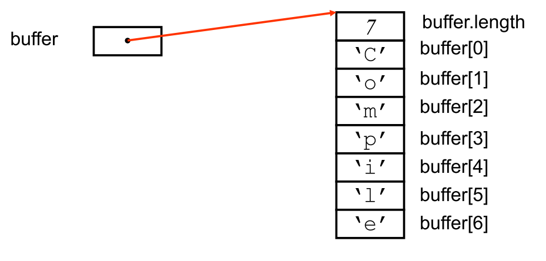


## Where to Put Data

3 methods

* Static allocation
* Stack allocation
* Heap allocation


### Static Allocation

Originally all data were global. All memory allocation was **static**.

Data was placed at a **fixed memory address** during compilation, for the entire execution of a program.

Static allocation can waste memory space.

* Fortran introduced `equivalent` statement that forces 2 variables to share memory location


In modern languages, static allocation is used for **global variables** and **literals (constants)** that are fixed in size and accessible throughout program execution.

Also used for **static** and **extern** variables in C/C++ and for **static fields** in C# and Java classes.


### Stack Allocation

Recursive languages require **dynamic** memory allocation. Each time a recursive method is called, a new copy of local variables (frame) is pushed on a runtime stack. The number of allocations is unknown at compile-time.

A **frame** (or activation record) contains space for all of the local variables in the method. When the method returns, its frame is popped and the space reclaimed.
Thus, only the methods that are actually executing are allocated memory space in the runtime stack. This is called **stack allocation**.

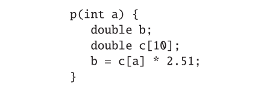

Frame for procedure `p`:

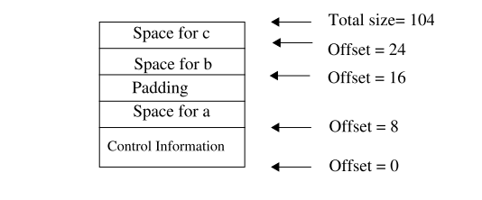

#### Stack Storage Allocation

Allocation of local variables

Example: When do the variables "exist"?:

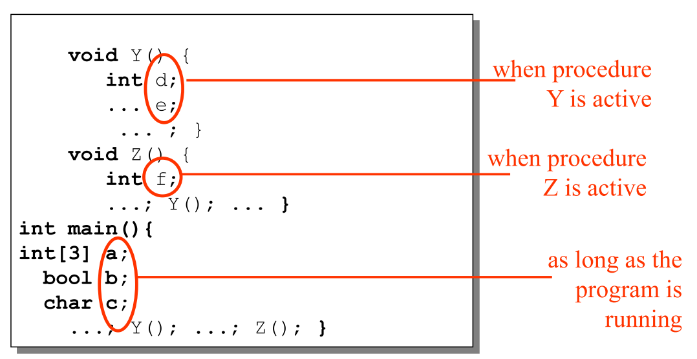


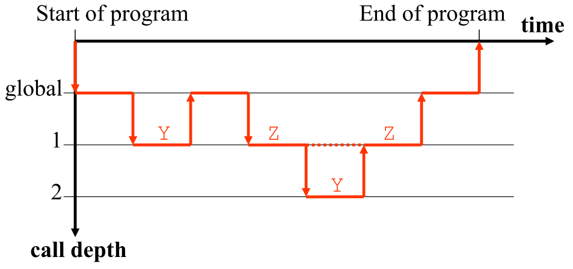


1. Procedure activation behaves like a stack (LIFO)
2. Local variables "live" as long as the procedure they are declared in.
3. $1+2\Rightarrow$ Allocation of locals on the "call stack" us a good model


#### Recursion

```java
int fact(int n) {
	if (n > 1) 	return n * fact (n-1);
	else 		return 1;
}
```

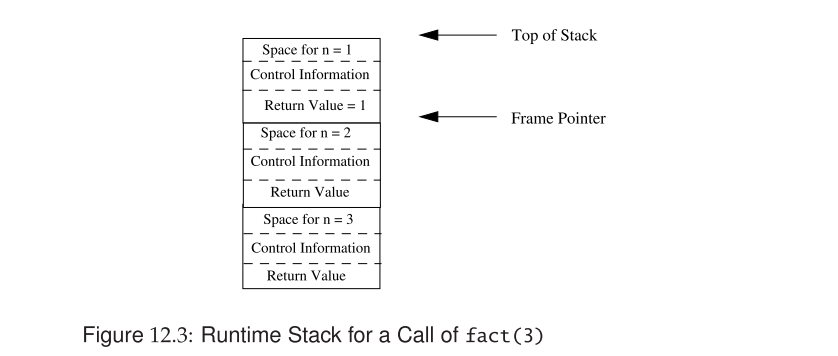

#### Dynamic Link

Stack frames may vary in size and because the stack may contain more than just frames (e.g. registers saved across calls), **dynamic link** is used to point to the preceding frame:

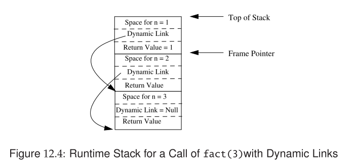


#### Nested Functions/Procedures

```java
int p(int a) {
	int q(int b) {
		if (b < 0) q (-b) else return a + b;
	}
	return q(-10);
}
```

Functions can nest in languages like Pascal, ML and Python. How to keep track of static block structure as above? 

A static link points to the frame of the method that statically encloses the current method:

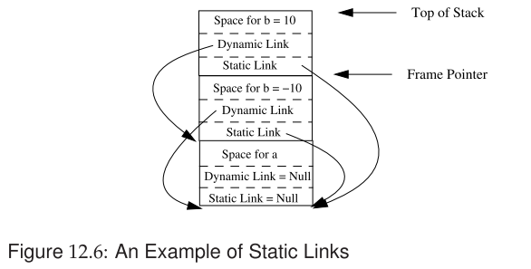

An alternative is the use of a display. We maintain a set of registers which comprise the display:

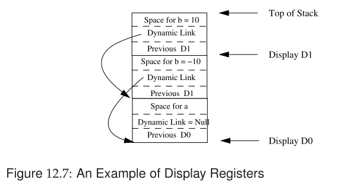

#### Blocks

```java
void p(int a) {
	int b;
	if (a > 0) 	{ float c, d; 	}
	else		{ int e[10];	}
}
```

We can view blocks as parameter-less procedures, and use procedure-level-frames to implement blocks.

* But because the then and else parts of the if statement above are mutually exclusive, variables in block 1 and 2 can overlay.
* This is called **block-level frame** as contrasted with **procedure level frame**


#### High-order Functions

Functions as values (first-class)

* Pass as arguments
* Return as values
* Stored into data structures

Implementation:

* A code pointer (a code address + an environment pointer)
    * Called a **closure**


### Heap Allocation

