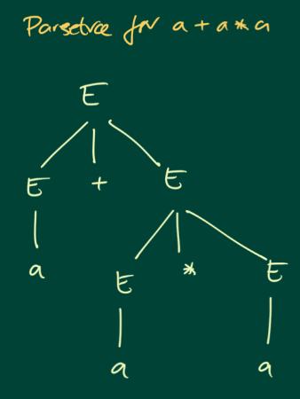
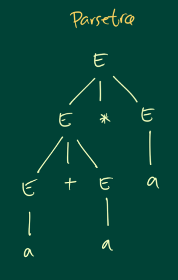
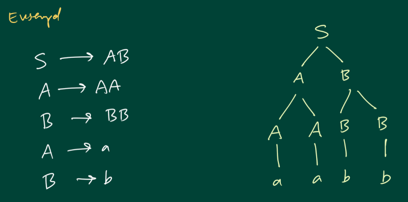

# Kontekstfrie Grammatikker

|                                                     | **Beskrive**                               | **Genkende**                                                 |
| --------------------------------------------------- | ------------------------------------------ | ------------------------------------------------------------ |
| **[Regulære  sprog](../SS/1a-regulære-sprog.md)** | [Regulære udtryk](../SS/3-regulære-udtryk.md) | [Endelige automater](../SS/1b-endelige-automater.md)  - [NFA](../SS/2-nondeterministiske-endelige-automater.md) og DFA (ækv.) |
| **Kontekstfrie  sprog**                        | <u>Kontekstfrie grammatikker</u>           | Pushdown-automater - NDPDA og DPDA (ikke ækv.)          |

 

## Kontekstfri Grammatik - CFG

**Definition**:

En **kontekstfri grammatik** er en 4-tupel
$$
(V,\Sigma,R,S)
$$

| Symbol   | Betydning                                       |
| -------- | ----------------------------------------------- |
| V        | Endelig mængde af variable (aka. nonterminaler) |
| $\Sigma$ | Endelig mængde af terminaler                    |
| R        | Endelig mængde af regler                        |
| S        | Startvariabel $S\in V$ (aka. startsymbol)       |

Regler i R er på formen:
$$
A \longrightarrow w, \quad w \in (V\cup\Sigma)^*
$$

### Eksempel

Sprog:
$$
L=\{a^nb^n | n \geq0\}
$$
CFG:
$$
\text{S} \longrightarrow \varepsilon \ |\  \text{aSb}
$$

​	svarer til:

$$
\begin{align*}
\text{S} &\longrightarrow \varepsilon \\
\text{S} &\longrightarrow \text{aSb}
\end{align*}
$$

#### Byggelse af en streng

Strengen *aaabbb*

$$
\begin{align*}
\text{S} &\Rightarrow \text{aSb} \\
& \Rightarrow \text{aaSbb} \\
& \Rightarrow \text{aaaSbbb} \\
& \Rightarrow \text{aaabbb}
\end{align*}
$$

## Derivition

**Definition:**

Lad G være en CFG hvor $G=(V,\Sigma,R,S)​$ 
og lad $u,v \in (V\cup\Sigma)^*​$

Hvis

$$
\begin{align*}
u&=u_1Au_2 \quad og \quad A\longrightarrow w \\
og \quad v &=u_1wu_2 
\end{align*}
$$

så skriver vi

$$
u \Rightarrow v
$$

​	u **deriverer** i et skridt til v
$$
u \Rightarrow^* v
$$

​	u **deriverer** i 0 eller flere et skridt til v

### Eksempel
Sprog

$$
L_2=\{w \in \{a,b\}^* \ | \ \text{w er et palindrom}\}
$$

​	Eksempler:
$$
aaa \in L_2 \quad abba \in L_2 \quad ab \notin L_2
$$
Regler:
$$
S \longrightarrow \varepsilon \ | \ a \ | \ b \ | \ aSa \ | \ bSb
$$
Derivation af *abba*
$$
S \Rightarrow aSa \Rightarrow abSba \Rightarrow abba
$$

## Kontekstfrie sprog

**Definition:**

Lad $G=(V,\Sigma,R,S)​$  være en CFG

Sproget defineret af G er

$$
L(G)=\{w\in\Sigma^* \ | \ S \Rightarrow^*w\}
$$

Et sprog L kalder vi **kontekstfrit** hvis
der findes en CFG G så $L=L(G)$

## Kontekstfrie sprog vs Regulære sprog

**<u>Sætning</u>**

Hvis M er en DFA, kan vi konstruere en CFG G så $L(G)=L(M)​$

**Eksempel:**

​	M:

Ide i konstruktion: Til hver tilstand svarer en variabel i vores CFG

$$
\begin{align*}
A_1 &\longrightarrow aA_1 \ | \ bA_2 \ | \ b\\ 
A_2 &\longrightarrow vA_2 \ | \ aA_1 \ | \ b \ | \ \varepsilon
\end{align*}
$$

**Generelt:**

Hvis $\delta(q,a)=q'$ lav reglen:

​	$A_q\longrightarrow aA_{q'}$ 	Hvis $q'\in F: \quad A_q\longrightarrow a$
​					Hvis $q\in F : \quad A_q\longrightarrow \varepsilon$

### Verdenskort (Venn diagram)

## Derivitionstræer / Parsetræer

Et parsetræ er en trærepræsentation af en derivition.

### Eksempel

Aritmetiske udtryk

$$
V=\{E\},\Sigma=\{+,*,a\} \\
E \longrightarrow E+E \ | \ E*E \ | \ a
$$

"a+a*a"

$$
E\Rightarrow E+E \Rightarrow a+E \Rightarrow a+E*E \Rightarrow a+a*E \Rightarrow a+a*a
$$

#### Parsetræ

### MEN

Kan også deriveres på en anden måde:

$$
E\Rightarrow E*E \Rightarrow E+E*E \Rightarrow a+E*E \Rightarrow a+a*E \Rightarrow a+a*a
$$

Grammatikken er **tvetydig** (ambigous).

Begge derivitioner er **venstrederivitioner**, 2 forskellige venstrederivitioner.

## Tvetydighed

**Definition**:

En CFG G er **tvetydig** hvis der findes en $w\in L(G)$ så $S\Rightarrow^*w$ med to (eller flere) forskellige **venstrederivitioner**

**Sætning:**

En CFG G er tvetydig hvis og kun hvis der findes en $w\in L(G)$ som har mindst to forskellige parsetræer.

### Indbygget Tvetydighed

Der findes kontekstfrie sprog L så **enhver** CFG G så $L(G)=L$ vil være tvetydig.

Den slags sprog kaldes **indbygget tvetydig**

### Bestem Tvetydighed

**Sætning**

Der findes **ikke** nogen algoritme, der altid kan fortælle os om en CFG er tvetydig.

(umulighedsresultat)

## Chomsky Normalform (CNF)

**Definition**

En CFG er på Chomsky-Normalform (CNF) hvis reglerne overholder:

* Eneste tilladte $\varepsilon$-regel er $S\longrightarrow\varepsilon​$
* Alle andre regler er på formerne:
    * $A\longrightarrow BC$
    * $A\longrightarrow a$
* S fremkommer ikke på nogen højreside

En CFG på CNF vil altid gøre at parstræer for strenge "næsten binære træer"

**Eksempel:**

**Sætning:**

For enhver CFG G kan vi konstruere en CFG G' på CNF så $L(G')=L(G)$

**Bevis (Algoritme):**

*Eksempel:*

$$
\begin{align*}
S &\longrightarrow aSSb \ | \ \varepsilon
\end{align*}
$$

**1)** (ny startvariabel)

Lav ny startvariabel $S_1$ og regel:

$$
S_1 \longrightarrow S
$$
*Eksempel:*

$$
\begin{align*}
S_1 &\longrightarrow S \\
S &\longrightarrow aSSb \ | \ \varepsilon
\end{align*}
$$

**2)** (fix $\epsilon$-regler)

Fjern reglerne $A \longrightarrow \varepsilon$ en ad gangen (epsilonregler) og

Tilføj nye regler hvor 0 eller flere forekomster af A er blevet fjernet.

*Eksempel:*

$$
\begin{align*}
S_1 &\longrightarrow S \\
S &\longrightarrow aSSb \ | \ \varepsilon\\
&\Downarrow \\
S_1 &\longrightarrow S \ | \ \varepsilon\\
S &\longrightarrow aSSb \ | \ aSb \ | \ ab\\
\end{align*}
$$

*Vi fjerner at S kan blive til epsilon. Dette betyder at alle steder hvor der står et S, skal vi kunne skrive epsilon*
$$
S \longrightarrow aSSb \ | \ aS \varepsilon b \ | \ a \varepsilon \varepsilon b\\
$$
**3)** (forlængelse af for korte regler)

For hver regel der sender én variabel over i én anden variabel ($A\longrightarrow B$): fjern reglen og erstat med $A\longrightarrow w$ for hver regel $B\longrightarrow w$ (der skriver B om til w)

*Eksempel:*

$$
\begin{align*}
S_1 &\longrightarrow S \ | \ \varepsilon\\
S &\longrightarrow aSSb \ | \ aSb \ | \ ab\\
&\Downarrow \\
S_1 &\longrightarrow aSSb \ | \ aSb \ | \ ab \ | \ \varepsilon\\
S &\longrightarrow aSSb \ | \ aSb \ | \ ab
\end{align*}
$$

**4)** (forkortelse af for lange regler)

For hver regel $A\longrightarrow u_1u_2...u_k,\quad k>2$ ($u_i$ kan være variabler eller terminaler),
lav nye regler og nye variabler.

$$
\begin{align*}
A &\longrightarrow u_1W_1 \\
W_1 &\longrightarrow u_2W_2 \\
&\quad \vdots \\
W_{k-2} &\longrightarrow u_{k-1}u_k
\end{align*}
$$

*Eksempel:*

$$
\begin{align*}
S_1 &\longrightarrow aSSb \ | \ aSb \ | \ ab \ | \ \varepsilon\\
S &\longrightarrow aSSb \ | \ aSb \ | \ ab \\
&\;\Downarrow \\
S_1 &\longrightarrow aU_1 \ | \ aU_3 \ | \ ab \ | \ \varepsilon \\
U_1 &\longrightarrow SU_2 \\
U_2 &\longrightarrow Sb \\
U_3 &\longrightarrow Sb \\
S &\longrightarrow aU_4 \ | \ aU_6 \ | \ ab \ \\
U_4 &\longrightarrow SU_5 \\
U_5 &\longrightarrow Sb \\
U_6 &\longrightarrow Sb \\
\end{align*}
$$

**5)**

For hver terminal a som ikke er alene på en højreside: lav ny regel $U_a$

$$
U_a\longrightarrow a
$$

*Eksempel:*

$$
\begin{align*}
S_1 &\longrightarrow aU_1 \ | \ aU_3 \ | \ ab \ | \ \varepsilon \\
U_1 &\longrightarrow SU_2 \\
U_2 &\longrightarrow Sb \\
U_3 &\longrightarrow Sb \\
S &\longrightarrow aU_4 \ | \ aU_6 \ | \ ab \ \\
U_4 &\longrightarrow SU_5 \\
U_5 &\longrightarrow Sb \\
U_6 &\longrightarrow Sb \\
&\;\Downarrow \\
S_1 &\longrightarrow U_aU_1 \ | \ U_aU_3 \ | \ U_AU_b \ | \ \varepsilon \\
U_a &\longrightarrow a \\
U_b &\longrightarrow b \\
U_1 &\longrightarrow SU_2 \\
U_2 &\longrightarrow SU_b \\
U_3 &\longrightarrow SU_b \\
S &\longrightarrow U_aU_4 \ | \ U_aU_6 \ | \ U_aU_b \ \\
U_4 &\longrightarrow SU_5 \\
U_5 &\longrightarrow SU_b \\
U_6 &\longrightarrow SU_b \\
\end{align*}
$$

