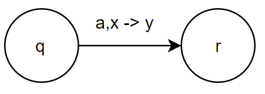
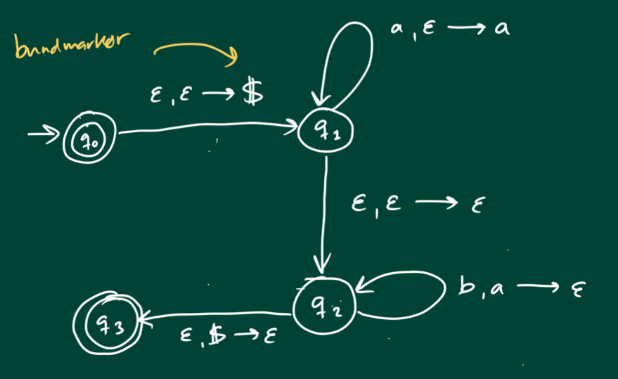

# Pushdown Automater

> PDA = en automat med en stak

!!! warn "Udvid noter"
    indsæt information om overføringsfunktion fra SS6 afsnit 2 [https://www.youtube.com/watch?v=KUZwifJbGxE&list=PLA8H0-CuqhGGH6lTKmcgzzmK7kkwX75rF&index=2](https://www.youtube.com/watch?v=KUZwifJbGxE&list=PLA8H0-CuqhGGH6lTKmcgzzmK7kkwX75rF&index=2)

**Definition**

En pushdown-automat (PDA) er en 6-tupel
$$
(Q,\Sigma, \Gamma, q_0, \delta, F)
$$

| Symbol   | Betydning                      |
| -------- | ------------------------------ |
| Q        | Mængde af tilstande            |
| $\Sigma$ | Input alfabet                  |
| $\Gamma$ | Stak alfabet                   |
| $q_0$    | Starttilstand $q_0 \in Q$      |
| $\delta$ | Overførselsfunktion            |
| F        | Accepttilstande $F\subseteq Q$ |

$$
\delta:\quad Q \times \Sigma_{\varepsilon} \times \Gamma_{\varepsilon} \longrightarrow \mathcal{P}(Q \times \Gamma_{\varepsilon})
$$

## PDA Som en Orienteret Graf

**Betyder:**

Når PDA'en er i tilstand *q* og ser *a* som næste input tegn og *x* er øverst på stakken, så skift til tilstand *r* og erstat *x* med *y*.
$$
(r,y)\in\delta(q,a,x)
$$

## Eksempel

$$
L=\{a^nb^n\ | \ n\geq 0\}
$$

$ bruges som bundmarkør i stakken.

Inputstreng: *aabb*

Stakindhold:

## Sprog Accepteret af PDA

Lad $M=(Q,\Sigma, \Gamma, q_0, \delta, F)$ være en PDA

Lad $w\in\Sigma^*$, hvor $w=u_1...u_k$, hvor $u_i\in\Sigma_{\varepsilon} \quad (1\leq i\leq k)$

**M accepterer w** hvis:

1. Der findes en følge af tilstande $r_0...r_k$

2. Der findes en følge af stakindhold $s_0...s_k$

    $(s_i\in\Gamma^* \ \text{for} \ 0\leq i \leq k)$

    

    Der gælder om (1) og (2) at:

    * $r_0=q_0,\quad s_0=\varepsilon$
    * $\text{for alle}\ 0\leq i \leq k$ gælder:

    $$
    \begin{align*} 
    && s_i &=a_iS_i' \\
    (r_{i+1}&,a_{i+1}) \in \delta(r_i,u_{i+1},a_i) & s_{i+1} &=a_{i+1}S_i'
    \end{align*}
    $$

    

    * $r_k\in F$

## Eksempel 2-3

!!! warn "Udvid noter"
    indsæt eksempler fra SS6 afsnit 4 [https://www.youtube.com/watch?v=eBgtVhYUf50&list=PLA8H0-CuqhGGH6lTKmcgzzmK7kkwX75rF&index=4]

## Lav Pushdown Automat ud fra CFG

1. Placer markersymbol $, og startvariablen på stakken.
2. Gentag forevigt:
    1. Hvis toppen af stakken er en variabel A, nondeterministisk vælg en af reglerne for A og substituer A med strengen på højre side af reglen.
    2. Hvis toppen af stakken er en terminal a, læs næste symbol fra input og sammenlign med a. Hvis de matcher, gentag. Hvis de ikke matcher, afvis på denne gren.
    3. Hvis toppen af stakken er $, gå ind i accept tilstand.

