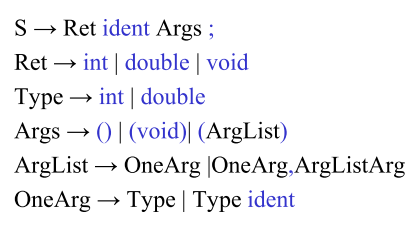
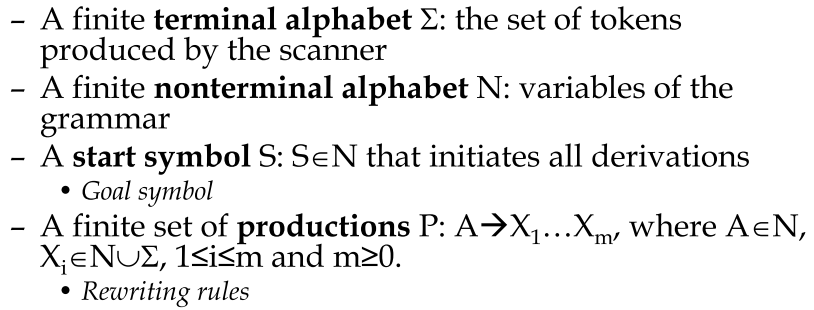
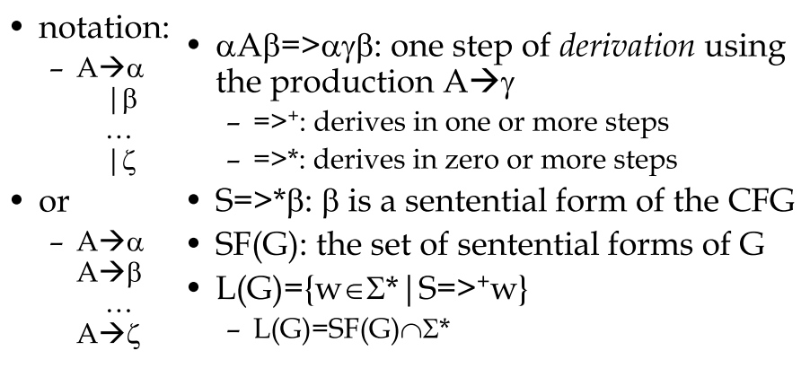
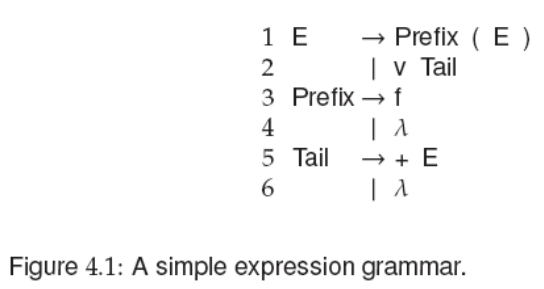
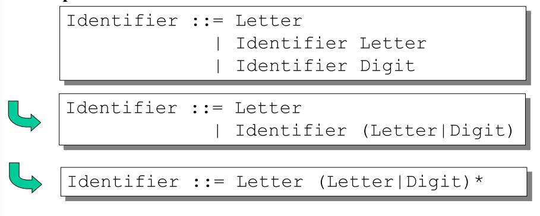

# Context Free Grammar (CFG)

* A finite set of **terminal symbols**
* A finite set of **non-terminal symbols**
* A **start symbol**
* A finite set of **production rules**

## How to Design a Grammar

Lets write a CFG for C-style function prototypes.

**Examples**

- `void myf1(int x, double y);`
- `int myf2();`
- `int myf3(double z);`
- `double myf4(int, int w, int);`
- `void myf5(void);`

### One Possible Grammar

#### Examples

### Another Possible Grammar

#### Examples

## Definition

**Components: ** $G=(N,\Sigma,P,S)$

**Vocabulary** $V=N\cup \Sigma​$

* $N \cap \Sigma = \phi​$

## Derivation

### Leftmost Derivation

A derivation that always chooses the leftmost possible nonterminal at each step.

#### Example

##### Derivation

`f ( v + v )`

### Rightmost Derivation

The rightmost possible terminal is always expanded

### Parse Trees

A graphical representation of a derivation

* Root: start symbol S
* Each node: either grammar symbol or $\lambda$ or $\varepsilon​$ 
* Interior nodes: nonterminals
  * An interior node and its children: production

#### Example

## BNF Form

Backus-Naur Form (BNF)

* Formal grammar for expressing CFG

Single Grammar rule format

* Non-terminal -> zero or more grammar symbols

### Extended BNF (EBNF)

EBNF can be rewritten to BNF

**Example:**

​	`expression -> term (+ term)*`

Rewritten to:

​	`expression -> term term_tmp`

​	`term_tmp -> + term term_tmp`

​			`| \lambda`

#### Algorithm to rewrite

## Properties of grammars

A non-terminal N is **left-recursive** if starting with at sentential form N, we can produce another sentential form starting with N

​	expression -> expression '+' factor | factor

Right-recursion also exists, is less important

​	expression -> term '+' expression

## Grammar Transformations

We can rewrite the rules without changing the output of the rules.

This can create less readable code grammars.

### **Left factorization**

**Example:**

### Elimintaion of Left Recursion

**Example:**

### Substitution

## Dangling Else Problem

Slide 31-34

​	

# From tokens to parse trees

The process of finding the structure in the flat stream of tokens is called **parsing**, and the mudule that performs this task is called **parser**.

​	slide 38

Example parsing of Micro english

​	slide 39

* Topdown parsers
  * slide 40
  * correspond to a left derivation​
    * slide 41
* Right derivations
  * slide 43
  * corresponds to growing the tree from below
    * bottom up parsing -> rightmost derivation in reverse
    * slide 44

* Top-down vs bottom up
  * slide 45
  * 

## Hierachy

LL(1) formal defintion

* slide 47

Properties of the grammar that determines if it is LL(1) or not.

* First sets
  * slide 48
  * algorithm on slide 49
* Follow Sets
  * Slide 50-51
  * algorithm on slide 52

Provable facts about LL(1) grammars

* slide 53

LR Grammars

* slide 55
* No properties to detect if LR
  * it is LR if you can build an build an LR parser for it.

Other types of grammars

* slide 56
* Parsing expression grammars can not be ambigous
  * relatively new, (about 2003), not in the books.

What can you do in your project

* slide 57
* some tools

Designing CFGs

* slide 58

