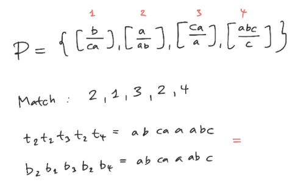
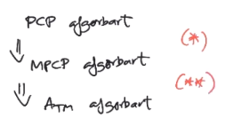
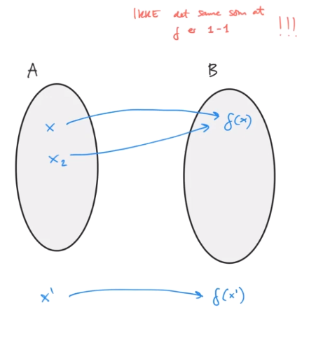
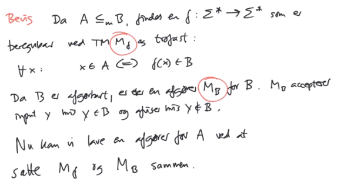
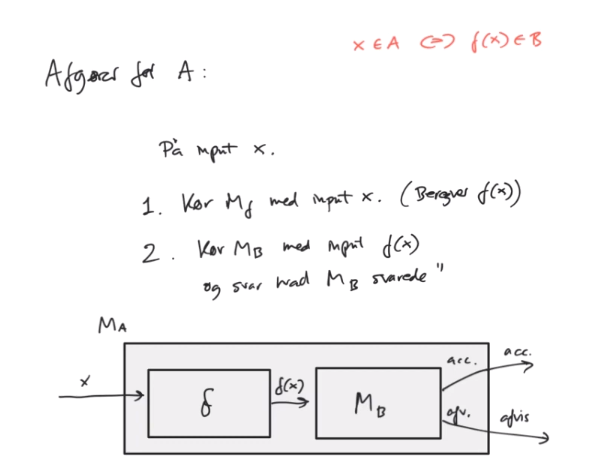
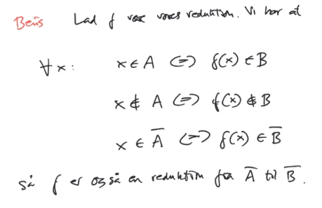

# Posts Korrospondanceproblem ; Teorien for Reduktioner

## Posts Korrespondanceproblem

En samling af Post-brikker over alfabetet $\Sigma$ er en endelig mængde af par:

$$
P=\left\{ \left[\frac{t_1}{b_1}\right],\dots,\left[\frac{t_k}{b_k}\right]\right\}
$$

hvor $\quad t_i,b_i\in \Sigma^*, \quad (1\leq i \leq k)$

En **match** for $P$ er en følge af indekser $i_1,\dots,i_n$ så $t_{i_1},\dots,t_{i_n} = b_{i_1},\dots,b_{i_n}$

​	(Samme indeks må bruges 0 eller flere gange)

**Eksempel**:

Generalt: Hvis $P$ har én match, så har $P$ uendeligt mange matches.

Da brikker må bruges 0 eller flere gange er der et <u>uendeligt</u> stort søgerum.

### Problemet

Givet en samling Post-brikker $P$, har $P$ en match?

$$
PCP= \biggl\{ 
\ \mathrel{\Big|}  \begin{array}{} P \text{ er en samling Post-brikker. }\\ P \text{ har en match} \end{array} \biggr\}
$$

$PCP$ er uafgørbart.

#### Bevis

Reduktion.

To skridt:

* $A_{TM} \leadsto MPCP (\textcolor{red}{**})$

$$
MPCP= \biggl\{ 
\ \mathrel{\Big|}  \begin{array}{} P \text{ er en samling Post-brikker. }\\ P \text{ har en match, der starter med brik 1} \end{array} \biggr\}
$$

* $MPCP \leadsto PCP (\textcolor{red}{*})$ 

[Bevis del 1](https://www.youtube.com/watch?v=4X_OApgoOao&list=PLA8H0-CuqhGFapCct-IfVWytYjc3vzbYH&index=3)

[Bevis del 2](https://www.youtube.com/watch?v=u6GXQclhGgo&list=PLA8H0-CuqhGFapCct-IfVWytYjc3vzbYH&index=4)

## Reduktion

Oversættelse mellem sprog

* Skal være trofast
* Skal være beregnbar

**Beregnbar** 

Lad $f: \Sigma^* \to \Sigma^*$

$f$ er en **beregnbar** hvis der findes en TM $M_f$

så at når $f(x)=y$, så vil $M_f$ med input x standse med y på båndet.

**Trofast**

Lad $A, B$ være sprog over alfabet $\Sigma$

​	$f: \Sigma^* \to \Sigma^*$

er trofast hvis for alle $x\in\Sigma^*$

​	$x \in A\Longleftrightarrow f(x)\in B$

**Reduktion**

Lad $A, B$ være sprog over alfabet $\Sigma$

Vi siger at $A$ reducerer til $B$,      $A\leq_m B$,

hvis der findes en $f: \Sigma^* \to \Sigma^*$ som er beregnbar og trofast mht. $A$ og $B$

Tænk på $\leq_m$ som "**ikke sværerer end**"

### Afgørbarhed

**Sætning**

Hvis $A \leq_m B$ og $B$ er afgørbart, så er $A$ også afgørbart.

**Korollar**

Hvis $A \leq_m B$ og $A$ er uafgørbar, så er $B$ også uafgørbar

### Genkendelighed

**Sætning**

Hvis $A \leq_m B$ og $B$ er genkendeligt, så er $A$ også genkendeligt.

**Korollar**

Hvis $A\leq_m B$ og $A$ er u-genkendeligt, sså er $B$ heller ikke genkendeligt

### Komplement

**Sætning**

Hvis $A\leq_m B$, så $ \overline A \leq_m \overline B$

