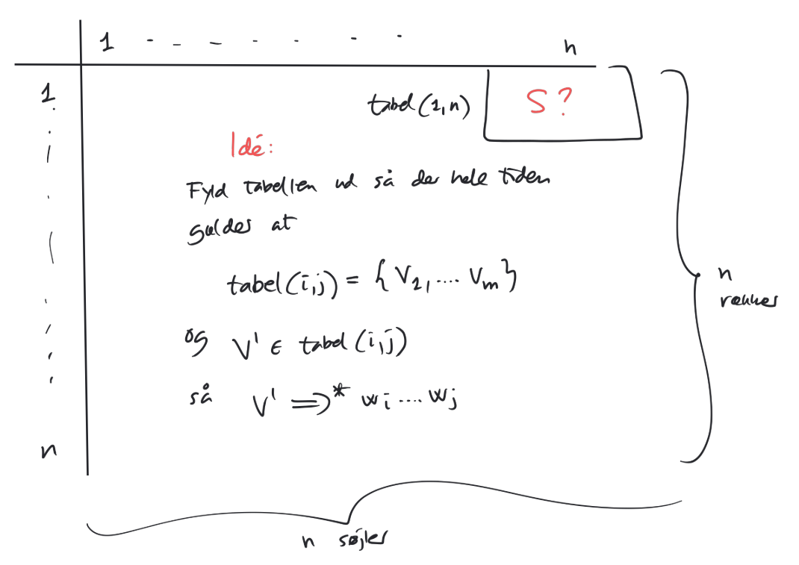
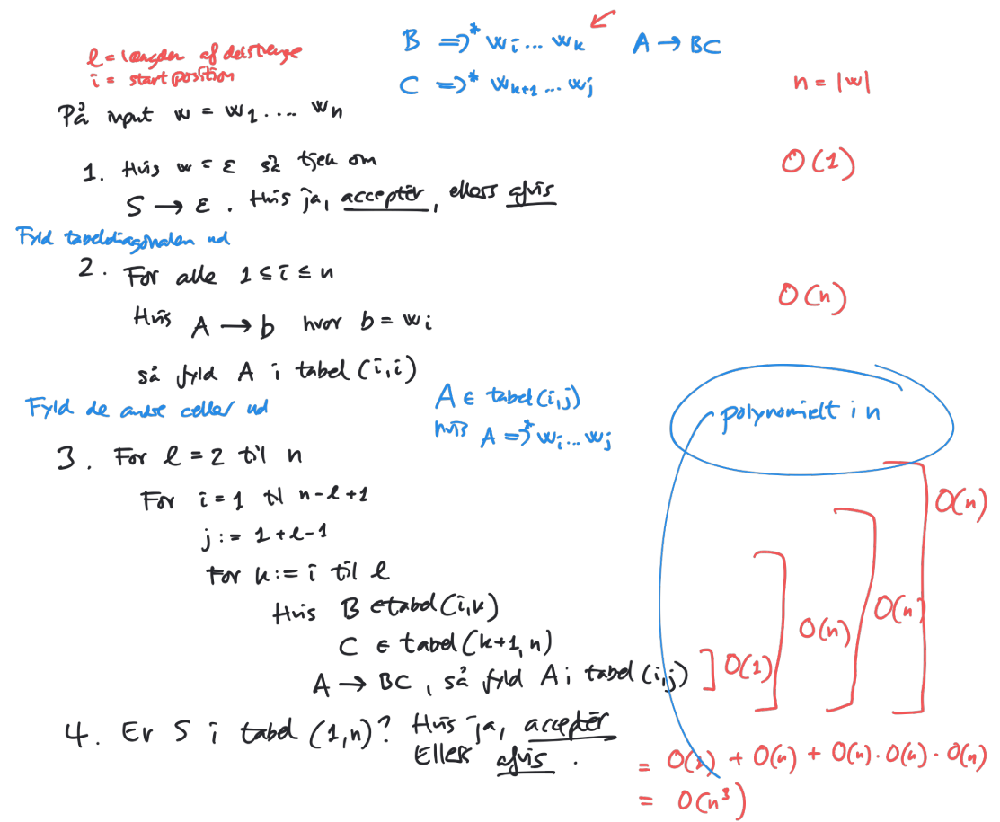

# Tidskompleksitet

**Definition (worst-case)**

Lad $M$ være en TM, der standser for ethvert input.

**Tidskompleksiteten af $M$** er en funktion
$$
t_M:\N\to\N
$$

så 

​	$t_M(n)=k$ 

​	hvis $M$ på et vilkårligt input af længde n højst bruger k skridt.

Sammelign vækstrater med [O-notation](..\..\3-semester\AD1\extra1-big-o-cheat-sheet.md)

## Kompleksitetsklasser

**Kompleksitetsklasse**

$=$

famillie af sprog, der alle kan afgøres med afgører med bestemt tidskompleksitet.

**Definition**

Lad $f: \N \to \R_+$

Så er $TIME(f(n))$ familien af sprog givet ved:

$$
TIME(f(n))=\left\{ L\ \mid \begin{array}\  L \text{ kan afgøres af en TM M, }\\
\text{der har tidskompleksitet } O(f(n) \end{array} \right\}
$$

## Antallet af Bånd på TM

Hvad betyder antallet af bånd på en TM for tidskompleksiteten?

**Sætning**

Lad M være en k-bånds-TM med tidskompleksiteten $t(n)\geq n$.

Så kan vi simulere M på en 1-bånds TM med tidskompleksitet $t^2(n)$ (kvadratisk langsommere)

​	Afhængig ikke af antal bånd!

## Tidskompleksitet i Nondeterminisme

**Definition**

Lad $M$ være en NTM der altid standser for ethvert input.

$M$ har tidskompleksitet $t: \N\to\N$ hvis det for enhver beregning på et vilkårligt input af længde n gælder at $M$ højst bruger $t(n)$

**Sætning**

Lad $M$ være en NTM med tidskompleksitet $t(n)$.

Så kan $M$ simuleres af en DTM med tidskompleksitet $2^{O(t(n))}$ (eksponentielt meget værre)

## Tidsklassen P

**Definition**

$$
P=\bigcup_{k\geq 0} TIME(n^k)\\
$$

$$
P=\{L\mid L \text{ kan afgøres af en DTM med tidskompleksitet } O(n^k), k\geq0\}
$$

---

$PATH \in P$

### Kontekstfrie Sprog

**Sætning**

Alle kontekstfrie sprog er i $P$

**Bevis**

En snedig algoritme, der givet en CFG G på [Chomsky-normalform](../../4-semester/SS/05-kontekstfrie-grammatikker.md#chomsky-normalform-cnf) kan afgøre om et $w\in L(G)$

Tidskompleksitet er $O(n^3),\quad (n=|w|)$

Kaldes **CYK-algoritmen**

- Eksempel på dynamisk programmering

#### Bevis

$$
w=w_1,\dots,w_n\quad(|w|=n) \nonumber
$$

