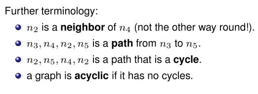
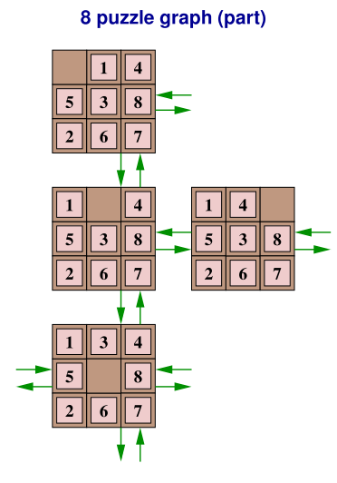
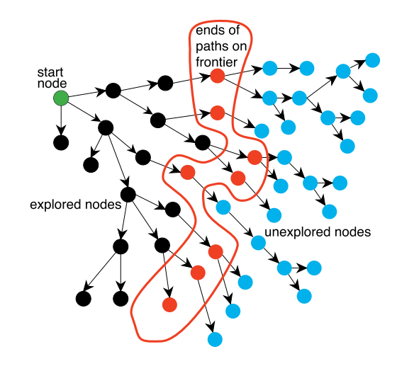

# Problem Solving as Search

## Problem Description

We consider problems where an agent

* has a state-based representation of its environment
* can observe with certainty which state it is in
* has a certain goal it wants to achieve
* can execute actions that have definite effects (no uncertainty)

Agent needs to find a sequence of actions leading to a **goal state**

* A state in which its goal is achieved

### Example

Problem: re-arange tiles into goal configuration

* 362.880 states ($9!$)
* Actions: *move_* *up/down/left/right*

## State-Space Problem

Consists of:

* A set of states
* A subset of **start states**
* A set of actions (not all available at all states)
* An **action function** that for a given state $s$ and action $a$ returns the state reached when executing $a$ in $s$
* A **goal test** that for any state $s$ returns the boolean value $goal(s)$ (true if $s$ is a goal state)
* (Optional) A **cost function** on actions
* (Optional) A **value function** on goal states

A **Solution** consists of:

* For any given start state, a sequence of actions that lead to a goal state 
* (optional) a sequence of actions with minimal cost 
* (optional) a sequence of actions leading to a goal state with maximal value

## Graphs

Se [AD1 - Graph Theory](..\..\3-semester\AD1\10a-graph-theory.md)

A **directed graph** consists of

* A set of nodes
* A set of arcs (ordered in pairs of nodes)

### Example

* Nodes: states
* Arcs: possible state-transitions from actions (can be labeled with actions)

!!! note
    Slide 11: Extra example

## Graph Search

A state-space problem can be solved by searching in the state-space graph  for paths from start states to a goal state

* Does not require the whole graph at once
    * Search may only locally generate neighbors of currently visited node

### From Graph to Search Tree

* Search tree represents how we can navigate the state-space graph

* Red nodes are nodes that we can explore from where we are now

### Iterative Deepening Search

**Goal:**

* Termination guarantee of breadth-first seach
* Space efficiency of depth-first search

**Algorithm**

Set a $k$-value, do depth-first search till $k$ layers deep.

Increase $k$, repeat

**Properties**:

* Has desired termination and space efficiency properties
* Duplicates computations (depth-bounded search $k$ repeats computations of depth-bounded search $k-1$). 
    * Not as problematic as it looks: constant overhead of ($b/(b-1)$)

### Uninformed Search

* Depth-first, Breadth-first and Iterative deepening are **uninformed** search strategies:
    * They do not assume/use any knowledge of the search space exept the pure graph structure.

### Informed Search

 