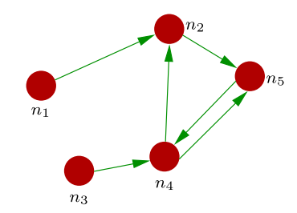

# Problem Solving as Search

Extra knowledge beyond the search space is called **heuristic knowledge**

## Problem Description

We consider problems where an agent

* has a state-based representation of its environment
* can observe with certainty which state it is in
* has a certain goal it wants to achieve
* can execute actions that have definite effects (no uncertainty)

Agent needs to find a sequence of actions leading to a **goal state**

* A state in which its goal is achieved

### Example

Problem: re-arange tiles into goal configuration

* 362.880 states ($9!$)
* Actions: *move_* *up/down/left/right*

## State-Space Problem

Consists of:

* A set of states
* A subset of **start states**
* A set of actions (not all available at all states)
* An **action function** that for a given state $s$ and action $a$ returns the state reached when executing $a$ in $s$
* A **goal test** that for any state $s$ returns the boolean value $goal(s)$ (true if $s$ is a goal state)
* (Optional) A **cost function** on actions
* (Optional) A **value function** on goal states

A **Solution** consists of:

* For any given start state, a sequence of actions that lead to a goal state 
* (optional) a sequence of actions with minimal cost 
* (optional) a sequence of actions leading to a goal state with maximal value

## Graphs

Se [AD1 - Graph Theory](../../3-semester/AD1/10a-graph-theory.md)

Se [PM, 3.3.1: Formalizing Graph Searching](https://artint.info/2e/html/ArtInt2e.Ch3.S3.SS1.html)

A **directed graph** consists of

* A set of nodes
* A set of arcs (ordered in pairs of nodes)

### Example

* Nodes: states
* Arcs: possible state-transitions from actions (can be labeled with actions)

!!! note
    Slide 11: Extra example

## Graph Search

A state-space problem can be solved by searching in the state-space graph  for paths from start states to a goal state

* Does not require the whole graph at once
    * Search may only locally generate neighbors of currently visited node

### From Graph to Search Tree

* Search tree represents how we can navigate the state-space graph

* Red nodes are nodes that we can explore from where we are now (**frontier** or **fringe**)

[Generic Search Algorithm](https://artint.info/2e/html/ArtInt2e.Ch3.S4.html#Ch3.F4)

### Iterative Deepening Search

**Goal:**

* Termination guarantee of breadth-first seach
* Space efficiency of depth-first search

**Algorithm**

Set a $k$-value, do depth-first search till $k$ layers deep.

Increase $k$, repeat

**Properties**:

* Has desired termination and space efficiency properties
* Duplicates computations (depth-bounded search $k$ repeats computations of depth-bounded search $k-1$). 
    * Not as problematic as it looks: constant overhead of ($b/(b-1)$)

### Uninformed Search

[3.5 Uninformed Search Strategies](https://artint.info/2e/html/ArtInt2e.Ch3.S5.html)

* Depth-first, Breadth-first and Iterative deepening are **uninformed** search strategies:
    * They do not assume/use any knowledge of the search space exept the pure graph structure.

### Informed Search

A **[heuristic function](https://artint.info/2e/html/ArtInt2e.Ch3.S6.html) $h(n)$** takes a node $n$ and returns a non-negative real number.

* This number is an estimate of the cost of the least-cost path from node $n$ to a goal node.

 $h(n)$ is an **admissible heuristic** if $h(n)$ is always less than or equal to the actual cost.

An example could be that $h(n)$ could be the cost if we could move through walls.

Simple use of heuristic function is **heuristic depth-first search**.

* Selects the locally best path, but explores all paths from that before it selects another path.
* Often used, but suffers the problems of depth-first search.

Another use is **greedy best-first search**

* Always select a path on the frontier with the lowest heuristic value.
* Sometimes work well, but sometimes uses paths that looks promising in the beginning.

#### Example

"*Consider the graph shown in* [Figure 3.9](https://artint.info/2e/html/ArtInt2e.Ch3.S6.html#Ch3.F9)*, drawn to scale, where the cost of an arc is its length. The aim is to find the shortest path from* ss *to* gg*. Suppose the Euclidean straight line distance to the goal* $g$ *is used as the heuristic function. A heuristic depth-first search will select the node below* ss *and will never terminate. Similarly, because all of the nodes below* ss *look good, a greedy best-first search will cycle between them, never trying an alternate route from* $g$*.*"

#### A* Search

[3.6.1 A* Search](https://artint.info/2e/html/ArtInt2e.Ch3.S6.SS1.html)

Uses both path cost (as lowest-cost-first), and heuristic information (as greedy best-first search).

* For each path on the frontier, A* uses an estimate of the total path cost from the start node to a goal node constrained to follow that path initially.
* Uses $cost(p)$, the cost of the path found
* As well as $h(p)$, the estimated cost from the end of $p$ to the goal.

For any path $p$ on the frontier, define:
$$
f(p)=cost(p)+h(p)
$$
This is an estimate of the total path cost to follow path $p$ then go to a goal node.

* If $n$ is the node at the end of path $p$, this can be depicted as:

$$
\underbrace{\underbrace{\text{start}\ \underrightarrow{\text{actual}}}_{cost(p)} \ n\ \underbrace{\underrightarrow{\text{estimate}} \ \text{goal}}_{h(p)}}_{f(p)}
$$

If $h(n)$ is an admissible heuristic, and so never overestimates the cost from node $n$ to a goal node, then $f(p)$ does not overestimate the path cost of going from the start node to a goal node via $p$

$A^*$ is implemented using the [Generic search algorithm](https://artint.info/2e/html/ArtInt2e.Ch3.S4.html#Ch3.F4), treating the frontier as a priority queue ordered by $f(p)$

[Example 3.15](https://artint.info/2e/html/ArtInt2e.Ch3.S6.SS1.html#Ch3.Thmciexamplered15)

#### Admissible

A search algorithm is **admissible** if, whenever a solution exists, it returns an optimal solution.

##### A* Admissiblity

[Proposition 3.1](https://artint.info/2e/html/ArtInt2e.Ch3.S6.SS1.html#Ch3.Thmtheorem1)

If there is a solution, $A*$ using heuristic function $h$ always returns an optimal solution if:

* The branching factor is finite (each node has a bounded number of neighbors)
* All arc costs are greater than some $\epsilon > 0$
* $h$ is an admissible heuristic, meaning that $h(n)$ is less than or equal to the actual cost of the lowest-cost path from node $n$ to a goal node.

See link for proof.

### Pruning the Search Space

[3.7.1 Cycle Pruning](https://artint.info/2e/html/ArtInt2e.Ch3.S7.SS1.html)

