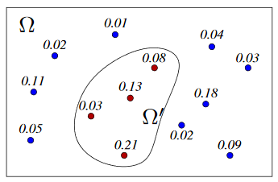
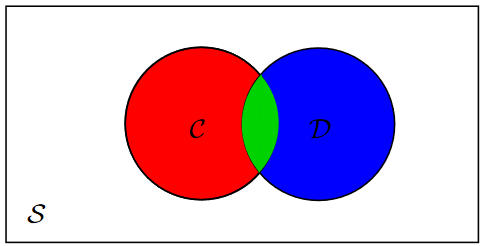
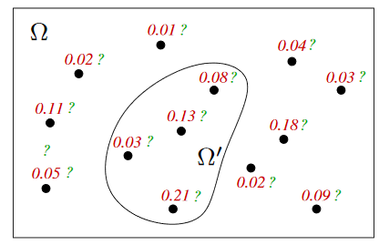
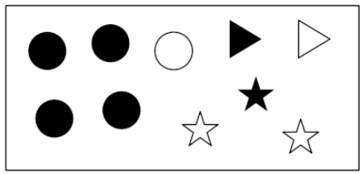

# Reasoning Under Uncertainty

**Epistemological**

* Pertaining to an agent’s beliefs of the world

**Ontological**

* How the world is.

## Semantics of Probability

Probability theory is built on the foundation of [worlds and variables](https://artint.info/2e/html/ArtInt2e.Ch4.S1.html).

The variables in probability theory are referred to as **random variables**.

Variables are written starting with an uppercase letter.

* Each variable has a **domain**. The set of values that it can take.
* A **discrete variable** has a domain that is a finite or countable set.

A **primitive proposition** is an assignment of a value to a variable or an inequality between variables, or variables and values.

Examples:

* $A=true$
* $X<7$
* $Y>Z$

Propositions are built from primitive propositions using [logical connectives](https://artint.info/2e/html/ArtInt2e.Ch5.S1.SS1.html).

### Probability Measures

A **probability measure** is a function $P$ from worlds into non-negative real numbers

$$
P(\Omega')\in[0,1]
$$

to subsets $\Omega'\subseteq \Omega$ such that

**Axiom 1:**	$P(\Omega)=1$

**Axiom 2:**	if $\Omega_1 \cap \Omega_2=\empty$, then $P(\Omega_1\cup\Omega_2)=P(\Omega_1)+P(\Omega_2)$

If all variables have a finite domain, then

* $\Omega$ is finite, and
* a probability distribution is defined by assigning a probability value $P(\omega)$
    to each individual possible world $\omega\in\Omega$

For any $\Omega' \subseteq \Omega$ then

$$
P(\Omega')=\sum_{\omega\in\Omega'}P(\omega)
$$

**Example**

$$
P(\Omega')=0.08+0.13+0.03+0.21=0.45
$$

#### Probability of Propositions

The definition of $P$ is extended to cover propositions.

The probability of proposition $\alpha$ written $P(\alpha)$, is the sum of the probabilities of possible worlds in which $\alpha$ is true.

$$
P(a)= \sum_{\omega\ :\ \alpha \text{ is true in } \omega}{P(\omega)}
$$

**Example**

$$
P(Color=red)=0.08+0.13+0.03+0.21=0.45
$$

### Probability Distribution

If $X$ is a random variable, a **probability distribution** $P(X)$ over $X$ is a function from the domain of $X$ into the real numbers, such that given a value

​	$x\in domain(X)$, $P(x)$ is the probability of the proposition $X=x$.

A probability distribution over a set of variables is a function from the values of those variables into a probability. Example:

​	$P(X,Y)$ is a probability distribution over $X$ and $Y$ such that

​	$P(X=x,Y=y)$, where $x\in domain(X)$ and $y\in domain(Y)$

has the value $P(X=x \and Y=y)$ where $X=x \and Y=y$ is a proposition and $P$ is the function on propositions defined above.

If $X_1 \dots X_n$ are all of the random variables, then an assignment to all of the random variables corresponds to a world,

and the probability of the proposition defining a world is equal to the probability of the world.

The distribution over all worlds, $P(X_1, \dots,X_n)$ is called the **joint probability distribution**.

## Axioms for Probability

**Axiom**

If $A$ and $B$ are disjoint, then $P(A\cup B)=P(A)+P(B)$

​	**Example**

Consider a deck with 52 cards. If $A=\{2,3,4,5\}$ and $B=\{7,8\}$ then

$$
P(A\cup B)=P(A)+P(B)=4/13+2/13=\frac{6}{13}
$$

**More Generally**

If $C$ and $D$ are not disjoint, then $P(C\cup D)=P(C)+P(D)-P(C\cap D)$

​	**Example**

If $C=\{2,3,4,5\}$ and $D=\{\spadesuit\}$ then

$$
P(C\cup D)=4/13+1/4-4/52= \frac{25}{52}
$$

**From The Book**

Suppose $P$ is a function from propositions into real numbers that satisfies the following three **axioms of probability:**

**Axiom 1**

​	$0\leq P(\alpha)$ for any proposition $\alpha$. That is, the belief in any proposition cannot be negative.

**Axiom 2**

​	$P(\tau)=1$ if $\tau$ is a tautology. That is, if $\tau$ is true in all possible worlds, its probability is 1.

**Axiom 3**

​	$P(\alpha \or \beta)=P(\alpha)+P(\beta)$ if $\alpha$ and $\beta$ are contradictory propositions;

That is, if $\neg(\alpha \or \beta)$ is a tautology.
In other words, if two propositions cannot both be true (mutually exclusive), the probability of their disjunction, is the sum of their probabilities.

If a measure of belief follows these intuitive axioms, it is covered by probability theory.

**Proposition 8.1**: 

*If there are a finite number of finite discrete random variables, Axioms 1, 2 and 3 are sound and complete with respect to the semantics*

**Proposition 8.2**:

*The following holds for all propositions* $\alpha$ *and* $\beta$:

1. *Negation of a proposition:*

$$
P(\neg\alpha)=1-P(\alpha)
$$

2. *If* $\alpha \leftrightarrow \beta$, *then* $P(\alpha)=P(\beta)$. *That is, logically equivalent propositions have the same probability.*

3. *Reasoning by cases*:

$$
P(\alpha)=P(\alpha \and \beta)+P(\alpha \and \neg \beta)
$$

4. *If* $V$ *is a random variable with domain* $D$, *then, for all propositions* $\alpha$

$$
P(\alpha)=\sum_{d\in D}{P(\alpha \and V = d)}
$$

5. *Disjunction for non-exclusive propositions:*

$$
P(\alpha \or \beta)=P(\alpha) + P(\beta) - P(\alpha \and \beta)
$$

[Proof](https://artint.info/2e/html/ArtInt2e.Ch8.S1.SS2.html#Ch8.S1.I4)

## Updating Probability

Given new information (**evidence**), degrees of belief change

Evidence can be represented as the set of possible world $\Omega'$ not ruled out by the observation

When we observe $\Omega'$

* Worlds that are not consistent with evidence have probability 0
* The probabilities of worlds consistent with evidence are proportional to their probability before observation, and must sum to 1

## Conditional Probability

The measure of belief in proposition $p$ given proposition $e$ is called the **conditional probability** of $p$ **given** $e$. Written:

$$
P(p\mid e)
$$

A proposition $e$ representing the conjunction of *all* of the agent’s **observations** of the world is called **evidence**.

Given evidence $e$, the conditional probability $P(p\mid e)$ is the agents **posterior probability** of $p$.
The probability $P(p)$ is the **prior probability** of $p$ and is the same as $P(p\mid true)$.

The conditional probability of $p$ given $e$ is:

$$
P(p\mid e)=\frac{P(p\and e)}{P(e)}
$$

**Example**

(probability for each world is 0.1)

$$
P(S=circle\mid Fill=f)=\frac{P(S=cicle\and Fill=f)}{P(Fill=f)}=0.1/0.4=0.25
$$

### Bayes Rule

For propositions $p,e$:

$$
P(p\mid e)=\frac{P(e\and p)}{P(e)}=\frac{P(e\mid p)\cdot P(p)}{P(e)}=\frac{P(e\mid p)\cdot P(p)}{P(e\and p)+P(e\and \neg p)}
$$

**Example**

A doctor observes symptoms and wishes to find the probability of a disease:

$$
P(disease\mid symp.)=\frac{P(symp.\mid disease)\cdot P(disease)}{P(sympt.)}
$$

### Chain Rule

For propositions $p_1,...,p_n$:

$$
P(p_1\and \dots \and p_n)=P(p_1)P(p_2\mid p_1)\cdots P(p_i\mid p_1\and\dots\and p_{i-1})\cdots P(p_n\mid p_1 \and\dots\and p_{n-1})
$$

### Semantics of Conditional Probability

Evidence e $e$ where $e$ is a proposition, will rule out all possible worlds that are incompatible with $e$.

Evidence $e$ induces a new probability $P(w\mid e)$ of world  $w$ given $e$. Any world where $e$ is false has conditional probability $0$, and remaining worlds are normalized so their probabilities sum to $1$:

$$
P(w\mid e)= \left\{{
\begin{array}{rcl}
c \cdot P(w) & \text{if} & e \text{ is true in world } w  \\ 
0 & \text{if} & e \text{ is false in world } w
\end{array}}\right.
$$

where $c$ is a constant (that depends on $e$) that ensures the posterior probability of all worlds sums to $1$.

For $P(w \mid e)$ to be a probability measure over worlds for each $e$:

Therefore, $c=1/P(e)$. Thus, the conditional probability is only defined if $P(e)>0$

The conditional probability of proposition $h$ given evidence $e$ is the sum of the conditional probabilities of the possible worlds in which $h$ is true:

A **conditional probability distribution**, written $P(X \mid Y)$, where $X$ and $Y$ are variables or sets of variables, is a function of the variables:

Given a value $x\in domain(X)$ for $X$ and a value $y \in domain(Y)$ for $Y$, it gives the value $P(X=x \mid Y= y)$.

**Proposition 8.3** (**Chain rule**):

*For any propositions* $a_1,\dots,a_n$:

$$
\begin{align*}
P(a_1 \and a_2 \and \dots \and a_n) &= &&P(a_1)^*\\
& && P(a_2 \mid a_1)^*\\
& && P(a_3 \mid a_1 \and a_2)^*\\
& && \vdots \\
& && P(a_n \mid a_1 \and \dots \and a_n-1)\\
&= && \prod^n_{i=1}{P(a_i \mid a_1 \and \dots \and a_i-1),}
\end{align*}
$$

​	*where the right-hand side is assumed to be zero if any of the products are zero (even if some of them are 	undefined*.

!!! note
    Complete notes. From [Bayes' Rule](https://artint.info/2e/html/ArtInt2e.Ch8.S1.SS3.html#SSSx2)

## Random Variables and Distributions

**Random Variables**

Variables defining possible worlds on which probabilities are defined.

**Distributions**

For a random variable $A$, and $a\in D_A$ we have the probability

$$
P(A=a)=P(\{ \omega\in\Omega \mid A=a \text{ in } \omega\})
$$

The **probability distribution of** $A$ is the function on $D_A$ that maps $a$ to $P(A=a)$
The distribution of $A$ is denoted

$$
P(A)
$$

**Joint Distributions**

Extension to several random variables

$$
P(A_1,\dots,A_k)
$$

is the **joint distribution of** $A_1,\dots,A_k$
The joint distribution tuples $(a_1,\dots,a_k)$ with $a_i\in D_{A_i}$ to the probability
$$
P(A_1=a_1,\dots,A_k=a_k)
$$

### Chain Rule for Distributions

$$
P(A_1,\dots,A_n)=P(A_1)P(A_2\mid A_1)\cdots P(A_i\mid A_1,\dots,A_{i-1})\cdots P(A_n\mid A_1,\dots,A_{n-1})
$$

Note: 

* Each $P(p_i\mid p_1\and\dots\and p_{i-1})$ was a number.
* Each $P(A_i\mid A_1,\dots,A_{i-1})$ is a function on tuples $(a_1,\dots,a_i)$

### Bayes rules for Variables

## Independence

The variables $A_i,\dots,A_k$ and $B_1,\dots,B_m$ are **independent** if:

$$
P(A_1,\dots,A_k \mid B_1,\dots,B_m)=P(A_1,\dots,A_k)
$$

Which is equivalent to

$$
P(B_1,\dots,B_m \mid A_1,\dots,A_k)=P(B_1,\dots,B_m)
$$

and

$$
P(A_1,\dots,A_k,B_1,\dots,B_m)=P(A_1,\dots,A_k)\cdot P(B_1,\dots,B_m)
$$

### Example

Results for Bayern Munich and SC Freiburg in seasons 2001/02and 2003/04. (Not counting thematches Munich vs. Freiburg):

$$
D_{Munich}=D_{Freiburg}=\{Win,Draw,Loss\}
$$

Summary:

Joint distribution

Conditional Distribution $\color{blue}P(Munich\mid Freiburg)$

We have (almost): $P(Munich \mid Freiburg)=P(Munich)$

The variables *Munich* and *Freiburg* are **independant**

Independance can greatly simplify the specification of a joint distribution:

The probability for each possible world is then defined e.g. 

$$
P(M=D,F=L)=0.25\cdot 0.4062 = 0.10155
$$

### Conditionally Independent Variables

The variables $A_1,\dots,A_n$ are **conditionally independent** of the variables $B_1,\dots,B_m$ **given** $C_1,\dots,C_k$ if

$$
P(A_1,\dots,A_n \mid B_1,\dots,B_m,C_1,\dots,C_k)=P(A_1,\dots,A_n\mid C_1,\dots,C_k)
$$

