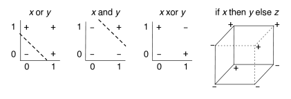

# Learning: Neural Networks

[Tensorflow Playground]([https://playground.tensorflow.org](https://playground.tensorflow.org/))

## Linear Regression and Classification

**Linear Regression:** The problem of fitting a linear function to a set of training examples, in which the input and target features are numeric.

$$
\begin{align*}
\hat Y^{\overline w}(e) &= w_0+w_1 * X_1(e)+\dots +w_n * X_n(e)\\
&= \sum^n_{i=0}w_i*X_i(e)
\end{align*}
$$
where $\overline w=\langle w_0,w_1,\dots,w_n\rangle$ is a tuple of weights.

To make $w_0$ not be a special case, new feature $X_0$ is always 1.

Suppose $E$ is a set of examples. The sum-of-squares error on $E$ for $Y$ is:

$$
\begin{align*}
error(E,\overline w) &= \sum_{e\in E}\left( Y(e)-\hat Y^{\overline w}(e) \right)^2 \\
&= \sum_{e\in E}\left( Y(e)- \sum^n_{i=0}w_i*X_i(e) \right)^2
\end{align*}
$$

The weights that minimize the error can be computed analytically. A more general approach, is to compute the weights iteratively.

### Gradient Descent

An iterative method for finding the minimum of a function.

* Starts with an initial set of weights
* In each step, it decreases each weight in proportion to its partial derivative.

$$
w_i:=w_i-\eta *\frac{\partial}{\partial w_i}error(E, \overline w)
$$

where $\eta$, the gradient descent step size, is called the **learning rate**.

* Given as the input to the learning algorithm

#### Linear Learner

* Termination is usually after some number of steps, when the error is small or when the changes get small. 

Not strictly implementing gradient descent.

Weights change while it iterates through the examples (**Incremental gradient descent**)

If examples are selected at random, its called **stochastic gradient descent**

**Batched gradient descent** updates the weights after a batch of examples.

* If batch is equal to all examples, its equivalent to gradient descent.

### Squashed Linear Functions

Consider binary classification. (domain of target is $\{0,1\}$)

The use of a linear function does not work well for such classification tasks; a learner should never make a prediction of greater than 1 or less than 0. 

A **squashed linear function** is of the form:

where $f$, an **activation function**, is a function from the real line $[-\infty,\infty]$ into some subset of the real line, such as $[0,1]$

* A prediction based on a squashed linear function is a **linear classifier**.
* A simple activation function is the **step function, ** $step_0(x)$, defined by:

$$
step_0(x)= 
\left \{ \begin{array}\
	1 & \text{if } x \geq0 \\
	0 & \text{if } x < 0
\end{array} \right .
$$

One differentiable activation function is the **sigmoid** or **logistic function**:

  

$$
sigmoid(x)=\frac{1}{1+e^{-x}}
$$
This function squashes the real line into the interval $(0,1)$

* Appropriate for classification
* Differentiable
    * $\frac{d}{dx}sigmoid(x)=sigmoid(x)*(1-sigmoid(x))$

The problem of determining weights for the sigmoid of a linear function that minimize an error on a set of examples is called **logistic regression**

To optimize the **log loss** error for logistic regression, minimize the negative log-likelihood:

where $\delta(e)=Y(e)-\hat Y^{\overline w}(e)$

The $Linear\_learner$ algorithm can be modified to carry out logistic regression to minimize log loss.

[Example 7.11](https://artint.info/2e/html/ArtInt2e.Ch7.S3.SS2.html#Ch7.Thmciexamplered11 )

### Linearly Separable

Consider each input feature as a dimension.

If there are $n$ features, there will be $n$ dimensions.

A **hyperplane** in an $n$-dimensional space is a set of points that all satisfies a constraint that some linear function of the variable is zero.

The hyperplane forms a $(n-1)$-dimensional space.

* In 2D that's a line
* In 3D that's a plane

A classification is **linearly separable** if there exists a hyperplane where the classification is true on one side of the hyperplane and false on the other side.

Figure 7.11: Linear separators for Boolean functions:

  

[Example 7.12 + 7.13](https://artint.info/2e/html/ArtInt2e.Ch7.S3.SS2.html#Ch7.Thmciexamplered12)

