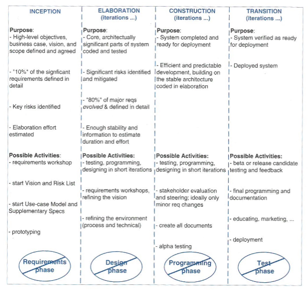
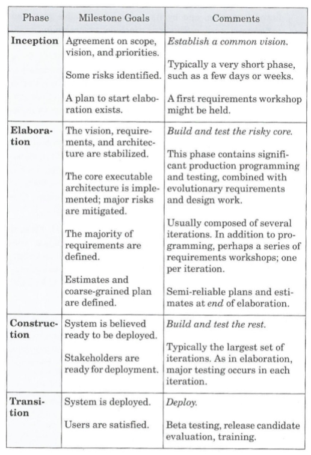

# UP

**Unified Process (UP)**

* Refined in **Rational Unified Process (RUP)**

An **iterative process framework**

Key practices and guidelines

* Develop in short timeboxed iterations
* Develop the high-risk and high-value elements (fx the core architecture) in ealy iterations, preferring re-use of existing components
* Ensure that you deliver value to your customer
* Accomedate change early in the project
* Work together as one team

## UP Phases

Organizes iteratiosn within four phases.

* **Inception**
    * The purpose with this phase is to define the scope and priorities and identify the key risks. 
        This is the shortest phase, from a few days to weeks.

* **Elaboration**

    * The purpose with this phase is that the vision, requirements and architecture are stabilised. 
        The major risks will be mitigated and architecturally significant elements will be programmed. Here the risky stuff will be build and tested. Contains several iterations.

* **Construction**

    * Here the purpose is to have a system that is ready to deploy by building and testing the rest – this is the largest phase. 
        Contains the most iterations.

* **Transition**

    * The goal with this phase is to deploy the system.

    

### Time

### Milestones

