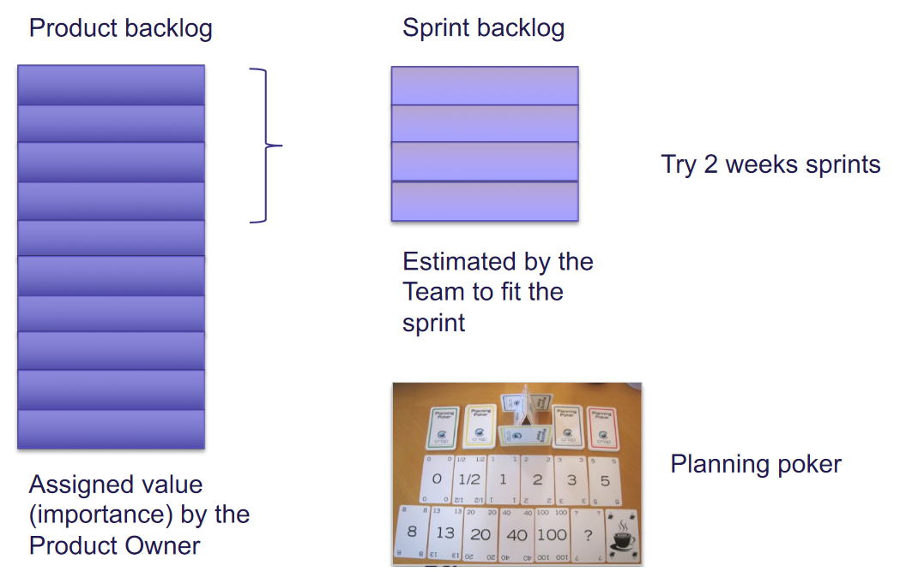
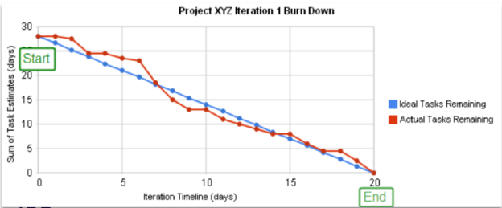

# Project Planning and Management

## Software Pricing

Price is affected by (not complete)

* Estimate of cost to build
* Overhead
    * Management
    * Building, offices, training
    * Expenses to write bid
* Discount - search for price that will beat competitive offers
* What is the value for the customer (as oppsed to production cost)

## Plan-driven Development

The development process is planned in detail

A project plan is created that records the work to be done, who will do it, the development schedule, and the work products

Managers use the plan to support project decision making and as a way of measuring progress

### Project Planning

Involves

* breaking down the *work* into parts
* assign these to project team members
* anticipate problems that might arise
* prepare tentative solutions to those problems

The <u>project plan</u> is used to:

* communicate how the work will be done to the project team and customers
* assess progress on the project

### Startup Planning

At this stage, you know more about the system requirements but do not have design or implementation information

Create a plan with enough detail to make decisions about the project budget and staffing. 

* This plan is the basis for project resource allocation

The startup plan should also define project monitoring mechanisms

A startup plan is still needed for agile development to allow resources to be allocated to the project

### Pros and Cons

The arguments <u>in favor</u> of a plan-driven approach are that early planning allows organizational issues (availability of staff, other projects, etc.) to be closely taken into account, and that potential problems and dependencies are discovered before the project starts, rather than once the project is underway.

The principal argument <u>against</u> plan-driven development is that many early decisions have to be revised because of changes to the environment in which the software is to be developed and used.

### Process 

### Work Breakdown

Break the work into activities and sub-activities

* Gantt charts
* PERT diagrams
* Text

Progress measured against milestones (project monitoring)

* Milestone specification
* Assessing whether the milestone has been reached

#### Gantt Chart

#### PERT Diagram

#### Milestones

Specify products and results

* Which product?
* What state?
* When?

Specify the assessment criteria and process

## Agile Planning

Agile methods of software development are iterative approaches where the software is developed and delivered to customers in increments/iterations.

The functionality of increments is not planned in advance but is decided during the development. 

* The decision on what to include in an increment depends on progress and on the customer’s priorities. 

The customer’s priorities and requirements change so it makes sense to have a flexible plan that can accommodate these changes

### XP: Story-based Estimation and Planning

The planning game is based on user stories that reflect the features that should be included in the system. 

The project team read and discuss the stories and rank them in order of the amount of time they think it will take to implement the story.

Stories are assigned ‘effort points’ (also called story points) reflecting their size and difficulty of implementation

The number of effort/story points implemented per day/sprint is measured giving an estimate of the team’s ‘velocity'

This allows the total effort required to implement the system to be estimated

### Agile Planning Applicability

Agile planning works well with <u>small, stable development teams</u> that can get together and discuss the stories to be implemented. 

However, where teams are large and/or geographically distributed, or when team membership changes frequently, it is practically impossible for everyone to be involved in the collaborative planning that is essential for agile project management

### Agile Estimation

* Based on requirements items
* XP: story points
* Scrum: Planning poker
* Experience-based

### Scrum

#### Sprint Planning

#### Monitor Progress

Daily Scrum:

* Stand-up meeting every morning
* Organised by Scrum Master
* Update Scrum board
    * Move items
    * Update estimates on items
* Remove obstacles

Update burn-down chart

#### Scrum Boards

## Estimation

Organizations need to make software effort and cost estimates

* *Experience-based techniques*
* *Algorithmic cost modeling*

### Estimate Uncertainty

### Experience-based Estimation

**Based on a triangular distribution**

$$
E=(a+m+b)\ /\ 3
$$

**Based on a double triangular distribution**

$$
E=(a+4m+b)\ /\ 6\\
SD= (b-a)\ /\ 6
$$

where 

* $a$ is best-case estimate
* $m$ is most likely estimate
* $b$ is worst-case estimate

### Algorithmic Cost Modeling

Cost is estimated as a mathematical function of product, project and process attributes whose values are estimated by project managers:

* Effort = A  ́Size^B^   ́M
* A is an organisation-dependent constant, B reflects the disproportionate effort for laarge projects and M is a multiplier reflecting product, process, and people attributes

The most commonly used product attribute for cost estimation is code size, (lines of code: LOC)

Most models are similar but they use different values for A, B and M.

#### COCOMO

An empirical model based on project experience.

Well-documented, ‘independent’ model which is not tied to a specific software vendor.

Long history from initial version published in 1981 (COCOMO-81) through various instantiations to COCOMO 2.

COCOMO 2 takes into account different approaches to software development, reuse, etc. 

1. *An application-composition  model*	This  models  the  effort  required  to develop  systems  that  are  created from reusable components, scripting,  or database programming. 
    Software size estimates are based on application points, and a simple size/productivity formula is used to estimate the effort required. 

    The number of application points in a program is a weighted estimate of the number of separate screens that are displayed, the number of reports that are produced, the number of modules in imperative programming languages (such as Java), and the number of lines of scripting language or database programming code.

2. *An early design model*  This model is used during early stages of the system design after the requirements have been established. 
    The estimate is based on the standard estimation formula that I discussed in the introduction, with a simplified set of seven multipliers. 
    Estimates are based on function points, which are then converted to number of lines of source code. Function points are a language-independent way of quantifying program functionality. 

    You compute the total number of function points in a program by measuring or estimating the number of external inputs and outputs, user interactions, external interfaces, and files or database tables used by the system.

3. *A reuse model*  This model is used to compute the effort required to integrate reusable components and/or automatically generated program code. 
    It is normally used in conjunction with the post-architecture model.

4. *A post-architecture model*   Once the system architecture has been designed, amore accurate estimate of the software size can be made. 
    Again, this model uses the standard formula for cost estimation discussed above. However, it includes a more extensive set of 17 multipliers reflecting personnel capability, product, and project characteristics.

