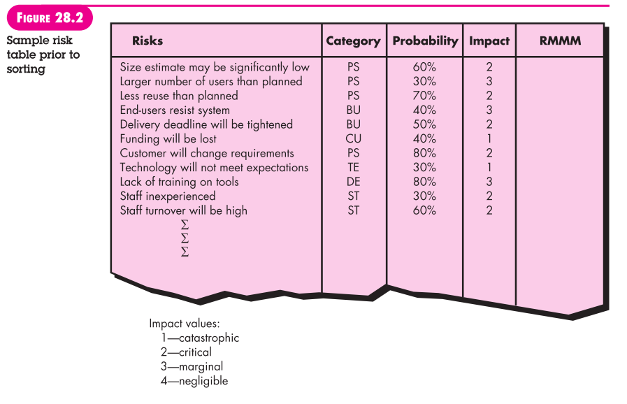
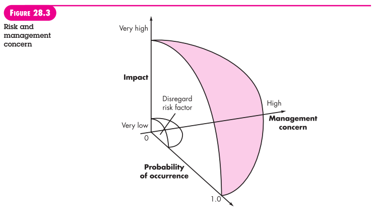
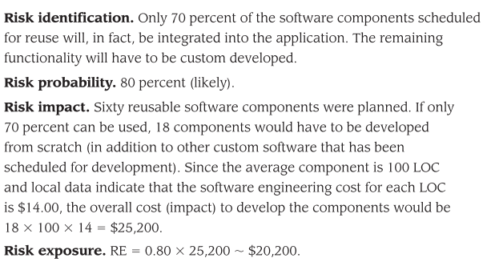
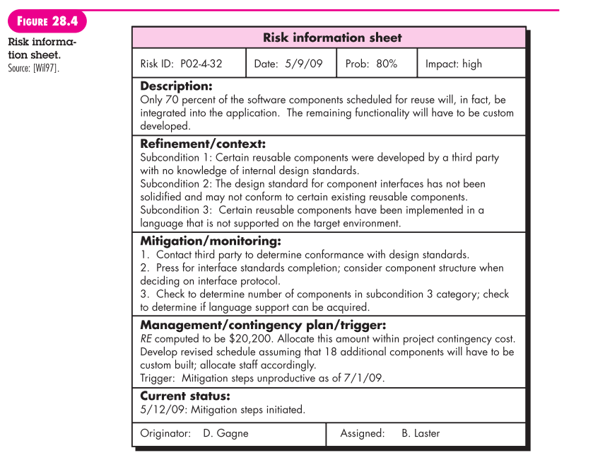

# Risk Management

> *First, risk concerns future happenings. Today and yesterday are beyond active*
> *concern, as we are already reaping what was previously sowed by our past actions.*
> *The question is, can we, therefore, by changing our actions today, create an opportunity for a different and hopefully better situation for ourselves tomorrow. This*
> *means, second, that risk involves change, such as in changes of mind, opinion,*
> *actions, or places. . . . [Third,] risk involves choice, and the uncertainty that choice*
> *itself entails. Thus paradoxically, risk, like death and taxes, is one of the few*
> *certainties of life.*  - Robert Charette

## What is a Risk?

It's not a risk if its certain to happen.

* A possible consequence of a choice

Risiko - Negativt
Oportunity - Positivt

## Reactive vs Proactive Risk Strategies

**Reactive Risk Strategy**

Laughingly called "Indiana Jones school of risk management"

At best, monitors the project for likely risks.

* Resources are set aside to deal with them, should they become problems.

    

More commonly, team does nothing until something goes wrong.

* Often called *fire fighting mode*

**Proactive Risk Strategy**

A more intelligent strategy.

Begins long before technical work is initiated.

* Potential Risks are identified.
* Their probability and impact are assessed.
* They are ranked by importance

## Software Risks

Risk always involves two factors:

* Uncertainty
* Loss

Different categories are created:

* **Project Risks**
    * Threatens project plan.
        * Increases cost
    * Project risks identify potential budgetary, schedule, personnel (staffing and organization), resource, stakeholder, and requirements problems and their impact on a software project.
* **Technical Risks**
    * Threatens the quality and timeliness of the software.
    * Technical risks identify potential design, implementation, interface, verification, and maintenance problems. 
    * In addition, specification ambiguity, technical uncertainty, technical obsolescence, and “leading- edge” technology are also risk factors.
    * "the problem is harder to solve than you thought it would be"
* **Business Risks**
    * Candidates for the top five business risks are 
        1. **Market Risk**: Building an excellent product or system that no one really wants
        2. **Strategic Risk:** Building a product that no longer fits into the overall business strategy for the company
        3. **Sales Risk:** Building a product that the sales force doesn’t understand how to sell
        4. **Management Risk**: Losing the support of senior management due to a change in focus or a change in people 
        5. **Budget Risks:** Losing budgetary or personnel commitment.

Another general categorization has been proposed:

* **Known Risks**
    * Can be uncovered by careful evaluation of the project plan.
* **Predictable Risks**
    * Extrapolated from past project plans
    * e.g. staff turnover, poor communication with the customer, dilution of staff effort
        as ongoing maintenance requests are serviced
* **Unpredictable Risks**
    * They can and do occur, but they are extremely difficult to identify in advance.

### Risk Identification

Two distinct types of risks in each category:

* **Generic risks**
    * Potential threat for every software project
* **Product-specific risks**
    * Identified only by those with a clear understanding of the technology, the people, and the environment that is specific to the software that is to be built

#### Risk Item Checklist

Used for identification and focuses of some subset of known and predictable risks in the following generic subcategories:

* *Product size*—risks associated with the overall size of the software to be built or modified.
* *Business impact*—risks associated with constraints imposed by management or the marketplace.
* *Stakeholder characteristics*—risks associated with the sophistication of the stakeholders and the developer’s ability to communicate with stakeholders in a timely manner.
* *Process definition*—risks associated with the degree to which the software process has been defined and is followed by the development organization.
* *Development environment*—risks associated with the availability and quality of the tools to be used to build the product.
* *Technology to be built*—risks associated with the complexity of the system to be built and the “newness” of the technology that is packaged by the system.
* *Staff size and experience*—risks associated with the overall technical and project experience of the software engineers who will do the work.

A number of comprehensive checklists for software project risk are available on the Web.

#### Assessing Overall Project Risk

The following questions have been derived from risk data obtained by surveying: 

1. Have top software and customer managers formally committed to support the project?
2. Are end users enthusiastically committed to the project and the system/ product to be built?
3. Are requirements fully understood by the software engineering team and its customers?
4. Have customers been involved fully in the definition of requirements?
5. Do end users have realistic expectations?
6. Is the project scope stable?
7. Does the software engineering team have the right mix of skills?
8. Are project requirements stable?
9. Does the project team have experience with the technology to be implemented?
10. Is the number of people on the project team adequate to do the job? 
11. Do all customer/user constituencies agree on the importance of the project and on the requirements for the system/product to be built?

If any of these are answered negatively, then mitigation, monitoring and management should be instituted without fail.

The degree to which the project is at risk is directly proportional to the number of negative responses to these questions.

#### Risk Components and Drivers

The US Air Force have published guidelines for software risk identification and abatement. 

Risk components are defined:

* *Performance risk*—the degree of uncertainty that the product will meet its requirements and be fit for its intended use.
* *Cost risk*—the degree of uncertainty that the project budget will be maintained.
* *Support risk*—the degree of uncertainty that the resultant software will be easy to correct, adapt, and enhance.
* *Schedule risk*—the degree of uncertainty that the project schedule will be maintained and that the product will be delivered on time.

The impact of each risk driver is divided into one of:

* Negligible
* Marginal
* Critical
* Catastrophic

### Risk Projection (Risk Estimation)

Attempts to rate each risk in:

1. The probability that risk is real

2. The consequences 

    

There are four risk projection steps:

1. Establish a scale that reflects the perceived likelihood of a risk.
2. Delineate the consequences of the risk
3. Estimate the impact of the risk on the project and the product
4. Assess the overall accuracy of the risk projection so that there will be no misunderstandings

#### Risk Table

* Sorted by probability and impact to rank risks
* You can define a *cutoff line*.
    * Horizontal line somewhere in the table
    * Only risks above the line are given further attention.

* RMMM contains a pointer into a *risk mitigation, monitoring, and management plan*

#### Risk Impact

Three factors affect the consequences.

* Its nature
* Its scope
* Its timing

Overall *risk exposure* $RE$ is calculated:
$$
RE=P\times C
$$
where $P$ is the probability of the risk, and $C$ is the cost to the project if the risk occurs.

##### Example:

### Risk Refinement

Refine risks into a set of more detailed risks, each somewhat easier to mitigate, monitor and manage.

#### Condition-Transition-Consequence (CTC) Format

Using the CTC format for the example from before:

*Given that all reusable software components must conform to specific design standards and that some do not conform, then there is concern that (possibly) only 70 percent of the planned reusable modules may actually be integrated into the as-built system, resulting in the need to custom engineer the remaining 30 percent of components.*

This can be refined:

**Subcondition 1**
*Certain reusable components were developed by a third party with no knowledge of internal design standards.*

**Subcondition 2**
*The design standard for component interfaces has not been solidified and may not conform to certain existing reusable components.*

**Subcondition 3**
*Certain reusable components have been implemented in a language that is not supported on the target environment.*

### Risk Mitigation, Monitoring, and Management

An effective strategy must consider three issues:

* Risk avoidance
* Risk monitoring
* Risk Management

Avoidance is always the best strategy.

* Achieved by making a risk mitigation plan.

