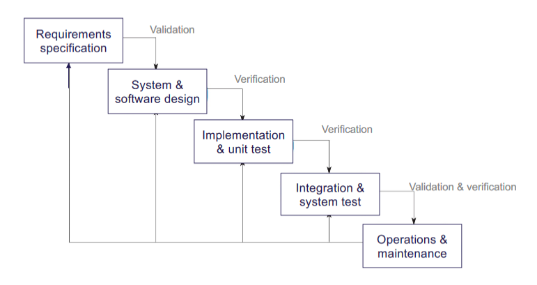

# Software process models: Waterfall

## Software Engineering

Pga. ingen **fysiske constraints**, kan software systemer **hurtigt** blive ekstrem **komplekse**, **svære** at forstå, og **dyre** at ændre i.

Mange fejl i software projekter skyldes 2 faktorer

1. **Increasing System Complexity**
    * **Demands change,** systemr skal leveres **hurtigere**; **større**, endnu mere **komplekse**.
2. **Failure to use software engineering methods**
    * Det er **nemt** at skrive computer programmer **uden** at bruge **SE** metoder og teknikker.
    * Mange selskaber er blevet **software udviklere med tiden**
        * De bruger **ikke SE** metoder i deres hverdagsarbejde
        * Derfor bliver deres software ofte **dyrere** og **mindre reliable** end det burde.

### SE Process Activities

1. **Software specification** 
    * The functionality of the software and constraints on its operation must be defined.
2. **Software development** 
    * The software to meet the specification must be produced.
3. **Software validation** 
    * The software must be validated to ensure that it does what the customer wants.
4. **Software evolution** 
    * The software must evolve to meet changing customer needs.

## Waterfall

Aktiviteter foregår i **sekvens**, overlevering af work products mellem faser, **milestones** og relateret **work** **products** bruges til at overvåge **progress**

### Plan Drevet

Plan drevet, da process aktiviteterne er planlagt før start.

1.  **Requirements analysis and definition** 
    * **Services**, **constraints**, og **mål** etableres ved **konsultation** med system brugere.
    * Beskrives i **detajler** som **system specifikation**
2.  **System and software design** 
    * Allokerer **requirements** til **hardware** eller **software** systems.
        Etablerer en overall system **arkitektur**
    * **Identificering** og **beskrivesle** af fundamental software system **abstraktion og relationships**
3.  **Implementation and unit testing** 
    * Software design **udarbejdes** og **unit testing** verificerer at hver **unit** overholder dets specifikation
4.  **Integration and system testing** 
    * Program **units** eller programmer **integrerets** og testes som **helhed**.
    * **Udleveres** til kunden efter testing
5.  **Operation and maintenance** 
    * System installeres og tages i **brug**.
    * **Vedligeholdelse**
    * **Opdatering**

### Hvornår waterfall?

* **Embedded systems**
    * Infleksibilt hardware
* **Life critical systems**
    * **Specs** og **design** documents skal være **komplet**.
    * Ekstensiv **sikkerhedsanalyse**
* **Store software systemer**
    * Del af **bredere** ingeniør systemer
    * **Hardwaren** kan være udviklet med **lignende** model.
        * **Fælles** model for hardware og software