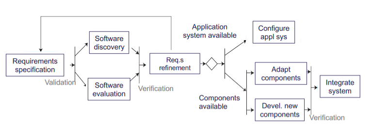

# Software process model: integration & configuration

## Software Engineering

Pga. ingen **fysiske constraints**, kan software systemer **hurtigt** blive ekstrem **komplekse**, **svære** at forstå, og **dyre** at ændre i.

Mange fejl i software projekter skyldes 2 faktorer

1. **Increasing System Complexity**
    * **Demands change,** systemr skal leveres **hurtigere**; **større**, endnu mere **komplekse**.
2. **Failure to use software engineering methods**
    * Det er **nemt** at skrive computer programmer **uden** at bruge **SE** metoder og teknikker.
    * Mange selskaber er blevet **software udviklere med tiden**
        * De bruger **ikke SE** metoder i deres hverdagsarbejde
        * Derfor bliver deres software ofte **dyrere** og **mindre reliable** end det burde.

### SE Process Activities

1. **Software specification** 
    * The functionality of the software and constraints on its operation must be defined.
2. **Software development** 
    * The software to meet the specification must be produced.
3. **Software validation** 
    * The software must be validated to ensure that it does what the customer wants.
4. **Software evolution** 
    * The software must evolve to meet changing customer needs.

## Integration and Configuration

Afhænger af **tilgængeligheden** af **genbruglige** **components** eller **systemer**.

Fokuserer på at **konfigurere** disse **komponenter** til brug i **nye** omgivelser og **integrere** dem ind i et **system**

Et system samles fra eksisterende konfigurerbare moduler.

Det er meget almindeligt at genbruge kode. Disse 3 typer software genbruges ofte:

* **Standalone** systemer som konfigureres til et bestemt miljø
* **Collection of objects as component or package**
* **Web services**, udvikles ifølge standarder
    * Kan kaldes remotely, (eks. REST API'er)

### Plandrevet eller Agilt?

Kan både være **plandrevet** eller **agilt**

### Fordele og Ulemper

**Fordele**

* **Reducerer** mængden af **software** der skal udvikles
    * **Cost** og **risk** **reduceres** 

**Ulemper**

* Uundgåligt at **kompromittere** **requirements**
    * Kan føre til at system **ikke** **opfylder** reel behov fra bruger
* **Ingen** **kontrol** over genbrugt software
    * **Hvordan** og **hvornår** nye **versioner** kommer
    * Ændringer i **funktionalitet**

### Model

1. **Requirements specification**
    * Initial requirements foreslås, ikke detaljeret - essential requirements og system features
2. **Software discovery and evaluation**
    * Der søges efter komponenter og systemer der kan give den krævede funktionalitet.
    * Kandidater evalueres efter om de møder essential requirements, og hvor suitable de er
3. **Requirements refinement**
    * Requirements refineres efter info om brugbare komponenter/systemer
4. **Application system configuration**
    * Hvis off-the-shelf system findes, konfigureres det til brug i det nye system
5. **Component adaption and integration**
    * Hvis ikke, bliver eksisterende komponenter evt. modificeret, og nye udvilkes til at integrere i systemet