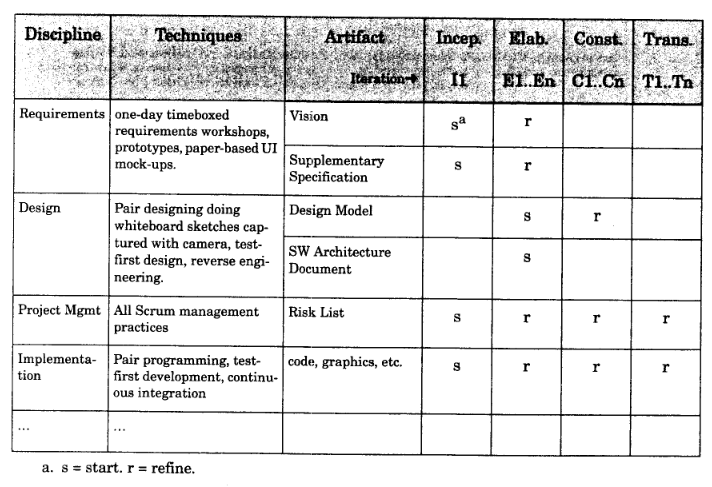

# Key features of RUP

RUP er **inkrementiel** **iterativt** metode **framework**.

Rational Unified Process

* Udvikles i **korte timeboxed** iterationer.
* **High risk**, **high-value** udvikles i de **tidlige** iterationer
* **re-use** af eksisterende komponenter
* Accomedate ændringer **tidligt** i projektet
* Work together as <u>one</u> team

UP definerer omkring **50** optional artifacts eller work products (ex Vision, Risk List)

* **Less is better**: Brug en minimal mængde af work products

**RUP** er baseret på et sæt "byggeklodser"

* **Roles** (Who)
    * Defineret sæt af relaterede skills og ansvarligheder
* **Work Product** (What)
    * Resultat fra en tasks, inkl. dokumenter og modeller
* **Tasks** (How)
    * En unit arbejde assigned til en rolle

## Tasks

Tasks deles op i discipliner

## Faser

4 faser

* **Inception**

    * **Scope** og **prioriteter** definieres
    * **Key risks** identificeres.
    * Korteste fase (få date til uger)

* **Elaboration**

    * **Vision**, **requirements** og **arkitektur** stabiliseres.
    * **Major risks** **mitigeres** og arkitektuelt **signifikante elementer** programmeres
    * **Risky stuff** bygges og testes

* **Construction**

    * Resten **bygges** og **testes**
    * Systemet **klargøres** og er **ready-to-deply** i slutningen
    * Største fase

* **Transition**

    * Systemet deployes

        

## Hvad Skrædersyes til hvert projekt

Practices og work products udvælges fra en stor bunke af valgbare elementer.

* Less is better

## UP Best Practices

1. Udvikl ved brug af **timeboxed iterations**

    * Anbefalet mellem 2 og 6 uger

    Start udvikling **tidligt**

2. Understreg programmering af **high-risk, high-value** elementer og **sammenhængende** arkitektur i **tidlige** iterationer

    **Re-use** eksisterende komponenter

3. **Kontinuerligt** verificer **kvalitet**.

    Test tidligt, ofte og realistisk

    **TDD** og **Continous Integration**

4. Lav en lille smule **visuel modelling** før start programmering af iteration.
5. **Manage requirements** 
    * Find og refiner requirements iterativt og inkrementielt
6. **Manage Change** gennem disciplinerede configuration management og versions-kontrol

## Typiske Pitfalls ved RUP

RUP er **ikke** waterfall.

* De forskellige **faser** er et **mix** af **disciplinerne**

RUP iterationer bør **ikke** være længere end **6 uger.**

* Hvis mål **ikke** kan **opnås**, **flyttes** eller **simplificeres** mål.

## Scrum og XP med RUP

### Scrum

**Scrum** practices er **consistent** med UP practices.

* Projekt **manager** fungere som **Scrum Master**
* **Sprint Backlog** svarer til UP artifact; **Iteration Plan**

UP er **mere defineret** end Scrum i dets processer

### XP

**Fleste** XP practices er **consistent** med UP practices

* **TDD** er specialisering af UP quality; **continously verifying quality**
* Alle UP **workprodukts** er **optional**
    * Passer med XPs "**minimal** modeling and documentation"

