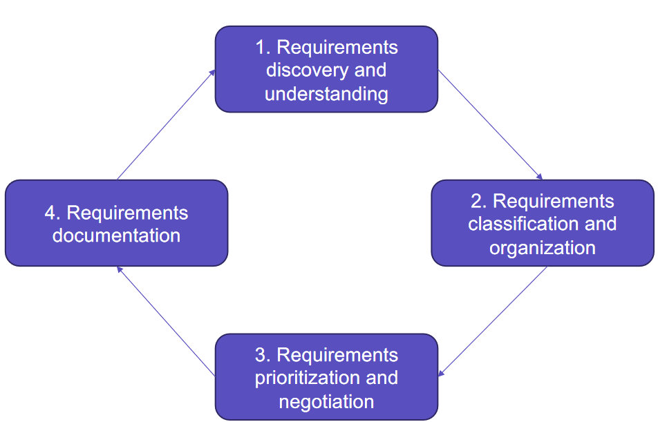

# Requirements Elicitation and Managing change to requirements

## Requirement Elicitation

Er svært da:

* Stakeholders ved ikke hvad de vil have
* Stakeholders bruger deres eget sprog og implicit viden
* Forskellige stakeholders med diverse eller modstridende requirements
* Politik
* Økonomisk og business miljø er dynamisk

### Teknikker

**Interview**

* **Lukkede** interviews
    * **Predefinerede** spørgsmål
* **Åbne** intervies
    * **Ingen** predefieret **agenda**

**Observation / Ethnography**

* Se folk **gøre** deres **arbejde**
    * Se hvordan **arbejdet** virkeligt **udføres**
    * **Requirements** gennem **samarbejde** og **awareness**
    * **Forstå** **eksisterende** systemer

**Stories og Scenarier**

**Nemmere** at relatere **real-life** eksempler **end abstrakte** beskrivelser

## Requirements Ændringer

I **Waterfall** bliver **ændringer** approved af en **project manager** eller en **styringsgruppe**

* Dog **ofte ikke gjort** i waterfall

I **agilt** kan kun **Product** **owner** approve changes ved at opdatere **product backlog**

### Reducer Cost ved Ændringer

**Change Anticipation**

Eksempelvis ved brug af **prototyper** som kan vise **key features** til kunden

**Change Tolerance**

Eksempelvis via **inkrementiel** **udvilking**

### Prototyper

Kan bruges til at **validate** fra brugere at del af **løsningen er "fit for use"**

* Bruges i **tidlig fase** til at prøve **design** muligheder eller **lære** mere om **problemet**
* Kan give brugere **nye ideer** til requirements

## Configuration Management

Faktorer ved ændringer i systemet

* **Konsekvens ved ikke at lave ændring**
    * Hvis ændring er associeret med system fejl, skal seriøsiteten af fejlen vurderes.
* **Fordele ved ændringen**
    * Vil det være til fordel fore mange brugere eller kun enkelte?
* **Antal brugerer påvirket af ændringen**
    * Hvis kun få brugere bliver affected er det måske lav prioritet
* **Cost ved at lave ændringen**
    * Hvis ændringen påvirker mange system komponenter, og derfor større chance for nye bugs
    * Eller ændringen tager lang lang tid
* **Product release cycle**
    * Er der lige udgivet nyt release er det måske bedre at vente til nææste release

### Version Management

Eksempelvis vha. Git

* **Version and release identification**
    * Managed versioner assignes identifiers når de submittes til systemet
* **Storage Management**
    * VM holder delta'er (list of diferences) for at reduce storage
* **Change history**
    * Alle ændringer i systemet er recorded og listed
* **Independant developement**
    * VM lader udviklere arbejde på samme komponent på samme tid.