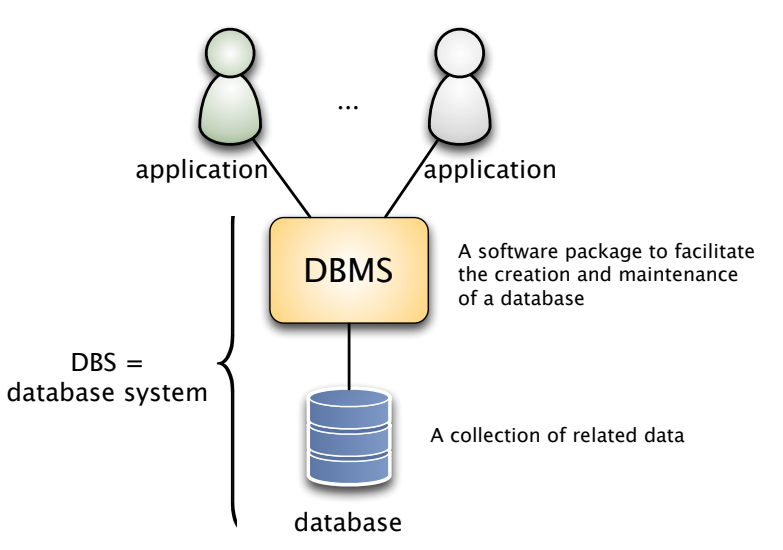
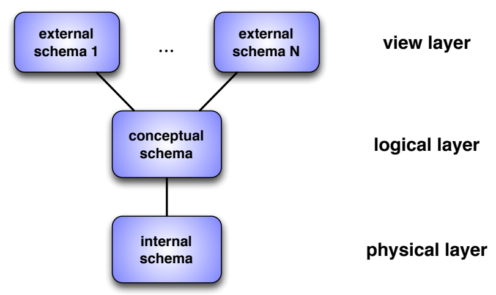
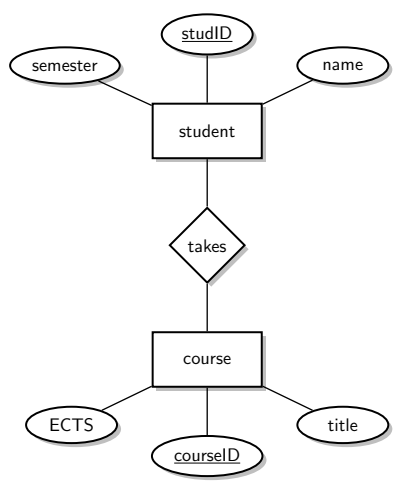

# Introduction

## Database System

### 3-Layer Schema Architecture

#### Physical Data Independence

Changes regarding file structure and access paths (physical layer) have no influence on the conceptual schema (logical layer)

**Examples of changes on physical layer:**

* New hard disk added
* New processor added
* Files are split into multiple files

#### Logical Data Independence

Changes on the logical layer have no influence on external schemas and applications

**Examples of changes on the logical layer:**

* Adding another attribute to the conceptual schema
    * Users still see the same set of attributes
* Changing the name of an attribute on the conceptual schema
    * In the users view the attributes still has the same name

### Definitions

**Mini-world**

* Some part of the real world about which information is stored

**Data/Information**

* Known facts about the mini-world that can be recorded and have an implicit meaning

**Database (DB)**

* A collection of related data

**Database Management Systems (DBMS)**

* A software package to facilitate the creation and maintenance of a database

**Database Systems (DBS)**

* A database and a DBMS

**Database Instance**

* The content of a DB at a particular time

## Entity Relationship Modeling

1. Entity $\to$ Entity type
2. Relationship $\to$ Relationship type
3. Attribute (characteristics)
4. Primary Key (identification)
5. Role (clarification)

## Relational Model

