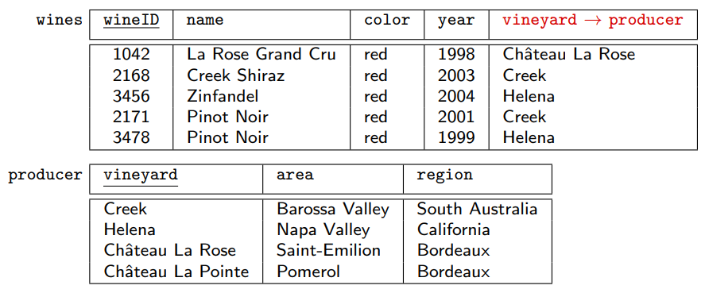
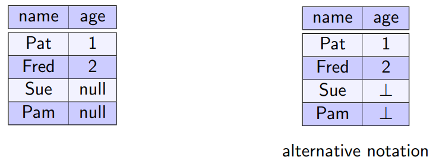
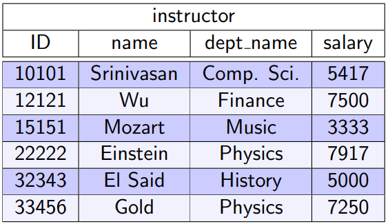
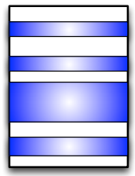
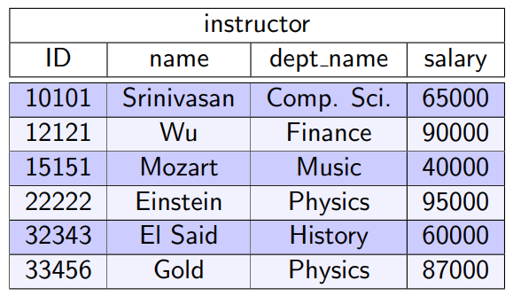
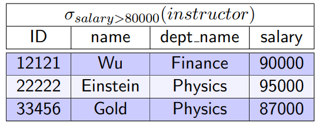

# Relational Model and Relational Algebra

## Learning Goals

* Explain the relational model
* Create non-trivial relational algebra queries
* Use the various join types in relational algebra quieries
* Explain the limitations of relational algebra

## The Relational Model

### Foundations

Assume $D_1, D_2,\dots,D_n$ are **domains**

#### **Relation:**

$R\subseteq D_1\times \dots \times D_n$

* Example: $telephoneBook\subseteq string \times string \times integer$
* Domains can be identical $D_i=D_j$ for $i \neq j$
* Based on mathematical sets

#### **Relational Schema**

* Defines the structure of stored data
* Is denoted as $sch(R)$ or $\mathcal R$
* Notation: $R(A_1: D_1, A_2:D_2, \dots)$ with $A_i$ denoting attributes
* Example:
    * $telephoneBook(name: string, street:string, \underline{phoneNumber:integer})$

#### **Illustration of Basic Concepts**

* Header: **relation schema**
* Column header: **attribute**
* Entries in the table: **relation**
* Row in the table: **tuble**
* An entry of a cell: **attribute value**
* Underlined attributes: **primary keys**

#### Foreign Key

* A relation may incluyde the primary key attributes of another table
* Valid values for foreign key attributes must appear in the primary key of the referenced table

#### Example

### Characteristics

#### Tuple Ordering

Tuples in a relation are **unordered**

These relations have <u>the same</u> information content:

#### Attribute Ordering

In accordance with the **mathematical defintion** of tuples, attributes in a tuple/relation are **ordered**

These relations have <u>different</u> information content:

However: 

* The order of attributes are immaterial for most applications
* Using attribute names instead of ordering is more convenient
* The Cartisian product becomes commutative

#### Atomic Values

* Values in a tuple are **atomic** (indivisible)
* A value cannot be a structure, a record, a collection type, or a relation

Example:

#### Null Values

A special **null** value is used to represent values that are unknown or inapplicable to certain tuples

Example:

#### Duplicates

A relation adheres to the **mathematical definition of a set**

* No two tuples in a relation may have identical values for all attributes

Example:

## Relational Algebra

### Relational Algebra Operations

| Name                          | Symbol   |
| ----------------------------- | -------- |
| [**Projection**](#projection) | $\pi$    |
| [**Selection**](#selection)   | $\sigma$ |
| **Rename**                    | $\rho$   |
| **Cartisian product**         | $\times$ |
| **Union**                     | $\cup$   |
| **Difference**                | $-$      |
| Intersection                  | $\cap$   |
| Join                          | $\Join$  |
| Left Outer Join               | $⟕$      |
| Right Outer Join              | $⟖$      |
| Outer Join                    | $⟗$      |
| Left Semi Join                | $⋉$      |
| Right Semi Join               | $⋊$      |
| Grouping                      | $\gamma$ |
| Division                      | $\div$   |

The operations marked with **bold** is the **fundamental operations**

* Any relational algebra query can be expressed with the set of fundamental operations only
* Removing any one of these operations reduces the expressive power

**Unary vs Binary operations**

* **Unary** operations: $\sigma, \pi, \rho$
* **Binary** operations: $\times, \cup, -$

### Fundamental Operations

Operations and their use:

* Input: one or multiple relations
* Output: a relation

Operations can be combined (with some rules)

#### Projection

The result is a relation of $n$ columns obtained by removing the columns that are not specified.

##### Extended Projection

#### Selection

Symbol: $\sigma_F$

* Selection predicate $F$ consist of:
    * Logic operations: $\or$ (or), $\and$ (and), $\neg$ (not)
    * Arithmetic comparison operators: $<, \leq, =, >, \geq, \neq$
    * Attribute names of the argument relations or constants as operands

Selecting/filtering rows of a table according to the selection predicate

$$
\sigma_{salary>80000}(instructor)
$$

