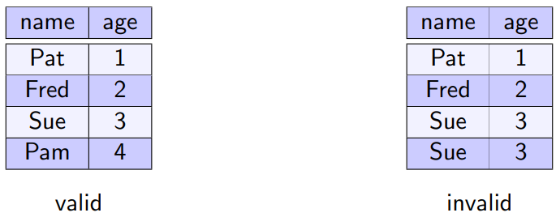
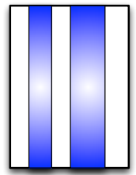
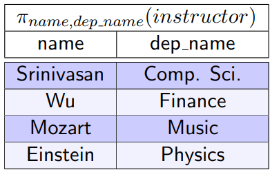
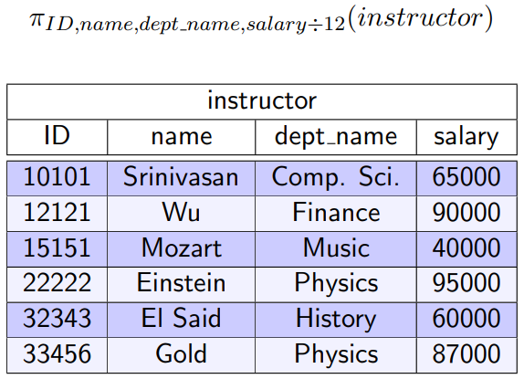
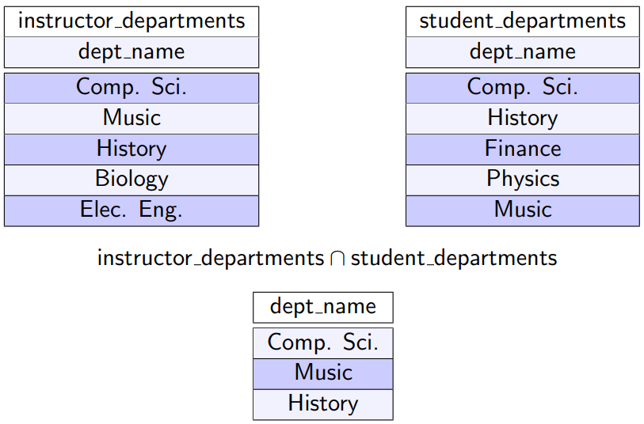
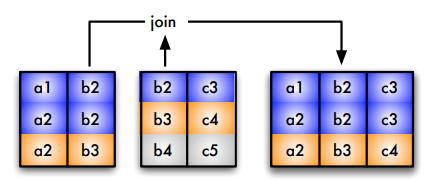
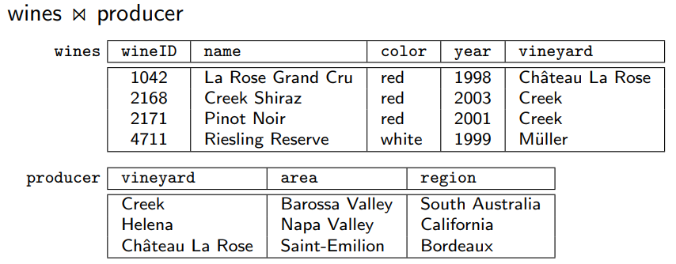
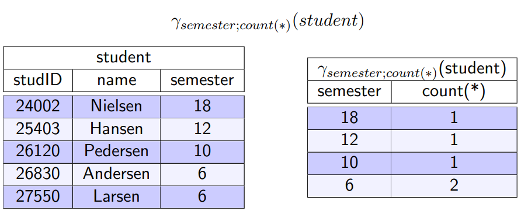

# Relational Model and Relational Algebra

## Learning Goals

* Explain the relational model
* Create non-trivial relational algebra queries
* Use the various join types in relational algebra quieries
* Explain the limitations of relational algebra

## The Relational Model

### Foundations

Assume $D_1, D_2,\dots,D_n$ are **domains**

#### **Relation:**

$R\subseteq D_1\times \dots \times D_n$

* Example: $telephoneBook\subseteq string \times string \times integer$
* Domains can be identical $D_i=D_j$ for $i \neq j$
* Based on mathematical sets

#### **Relational Schema**

* Defines the structure of stored data
* Is denoted as $sch(R)$ or $\mathcal R$
* Notation: $R(A_1: D_1, A_2:D_2, \dots)$ with $A_i$ denoting attributes
* Example:
    * $telephoneBook(name: string, street:string, \underline{phoneNumber:integer})$

#### **Illustration of Basic Concepts**

* Header: **relation schema**
* Column header: **attribute**
* Entries in the table: **relation**
* Row in the table: **tuble**
* An entry of a cell: **attribute value**
* Underlined attributes: **primary keys**

#### Foreign Key

* A relation may incluyde the primary key attributes of another table
* Valid values for foreign key attributes must appear in the primary key of the referenced table

#### Example

### Characteristics

#### Tuple Ordering

Tuples in a relation are **unordered**

These relations have <u>the same</u> information content:

#### Attribute Ordering

In accordance with the **mathematical defintion** of tuples, attributes in a tuple/relation are **ordered**

These relations have <u>different</u> information content:

However: 

* The order of attributes are immaterial for most applications
* Using attribute names instead of ordering is more convenient
* The Cartisian product becomes commutative

#### Atomic Values

* Values in a tuple are **atomic** (indivisible)
* A value cannot be a structure, a record, a collection type, or a relation

Example:

#### Null Values

A special **null** value is used to represent values that are unknown or inapplicable to certain tuples

Example:

#### Duplicates

A relation adheres to the **mathematical definition of a set**

* No two tuples in a relation may have identical values for all attributes

Example:

## Relational Algebra

$$
\newcommand{\leftouterjoin}{⟕}
\newcommand{\rightouterjoin}{⟖}
\newcommand{\outerjoin}{⟗}
\newcommand{\leftsemijoin}{⋉}
\newcommand{\rightsemijoin}{⋊}
\nonumber
$$

### Relational Algebra Operations

| Name                                        | Symbol            |
| ------------------------------------------- | ----------------- |
| [**Projection**](#projection)               | $\pi$             |
| [**Selection**](#selection)                 | $\sigma$          |
| **[Rename](#rename)**                       | $\rho$            |
| [**Cartesian product**](#cartesian-product) | $\times$          |
| [**Union**](#union)                         | **$\cup$**        |
| [**Difference**](#difference)               | $-$               |
| [Intersection](#intersection)               | $\cap$            |
| [Join](#join)                               | $\Join$           |
| [Left Outer Join](#outer-join)              | $\leftouterjoin$               |
| [Right Outer Join](#outer-join)             | $\rightouterjoin$               |
| [Outer Join](#outer-join)                   | $\outerjoin$               |
| Left Semi Join                              | $\leftsemijoin$ |
| Right Semi Join                             | $\rightsemijoin$               |
| Grouping                                    | $\gamma$          |
| Division                                    | $\div$            |

The operations marked with **bold** is the **fundamental operations**

* Any relational algebra query can be expressed with the set of fundamental operations only
* Removing any one of these operations reduces the expressive power

**Unary vs Binary operations**

* **Unary** operations: $\sigma, \pi, \rho$
* **Binary** operations: $\times, \cup, -$

### Fundamental Operations

Operations and their use:

* Input: one or multiple relations
* Output: a relation

Operations can be combined (with some rules)

#### Projection

The result is a relation of $n$ columns obtained by removing the columns that are not specified.

##### Extended Projection

#### Selection

Symbol: $\sigma_F$

* Selection predicate $F$ consist of:
    * Logic operations: $\or$ (or), $\and$ (and), $\neg$ (not)
    * Arithmetic comparison operators: $<, \leq, =, >, \geq, \neq$
    * Attribute names of the argument relations or constants as operands

Selecting/filtering rows of a table according to the selection predicate

$$
\sigma_{salary>80000}(instructor)
$$

#### Rename

**Relation**

Renaming a relation $R$ to $S$:

* $\rho_S(R)$

**Attribute**

Renaming attribute $B$ to $A$:

* $\rho_{A\leftarrow B}(R)$

Some literature uses $\beta$ for the rename operation

#### Cartesian Product

AKA **Cross Product**

The Cartesian product ($R\times S$) between relations $R$ and $S$ consists of all possible combinations ($|R|*|S|$ pairs) of tuples from both relations

Result schema:
$$
sch(R\times S)=sch(R) \cup sch(S) = \mathcal R \cup \mathcal S
$$
 Contains many (useless) combinations!

Attributes in the result are referenced as $R.A$ or $S.A$ to resolve ambiguity.

#### Set Operations

Set operations **union, intersection**, and **difference** can also be applied to relations

**Requirements**

Both involved relations must be **union-compatible:**

* they have the same number of attributes
* the domain of each attribute in column order is the same in both relations

#### Union

The result of a union $(R\cup S)$ between two relations $R$ and $S$ contains all tuples from both relations without duplicates

Example:

#### Difference

The difference ($R-S$ or $R \setminus S$) of two relations $R$ and $S$ removes all tuples from the first relation that are also contained in the second relation

### Overview of Fundamental Operations

### Non-Fundamental Operations

#### Intersection

The intersection $(R\cap S)$ of two relations $R$ and $S$ consists of a set of tuples that occur in both relations.

##### With Fundamental Operations

Intersection can be expressed as difference $(R\cap S= R- (R-S))$

#### Join

The natural join combines two relations via **common attributes** (same name and domains) by combining only tuples with the **same values** for common attributes.

Given two relations (and their schema)

* $R(A_1,\dots,A_m, B_1,\dots,B_k)$
*  $S(B_1,\dots,B_k,C_1,\dots,C_n)$

Example:

Result:

Tuples without matching partners (*dangling tuples*) are eliminated

##### With Fundamental Operations

Natural join can be expressed as a Cartesian product followed by selections and projections

**Example**

##### Is Join Commutative

For now, we do not consider joins and Cartesian products to be commutative.

For query optimization later, we usually consider joins as well as Cartesian product and other join variants to be commutative.

If we want to hold on to the mathematical definition of tuples and still consider joins to be commutative, we need to apply a projection operation to reorder the attributes:
$$
\pi_L(R\Join S) = \pi_L(S\Join R)
$$

#### Outer Join

* **⟕ - Left Outer Join** 
    * Keep dangling tuples in the <u>left</u> operand relation
* **⟖ - Right Outer Join**
    * Keep dangling tuples in the <u>right</u> operand relation
* **⟗ - (Full) Outer Join**
    * Keep dangling tuples of <u>both</u> operand relations

**Examples**

#### Semi Join

Find all tuples in a relation for which there are **matching tuples** in the other relation

**Left semi join:**
$$
L \leftsemijoin R= \pi_{\mathcal L}(L\Join R)
$$

where $\mathcal L$ represents the set of $L$'s attributes

**Right semi join**:
$$
L\rightsemijoin R = R \leftsemijoin L = \pi_{\mathcal R}(L \Join R)
$$
**Examples**

#### Grouping

Tuples with the **same attribute values** (for a specified list of attributes) are grouped.

An *aggregate* function is applied to each group (computing **one** value for each group)

Typical aggregate functions:

* **count** - number of tuples in a group
* **sum** - sum of attribute values in a group
* **min, max, avg**

**Notation**
$$
\gamma_{L;F}(R)
$$

* $L$: list of attributes for grouping
* $F$: aggregate function

Alternative symbols $\mathcal G$ or $\beta$

**Example**:

Determine the number of students per semester:

More examples in [DBS2 slides p75](https://www.moodle.aau.dk/pluginfile.php/1973718/mod_resource/content/0/DBS-2.pdf#page=75)

#### Division

**Example**

Find all $studID$s of students that took all 4 ECTS courses

* $takes(studID, courseID)$
* $course(courseID, title, ects, teacher)$

$$
takes \div \pi_{courseID}(\sigma_{ects=4}(course))
$$

Formal definition:

See examples in [DBS2 slides p81](https://www.moodle.aau.dk/pluginfile.php/1973718/mod_resource/content/0/DBS-2.pdf#page=81)

