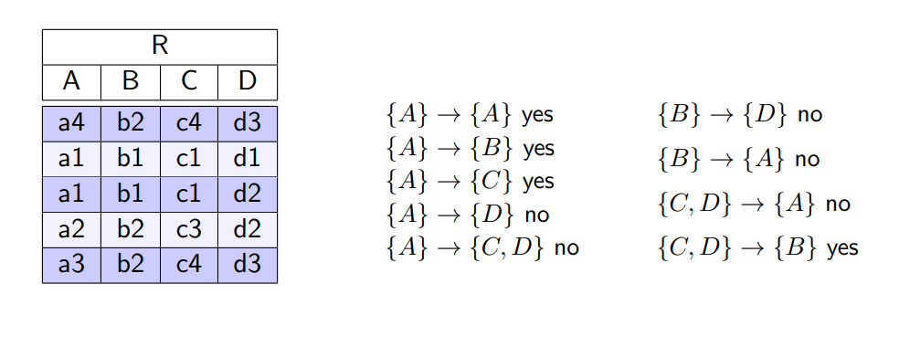

# Relational Database Design Theory

$$
\newcommand{\dep}[2]{\{#1\} \to \{#2\}}
\newcommand{\schema}{\mathcal{R}}
\nonumber
$$

**Learning Goals**

* Understanding the concepts of functional dependencies and normal forms
* Describe the quality of a design by using normal forms
* Improving a database design by decomposition

## Functional Dependencies

Symbols:

* Schema $\mathcal R = \{A,B,C,D\}$
* Instance $R$
* Let $\alpha \subseteq \mathcal R$ and $\beta \subseteq \mathcal R$ be sets of attributes

A **functional dependency** $\alpha \to \beta$ holds on $\mathcal R$ if for all legal instances $R$ of $\schema$:

$$
\forall r,s \in R: r.\alpha = s.\alpha \Rightarrow r.\beta = s.\beta
$$

The $\alpha$ values uniquely identify the $\beta$ values

$\alpha$ functionally determines $\beta$

A functional dependency $\alpha \to \beta$ is called **trivial** if $\beta \subseteq \alpha$

### Examples

If I have a zip code, I know the town

* Zip code 9220 gives one and only one town : Aalborg
* Zip code 9000 will not return { Aalborg, Viborg }

Notation: { zipCode } $\to$ { town }

Functional dependencies are **semantic constraints** that need to be true for all possible instances, not just for the current one!

### Keys

#### **Super Keys**

$\alpha \subseteq \schema$ is a **super key** if $\alpha \to \schema$, i.e. $\alpha$ determines all attribute values

* The set of all attributes is a super key: $\schema \to \schema$
* Super keys are not necessarily minimal

#### **Fully Functional Dependent**

$\beta$ is **fully functionally dependent** on $\alpha$ if:

* $\alpha \to \beta$ and
* $\alpha$ cannot be further reduced (= left reduced), i.e.

$$
\forall A \in \alpha:(\alpha - \{A\}) \nrightarrow \beta
$$

#### Candidate Keys

$\alpha\in\schema$ is a **candidate key** if $\schema$ is **fully functionally dependent** on $\alpha$.

* One of the candidate keys is chosen as **primary key**

### Deriving Functional Dependencies

Given a set of FDs (Functional dependencies) $F$ we can derive additional FDs

* $F^+$ contains all FDs that can be derived from $F$, i.e., all FDs **logically implied** by dependencies in $F$
* $F^+$ is $F$'s **closure**
* Inference rules ([Armstrong Axioms](#armstrong-axioms)) help computing $F^+$

#### Armstrong Axioms

$\alpha, \beta, \gamma, \delta$ are subsets of attributes in $\schema$

**Reflexivity**

If $\beta \subseteq \alpha$ then $\alpha \to \beta$ 	in particular: $\alpha \to \alpha$

**Augmentation**

If $\alpha \to \beta$ then $\alpha \gamma \to \alpha\gamma$

**Transitivity**

If $\alpha \to \beta$ and $\beta \to \gamma$ then $\alpha \to \gamma$

The Armstrong axioms are **sound** and **complete**.

* They are sound in the sense that they generate only correct functional dependencies
* They are complete in the sense that they generate all possible FDs ($F^+$) from a given set $F$

#### Additional Rules

Not essential, but sound and ease the derivation process

**Union**

If $\alpha\to\beta$ and $\alpha\to\gamma$ then $\alpha\to\beta\gamma$

**Decomposition**

If $\alpha\to\beta\gamma$ then $\alpha\to\beta$ and $\alpha\to\gamma$

**Pseudotransitivity**

If $\alpha\to\beta$ and $\gamma\beta\to\delta$ then $\alpha\gamma\to\delta$

#### Examples

Given the following functional dependencies $F$, derive additional ones by applying the Armstrong axioms

* A → BC
* CD → E
* B → D
* E → A

Derived FDs

* E → A and A → BC, then E → BC (transitivity)
* B → D, then CB → CD (augmentation)
* CB → CD and CD → E, then CB → E (transitivity)

### Closure of a Set of Attributes

The **closure of a set of attributes** ($\alpha^+$) with respect to a set of FDs $F$ and a set of attributes $\alpha$ is 

$$
\alpha^+ = \{A\mid \alpha\to A \in F^+\}
$$

Observation:

* If $\alpha\to \beta$ is in $F^+$ then $\beta$ is in $\alpha^+$

#### Attribute Closure Algorithm

Input:

* a set $F$ of FDs
* a set of attributes $\alpha \in \schema$

Applications:

* Test if a functional dependency $\alpha \to \beta$ holds
* Test if a given set of attributes $\kappa \subseteq \schema$ is a super key
* Test for super keys
    * By calling attrClosure($F, \kappa$) we obtain $\kappa^+$
        * if $\kappa^+ = \schema$ then $\kappa$ is a super key of $\schema$

[Example in DBS4 slides p 49](https://www.moodle.aau.dk/pluginfile.php/1979144/mod_resource/content/0/DBS-norm-csj-2.pdf#page=49)

### Canonical Cover (Minimal Cover)

* Two sets of FDs $F$ and $G$ are considered equivalent $F \equiv G$ if their closures are the same i.e. $F^+ = G^+$
* Both sets allow for deriving the same set of FDs

Observation

* $F^+$ can be huge
* Many redundant dependencies
* Difficult to overview

Goal:

* Find the smallest possible set $F_c$ for $F$ so that $F^+_c \equiv F^+$
    * There might be **alternative minimal sets**!

A **minimal cover** $F_c$ is a canonical representation of a set $F$ of functional dependencies

Characteristics:

1. $F_c \equiv F$ therefore $F_c^+ = F^+$ (equivalent if closures are the same)

2. FDs $\alpha \to \beta$ in $F_c$ do not contain **extraneous attributes**, i.e.:

    1. $\forall A \in \alpha:(F_c - \{\alpha \to \beta\})\cup \{(\alpha - A) \to \beta\} \not\equiv F_c$
    2. $\forall B \in \beta:(F_c - \{\alpha \to \beta\})\cup \{\alpha - (\beta - B)\} \not\equiv F_c$

3. The left side of an FD in $F_c$ is unique.

    Applying the union rule $\alpha \to \beta$ and $\alpha \to \gamma$ can be combined to $\alpha\to\beta\gamma$

**Check if Attribute is extraneous**

* Check if A ∈ α is an extraneous attribute in α → β by computing the attribute closure:
    * A ∈ α is extraneous if β ⊆ attrClosure(F, α − A)
* Check if B ∈ β is an extraneous attribute in α → β by computing the attribute closure:
    * B ∈ β is extraneous if
        * B ∈ attrClosure((F − {α → β}) ∪ {α → (β − B)}, α)

#### Minimal Cover Algorithm

[Example in DBS4 slides p 69](https://www.moodle.aau.dk/pluginfile.php/1979144/mod_resource/content/0/DBS-norm-csj-2.pdf#page=69)