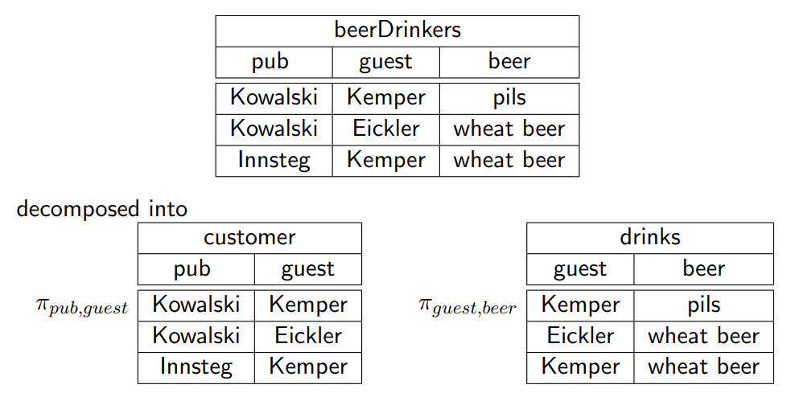
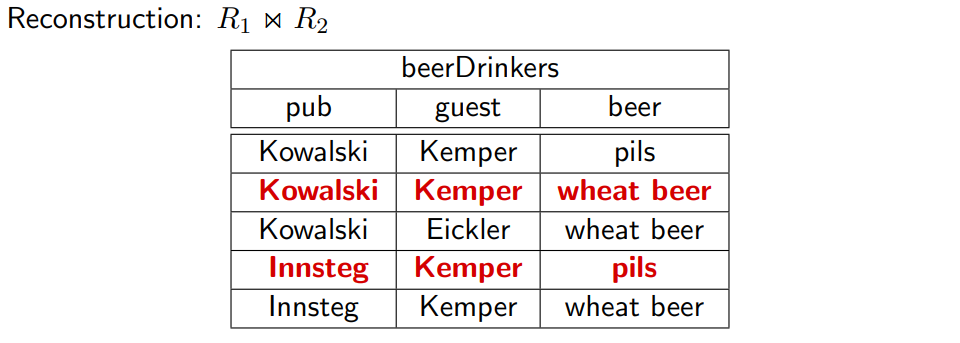
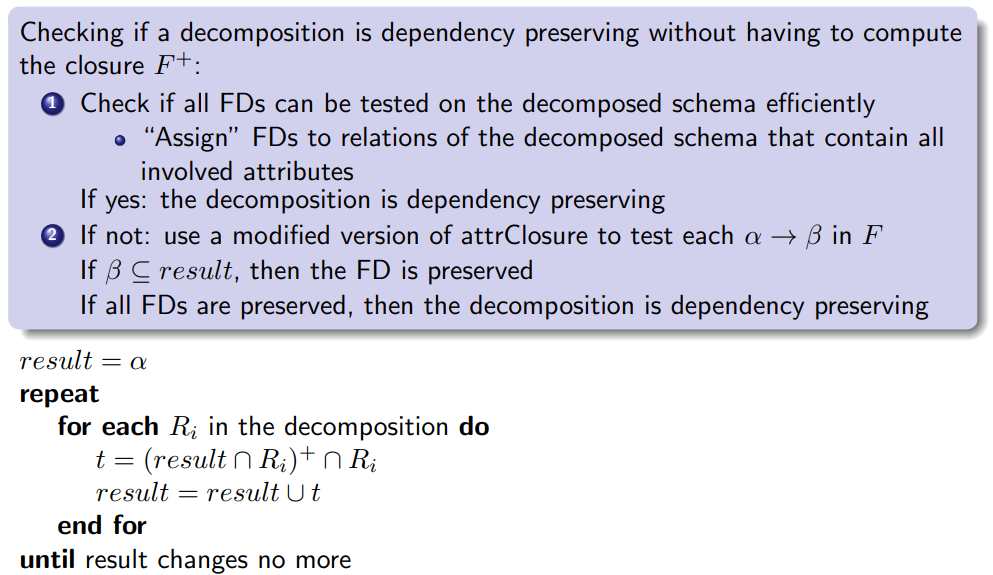
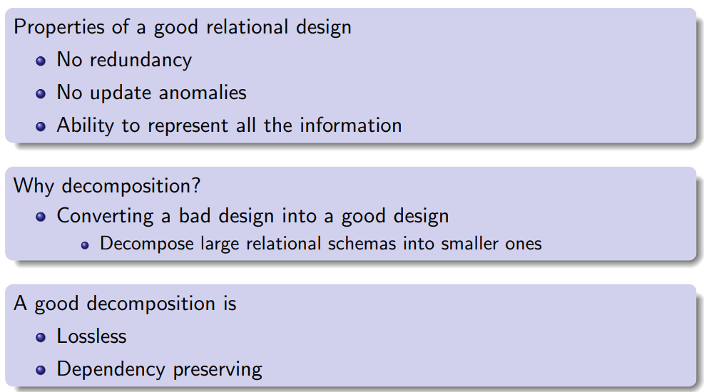
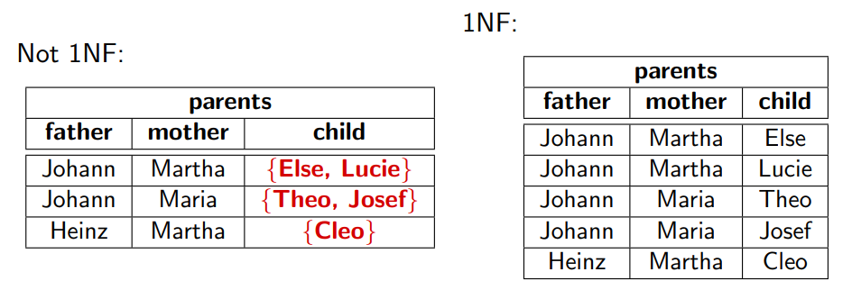
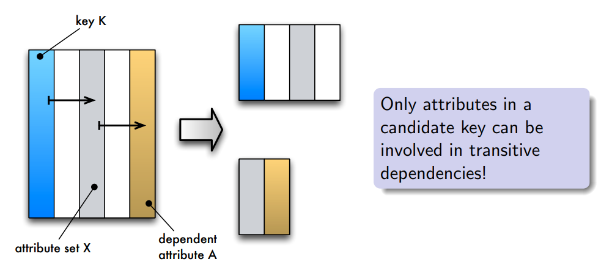
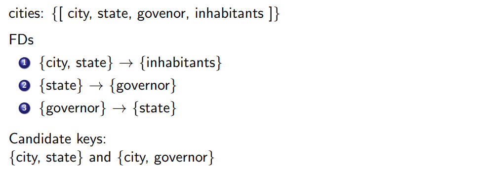
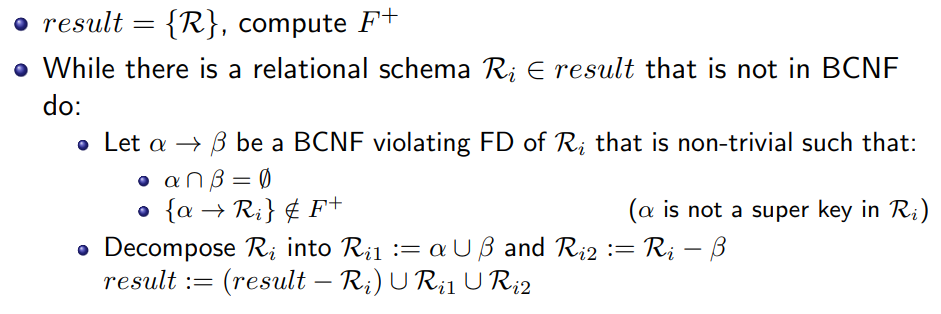

# Relational Database Design Theory

$$
\newcommand{\dep}[2]{\{#1\} \to \{#2\}}
\newcommand{\schema}{\mathcal{R}}
\newcommand{\oneton}[1]{\onetonop{#1}{,}}
\newcommand{\onetonop}[2]{#1_{n} #2 \dots #2  #1_{n}}
\nonumber
$$

**Learning Goals**

* Understanding the concepts of functional dependencies and normal forms
* Describe the quality of a design by using normal forms
* Improving a database design by decomposition

## Functional Dependencies

Symbols:

* Schema $\mathcal R = \{A,B,C,D\}$
* Instance $R$
* Let $\alpha \subseteq \mathcal R$ and $\beta \subseteq \mathcal R$ be sets of attributes

A **functional dependency** $\alpha \to \beta$ holds on $\mathcal R$ if for all legal instances $R$ of $\schema$:

$$
\forall r,s \in R: r.\alpha = s.\alpha \Rightarrow r.\beta = s.\beta
$$

The $\alpha$ values uniquely identify the $\beta$ values

$\alpha$ functionally determines $\beta$

A functional dependency $\alpha \to \beta$ is called **trivial** if $\beta \subseteq \alpha$

### Examples

If I have a zip code, I know the town

* Zip code 9220 gives one and only one town : Aalborg
* Zip code 9000 will not return { Aalborg, Viborg }

Notation: { zipCode } $\to$ { town }

Functional dependencies are **semantic constraints** that need to be true for all possible instances, not just for the current one!

### Keys

#### **Super Keys**

$\alpha \subseteq \schema$ is a **super key** if $\alpha \to \schema$, i.e. $\alpha$ determines all attribute values

* The set of all attributes is a super key: $\schema \to \schema$
* Super keys are not necessarily minimal

#### **Fully Functional Dependent**

$\beta$ is **fully functionally dependent** on $\alpha$ if:

* $\alpha \to \beta$ and
* $\alpha$ cannot be further reduced (= left reduced), i.e.

$$
\forall A \in \alpha:(\alpha - \{A\}) \nrightarrow \beta
$$

#### Candidate Keys

$\alpha\in\schema$ is a **candidate key** if $\schema$ is **fully functionally dependent** on $\alpha$.

* One of the candidate keys is chosen as **primary key**

### Deriving Functional Dependencies

Given a set of FDs (Functional dependencies) $F$ we can derive additional FDs

* $F^+$ contains all FDs that can be derived from $F$, i.e., all FDs **logically implied** by dependencies in $F$
* $F^+$ is $F$'s **closure**
* Inference rules ([Armstrong Axioms](#armstrong-axioms)) help computing $F^+$

#### Armstrong Axioms

$\alpha, \beta, \gamma, \delta$ are subsets of attributes in $\schema$

**Reflexivity**

If $\beta \subseteq \alpha$ then $\alpha \to \beta$ 	in particular: $\alpha \to \alpha$

**Augmentation**

If $\alpha \to \beta$ then $\alpha \gamma \to \alpha\gamma$

**Transitivity**

If $\alpha \to \beta$ and $\beta \to \gamma$ then $\alpha \to \gamma$

The Armstrong axioms are **sound** and **complete**.

* They are sound in the sense that they generate only correct functional dependencies
* They are complete in the sense that they generate all possible FDs ($F^+$) from a given set $F$

#### Additional Rules

Not essential, but sound and ease the derivation process

**Union**

If $\alpha\to\beta$ and $\alpha\to\gamma$ then $\alpha\to\beta\gamma$

**Decomposition**

If $\alpha\to\beta\gamma$ then $\alpha\to\beta$ and $\alpha\to\gamma$

**Pseudotransitivity**

If $\alpha\to\beta$ and $\gamma\beta\to\delta$ then $\alpha\gamma\to\delta$

#### Examples

Given the following functional dependencies $F$, derive additional ones by applying the Armstrong axioms

* A → BC
* CD → E
* B → D
* E → A

Derived FDs

* E → A and A → BC, then E → BC (transitivity)
* B → D, then CB → CD (augmentation)
* CB → CD and CD → E, then CB → E (transitivity)

### Closure of a Set of Attributes

The **closure of a set of attributes** ($\alpha^+$) with respect to a set of FDs $F$ and a set of attributes $\alpha$ is 

$$
\alpha^+ = \{A\mid \alpha\to A \in F^+\}
$$

Observation:

* If $\alpha\to \beta$ is in $F^+$ then $\beta$ is in $\alpha^+$

#### Attribute Closure Algorithm

Input:

* a set $F$ of FDs
* a set of attributes $\alpha \in \schema$

Applications:

* Test if a functional dependency $\alpha \to \beta$ holds
* Test if a given set of attributes $\kappa \subseteq \schema$ is a super key
* Test for super keys
    * By calling attrClosure($F, \kappa$) we obtain $\kappa^+$
        * if $\kappa^+ = \schema$ then $\kappa$ is a super key of $\schema$

[Example in DBS4 slides p 49](https://www.moodle.aau.dk/pluginfile.php/1979144/mod_resource/content/0/DBS-norm-csj-2.pdf#page=49)

### Canonical Cover (Minimal Cover)

* Two sets of FDs $F$ and $G$ are considered equivalent $F \equiv G$ if their closures are the same i.e. $F^+ = G^+$
* Both sets allow for deriving the same set of FDs

Observation

* $F^+$ can be huge
* Many redundant dependencies
* Difficult to overview

Goal:

* Find the smallest possible set $F_c$ for $F$ so that $F^+_c \equiv F^+$
    * There might be **alternative minimal sets**!

A **minimal cover** $F_c$ is a canonical representation of a set $F$ of functional dependencies

Characteristics:

1. $F_c \equiv F$ therefore $F_c^+ = F^+$ (equivalent if closures are the same)

2. FDs $\alpha \to \beta$ in $F_c$ do not contain **extraneous attributes**, i.e.:

    1. $\forall A \in \alpha:(F_c - \{\alpha \to \beta\})\cup \{(\alpha - A) \to \beta\} \not\equiv F_c$
    2. $\forall B \in \beta:(F_c - \{\alpha \to \beta\})\cup \{\alpha - (\beta - B)\} \not\equiv F_c$

3. The left side of an FD in $F_c$ is unique.

    Applying the union rule $\alpha \to \beta$ and $\alpha \to \gamma$ can be combined to $\alpha\to\beta\gamma$

**Check if Attribute is extraneous**

* Check if A ∈ α is an extraneous attribute in α → β by computing the attribute closure:
    * A ∈ α is extraneous if β ⊆ attrClosure(F, α − A)
* Check if B ∈ β is an extraneous attribute in α → β by computing the attribute closure:
    * B ∈ β is extraneous if
        * B ∈ attrClosure((F − {α → β}) ∪ {α → (β − B)}, α)

#### Minimal Cover Algorithm

[Example in DBS4 slides p 69](https://www.moodle.aau.dk/pluginfile.php/1979144/mod_resource/content/0/DBS-norm-csj-2.pdf#page=69)

## Normalization by Decomposition of Relations

### Normalization by decomposition

Decompose a relation schema $\schema$ into multiple relational schemas $\schema_1,\dots\schema_n$ to eliminate problems in the original design

Normal forms

* **Normal forms** describe the quality of a design
* 1NF, 2NF, 3NF, BCNF, 4NF, $\dots$
* Prohibit particular functional dependencies in a relation to avoid **redundancy, null values, and anomalies**

Good ER modeling typically directly leads to 3NF (or higher NF) relations

Normalization eliminates problems caused by functional dependencies among attributes of any entity type

### Valid and Lossless Decompositions

A decomposition is **valid** if  $\schema = \schema_1 \cup \schema_2$, i.e. no attributes in $\schema$ get lost

* $R_1 := \pi_{\schema_1}(R)$
* $R_2 := \pi_{\schema_2}(R)$

A decomposition of $\schema$ into $\schema_1$ and $\schema_2$ is **lossless** if the following holds for all possible instances $R$ of $\schema$ (also referred to as lossless-join decomposition):

$$
R=R_1 \Join R_2
$$

All data contained in the original instance $R$ of schema $\schema$ must be reconstructible with a natural join from the instances $R_1,\dots,R_n$ of the new schemas $\schema_1,\dots,\schema_n$

#### Formal Characterization of a Lossless Decomposition

Given

* A decomposition of $\schema$ into $\schema_1$ and $\schema_2$
* $F_\schema$ is the set of FDs in $\schema$

A decomposition is **lossless** if we can derive at least **one** of the following FDs:

* $(\schema_1 \cap \schema_2) \to \schema_1 \in F_\schema^+$     i.e., common attributes are super key in $\schema_1$
    **or**
* $(\schema_1 \cap \schema_2) \to \schema_2 \in F_\schema^+$     i.e., common attributes are super key in $\schema_2$

If this is not the case, the decomposition is said to be lossy

#### Example of a LOSSY Decomposition

The relationship between guest, pub, and beer got lost.

**Lossy decomposition** sometimes means that the reconstruction leads to **additional tuples.**

### Dependency Preservation

Second characteristic of a good decomposition

All functional dependencies that hold for $\schema$ must be verifiable in the new schemas $\schema_1,\dots,\schema_n$ 

* We can check all dependencies locally on $\oneton{\schema}$ 
* We avoid the alternative: computing the join $\onetonop{\schema}{\Join}$ to test if an FD is violated

A decomposition is dependency preserving if
$$
F_{\schema} \equiv (F_{\schema_1} \cup \cdots \cup F_{\schema_n})
$$
i.e. $F^+_\schema = (F_{\schema_1} \cup \cdots \cup F_{\schema_n})^+ $ 
with $F_{\schema_i}$ representing functional dependencies that can be checked efficiently on $R_i$

[Examples in DBS4 slides p 90](https://www.moodle.aau.dk/pluginfile.php/1979144/mod_resource/content/0/DBS-norm-csj-2.pdf#page=90)

### Summary Functional Dependencies

## Normal Forms

Normal forms

* define characteristics of relational schemas
* forbid certain combinations of FDs in a relation
* avoid redundancies and anomalies
* guideline to obtain good decompositions

### First Normal Form 1NF

A relation $\schema$ is in 1NF if the domains of all its attributes are atomic (no composite or set-valued domains)

### Third Normal Form 3NF

A relation schema $\schema$ is in 3NF if at least one of the following conditions holds for each of its FDs $\alpha \to \beta$ with $B \in \schema$

1. $B \in \alpha$, i.e. the FD is **trivial**
2. $\alpha$ is a **super key** of $R$
3. $B$ is part of a candidate key for $\schema$

Main characteristics

* 3NF prevents (some) **transitive** dependencies
* Exception: Condition 3

#### Non-Example

The relation is **not** in 3NF

#### Eliminates Transitive Dependencies

### Boyce Codd Normal Form BCNF

A relation schema $\schema$ is in BCNF if at least one of the following conditions holds for each of its FDs $\alpha \to \beta$ with $B \in \schema$

1. $B \in \alpha$, i.e. the FD is **trivial**
2. $\alpha$ is a **super key** of $R$

Main characteristics

* Difference to 3NF: no third option ($B$ is part of a candidate key for $\schema$)
* BCNF is more strict than 3NF (“includes” 3NF)
* BCNF prevents all **transitive** dependencies

#### Example

3NF vs. BCNF

**Is the relation in 3NF?**

<u>YES</u>

**Is the relation in BCNF?**

<u>NO</u>

### Decomposition

It is always possible to decompose a relational schema $\schema$ with FDs $F$ into

* 3NF relational schemas $\oneton{\schema}$ so that the decomposition is
    * lossless
    * dependency preserving
* BCNF relational schema $\oneton{\schema}$ so that the decomposition is
    * lossless

It is not always possible to create a BCNF decomposition $\oneton{\schema}$ of $\schema$ that is dependency preserving

#### Decomposition Algorithm for BCNF

Instead of computing $F^+$ to check $\alpha$ for its super key characteristics, we can compute $\alpha^+$ for this purpose

[Example in DBS4 slides p 133-](https://www.moodle.aau.dk/pluginfile.php/1979144/mod_resource/content/0/DBS-norm-csj-2.pdf#page=133)

### Summary 

| Normal Form | Main Characteristics         |
| ----------- | ---------------------------- |
| 1NF         | Only atomic attributes       |
| 3NF         | Some transitive dependencies |
| BCNF        | No transitive dependencies   |

In practice, if a BCNF composition is impossible without loosing dependency preservation, we go for the 3NF decomposition (although it allows for some redundancy)

Decomp. algorithms for all normal forms guarantee lossless decompositions.

Dependency preservation can only be guaranteed until 3NF.

