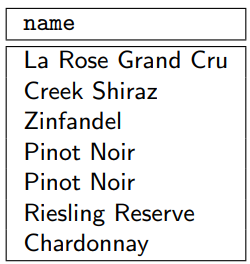
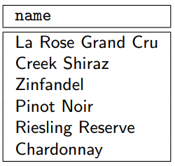

# SQL

**Learning Goals**

* Explain and use the SQL data model 
* Create non-trivial database tables 
* Modify non-trivial database tables 
* Create non-trivial SQL statements


## SQL


SQL is a **declarative** query language ("**what**" not "how")

It consists of multiple parts

**Data Definition Language (DDL)**

* Create/change the schema
* create, alter, drop

**Data Manipulation Language (DML)**

* Changes to an instance
* insert, update, delete

**Data Query Language (DQL)**

* Evaluate queries on an instance
* select * from where ... 

**Transaction Control Language (TCL)**

* Controls transactions
* commit, rollback

**Data Control Language (DCL)**

* Grant/revoke access rights
* grant, revoke


## Basic Data Definitions

**Data Types**

* **character**(n), **char**(n)
* **character varying**(n), **varchar**(n)
* **integer, smallint**
* **numeric**(p,s), **decimal**(p,s), ...
    * p - precision: max number of digits in total
    * s - scale: number of digits after the comma
* **real, double**
* **blob** or **raw** for very large binary data
* **clob** for large string attributes
* **data** for dates
* **xml** for xml documents
* ...


**varchar** vs **char**

* Both are limited to a length of n
* **char** always uses n bytes
* **varchar** uses only the required place, plus length information


## Create Tables

```sql
CREATE TABLE professor(
    empidinteger UNIQUE NOT NULL,
    namevarchar(10) NOT NULL,
    rankchar(2));
```

Is equal to

```sql
CREATE TABLE professor(
    empidinteger PRIMARY KEY,
    namevarchar(10) NOT NULL,
    rankchar(2));
```

The `PRIMARY KEY` constraint includes the `NOT NULL` and `UNIQUE` constraints.


### Foreign Keys

```sql hl_lines="7"
CREATE TABLE course(
    courseID integer,
    title varchar(30) NOT NULL,
    ects integer,
    taughtby integer,
    PRIMARY KEY(courseID),
    FOREIGN KEY(taughtBy) REFERENCES professor(empID)
);
```


### Default Values

When inserting data into a table, all values that are not explicitly stated are set to **null** (standard default value).

When defining a table, we can specify another default value

```sql
CREATE TABLE wine(
	wineID		integer NOT NULL,
	name		varchar(20) NOT NULL,
	color		varchar(10) DEFAULT 'red',
	year		integer,
	vineyard	varchar(20)
);
```

Here the default value of color will be 'red'


### Sequence Number Generators

**Sequence number generators** automatically create continuous identifiers.

```sql hl_lines="1"
CREATE SEQUENCE serial START 101;

CREATE TABLE wine(
    wineID integer PRIMARY KEY DEFAULT nextval(’serial’),
    name varchar(20) NOT NULL,
    color varchar(10),
    year integer,
    vineyard varchar(20)
);
```


## Alter Tables

Initial version

```sql
CREATE TABLE professor(
    empid integer NOT NULL,
    name varchar(10) NOT NULL,
    rank char(2)
);
```

### Change Table Definitions

Add an attribute

```sql
ALTER TABLE professor
	ADD COLUMN (office integer);
```

Delete an attribute

```sql
ALTER TABLE professor
	DROP COLUMN name;
```

Change an attribute type

```sql
ALTER TABLE professor
	ALTER COLUMN name type varchar(30);
```


### Deletion of a Table

Delete a table

```sql
DROP TABLE professor;
```

Delete the content of a table

```sql
TRUNCATE TABLE professor;
```

Cannot be used if there is another table with a foreign key referencing the table that we want to delete.


## Data Insertion

Standard insertion [w3schools Insert Into](https://www.w3schools.com/sql/sql_insert.asp):

```sql
INSERT INTO table_name (column1, column2, column3, ...)
VALUES (value1, value2, value3, ...); 
```

```sql
INSERT INTO takees
	SELECT studid, courseid
	FROM student, course
	WHERE title = 'Logics';
```


## Rights Management

**DCL**

Grant access rights

```sql
GRANT select, update
    ON professor
    TO some user, another user;
```

```sql
GRANT select (empid), update (office)
    ON professor
    TO some user, another user;
```


Revoke access rights

```sql
REVOKE ALL PRIVILEGES
    ON professor
    FROM some user, another user;
```


Privileges (rights) on tables, columns,. . . : `select`, `insert`, `update`, `delete`, `rule`, `references`, `trigger`


## Query Language

Basic building block of an SQL query (SFW block)

* `SELECT <list of columns>`
    * projection list with arithmetic operators and aggregation functions
* `FROM <list of tables>`
    * list of involved tables, with optional renaming
* `WHERE <condition>`
    * selection and join conditions, nested queries


Relational algebra → SQL

* projection π → `SELECT`
* cross product × → `FROM`
* selection σ → `WHERE`


### Cross Product

If the from clause enumerates more than a single table, the cross product is computed.

```sql
SELECT *
FROM wine, producer;
```

The result is the set of **all** combinations of tuples in the involved tables!


### Duplicate Elimination

The `DISTINCT` keyword removes duplicated entries. 

```sql
SELECT name
FROM wine;
```



```sql
SELECT DISTINCT name
FROM wine;
```

Corresponds to the projection operation in relational algebra!




### Set Operations

Set operations require union compatibility: 

* same number of attributes with compatible domains.


* domains are identical 
* domains are based on characters (length does not matter) 
* domains are based on numerical values (exact type does not matter, e.g., integer and float)

Result schema: column names of the **first** table


For set operations, duplicate elimination (e.g., `UNION DISTINCT`) is the default!

```sql hl_lines="3"
(SELECT name
FROM assistant)
UNION
(SELECT name
FROM assistant);
```

```sql hl_lines="3"
(SELECT name
FROM assistant)
UNION DISTINCT
(SELECT name
FROM assistant);
```

```sql hl_lines="3"
(SELECT name
FROM assistant)
UNION ALL
(SELECT name
FROM assistant);
```

Intersection (`INTERSECT`) and set minus (`EXCEPT`) are also supported.


### Nested Queries

Subqueries are necessary for comparisons to sets of values.

* Standard comparisons in combination with quantifiers: `ALL` or `ANY`
* Special keywords to access sets: `IN` and `EXISTS`


#### Uncorrelated Subqueries

Notation:

* `attribute IN ( SFW block )`

```sql
SELECT name
FROM professor
WHERE empid IN (SELECT taughtby
					FROM course);
```

Comparison of a value to a set of values

**Negation in combination with the IN keyword**

Simulation of the difference operator
$$
\mathrm{\pi_{vineyard}(producer) - \pi_{vineyard}(wine)}
$$
corresponding SQL query

```sql
SELECT vineyard
FROM producer
WHERE vineyard NOT IN (
	sqSELECT vineyard FROM wine);
```


#### Correlated Subqueries

The subquery is **correlated** to the parent query. See the `WHERE` clause:

```sql
SELECT name
FROM professor p
WHERE EXISTS (SELECT *
                FROM course v
                WHERE v.taughtby = p.empid);
```

Computes names of professors that teach any courses.


#### Quantifiers IN vs EXISTS

`IN`

* Is the “left tuple” contained in the “right set”?
* Example: `(studid, courseid) IN (SELECT * FROM takes);`

`EXISTS`

* Is the “right set” nonempty?
* Example: `EXISTS (SELECT * FROM takes WHERE ...);`


There are more quantifiers: `ANY` and `ALL`