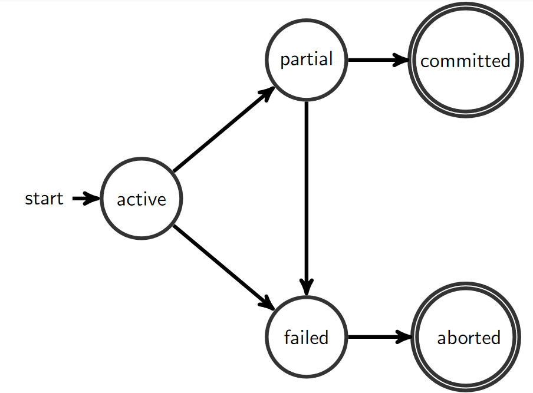
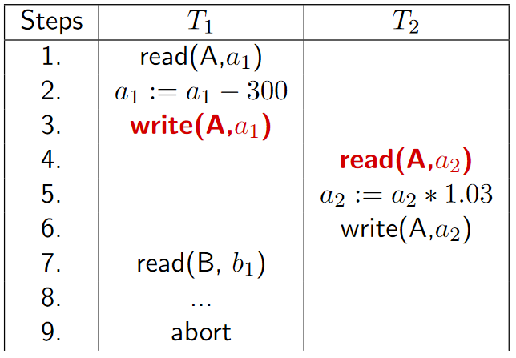
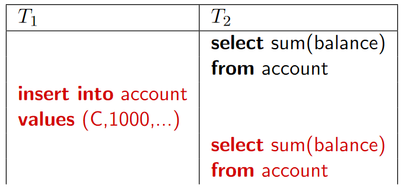
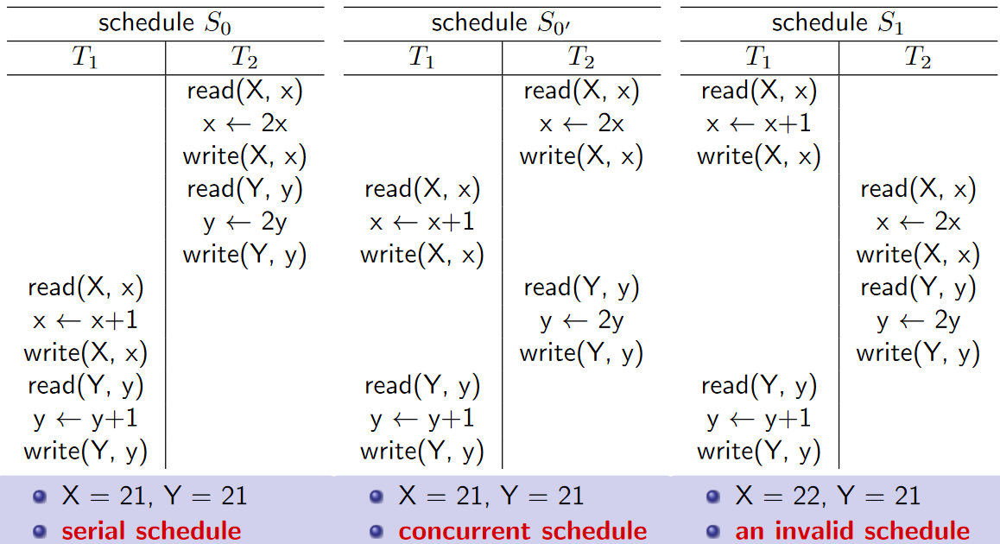
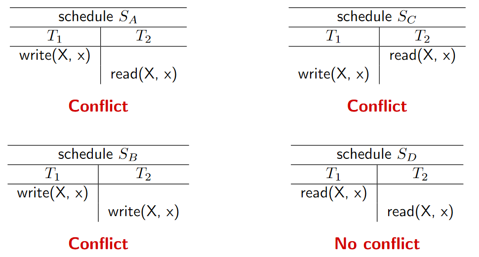
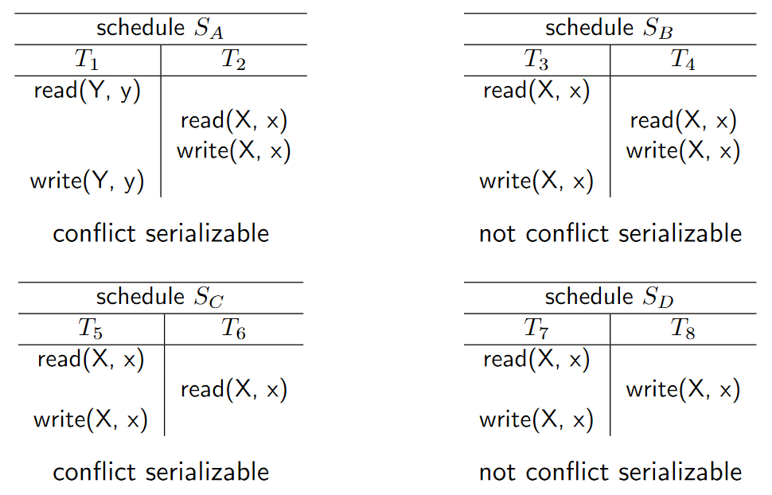
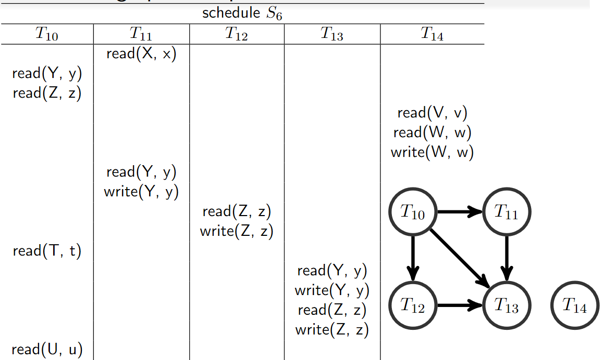
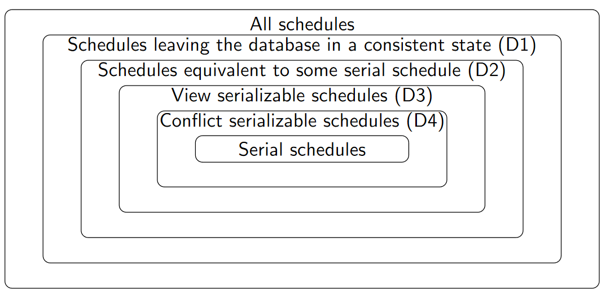
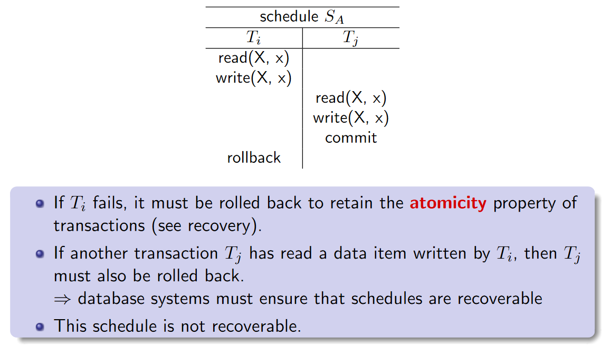
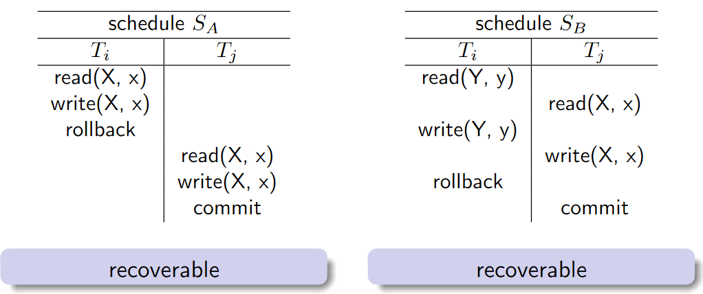

# Transactions

A **transaction** is a collection of operations that forms a **logical unit** of work, during which various data items are accessed and possibly updated 

**ACID Properties**

## Operations on Transactions

* `BEGIN` 
    * Starts a transaction
* `COMMIT`
    * Ends a transaction
* `ROLLBACK`
    * All changes are undone/discarded

**SAVEPOINT**

* `SAVEPOINT <savepoint_name>;`
    * Defines a point/state within a transaction
    * A transaction can be rolled back partially back up to the savepoint
* `ROLLBACK TO <savepoint_name>`
    * Rolls the active transaction back to the savepoint `<savepoint_name>`

## Transaction States

## Concurrency

Affects the **I** in **ACID**

**Problems**

* **Lost Updates**
    * Overwriting updates
    * 
* **Dirty Read**
    * Dependency on non-committed updates
    * 
* **Non-repeatable Read**
    * Dependency on other updates
    * T2 loses the illusion that it is alone in the database
    * 
* **Phantom Problem**
    * Dependency on new/deleted tuples
    * 

## Schedules

A **schedule** is a **sequence of operations** from one ore more transactions.
For concurrent transactions, the operations are interleaved.

**Operations**

* `read(Q,q)`
* `write(Q,q)`
* Arithmetic operations
* `commit`
* `abort`

**Serial Schedule**
The operations of the transactions are executed sequentially with no overlap in time

**Concurrent Schedule**
The operations of the transactions are executed with overlap in time

**Valid Schedule**
A schedule is valid if the result of its executions is "correct"

### Example Schedules

### Correctness

**Definition 1**
A concurrent execution of transactions must leave the database in a consistent state

**Definition 2 (D2)**
Concurrent execution of transactions must be (result) equivalent to some serial execution of the transactions

* We use **Definition 2**

**Simplifying assumptions**

* **Only reads and writes** are used to determine correctness
* This assumption is stronger than definition D2, as even fewer schedules are considered correct. 

### Conflicts

**Definition 4 (D4)**[^1]

A schedule is **conflict serializable** if it is **conflict equivalent** to a serial schedule

[^1]: Third definition D3 is view serializability, and is not covered in the course

There is a conflict if there is a read and a write on the same data unit. Also if there is a write on the same data unit.

Let I and J be consecutive instructions of a schedule S of multiple transactions

* If I and J do not conflict, we can swap their order to produce a new schedule S'

* The instructions appear in the same order in S and S', except for I and J, whose order does not matter

* S and S' are termed **conflict equivalent schedules**

#### Examples

### Conflict Graph

AKA **Precedence graph**

Directed graph

Assumption:

* A transaction will always read an item before it writes that item

Given a schedule for a set of transactions $T_1,T_2,\dots,T_n$

* The vertices of the conflict graph are the transactions identifiers
* An edge from $T_i$ to $T_j$ denotes that the two transactions are conflicting, with $T_i$ making the relevant access earlier
* Sometimes the edge is labeled with the item involved in the conflict

**Determining Serializability**

Given a schedule S and a conflict graph

* A schedule is **conflict serializable** if its conflict graph is **acyclic**
* Intuitively, a conflict between two transactions forces an execution order between them (topological sorting)

#### Example

### Relationship Among Schedules

## Recoverable and Cascadeless Schedules

**Transactions can fail!**

### Recoverable

A schedule is **recoverable** if for each pair of transactions $T_i$ and $T_j$ where $T_j$ reads data items written by  $T_i$, then $T_i$ must commit before $T_j$ commits.

### Cascading Rollbacks

A schedule is **cascadeless** if for each pair of transactions $T_i$ and $T_j$, where $T_j$ reads data items written by $T_i$, the commit operation of $T_i$ must appear before the read by $T_j$ 

* In other words, if you only read committed data

