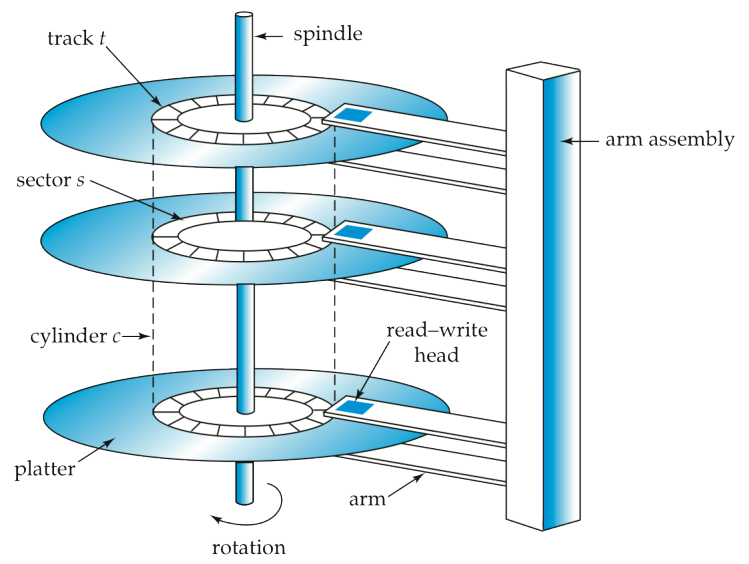

# Physical Design

**Learning Goals**

* Understand how tables are stored in files
* Understand basic indexing techniques
* Use knowledge of file/index to tune basic SQL queries

## File Organization

### Storage Hierarchy

* **Volatile storage** (cache, main memory): loses content when power is switched of
* **Non-volatile storage**: content persists even when power is switched of
* The higher the level, the faster the access

### Magnetic Hard Disk

For each disk access

* Each **track** is divided into **sectors** (smallest unit of data that can be read/written)
* A **block (page)** is a contiguous **sequence of sectors** from a single track
    * Basic unit of data transfer between disk and memory

Optimization of disk block access

* Organize blocks in the way data is accessed
* Store related information close to each other

Conceptually, relational data is stored as sequences of bits on disk.

**Functional requirements**

* Processing records sequentially
* Efficient key-value search
* Insertion/deletion of records

**Performance objectives**

* Little wasted space
* Fast response time
* High number of transactions

### Files

Storing databases on disks

* The database is stored as a collection of **files**
* Each file corresponds to a set of **records**
* A record contains a number of **fields**

Multiple records are “grouped” into **blocks (pages)**

Record size

* Fixed
* Variable

Files reside on mass storage (usually a disk)

* Fast random access
* Non-volatile storage

### Example

Blocks in a file system are not necessarily contiguous

Speed

* Speed of reading a block (an I/O):
    * $\sim 10$ msec to a non-contiguous block read
    * $\sim 1$ msec for a contiguous block read
* DBMS/OS can reorganize blocks to make them contiguous

### Fixed Size Records

<u>All records use the **same** length if they occupy the whole space or not</u>

**Read record** $i$

* Get record at location: $\mathrm{recordSize \times i}$

**Delete record** $i$

* Move records $i+1,\dots,n$ to location $i,\dots,n-1$ to close the gap

    or

* Move record $n$ to $i$

    or

* Mark the gaps and fill them with future insertions

    * Mark first gap in the file header
    * Use the gaps to point to other gaps (free-list)

### Variable Size Records

<u>Records have **different** lengths and occupy different amounts of disk space</u>

Use case: variable-lengths attributes (e.g., varchar)

Implementation alternatives

* If max. size is known:
    * Map variable size records to fixed size records
* Slotted-page-structure
    * Records stored contiguously
    * Block header contains pointers to records
    * 

### Organizing Records in a File

<u>Determine the order of records within a file</u>

**Heap file organization**

* A record can be placed anywhere in the file

**Sequential file organization**

* Records stored in sequential order by the value of the search key

**Hash file organization**

* Hash the record to a block based on a hash function and a hash key

#### Heap

* No apparent ordering on any of the columns in the table
* Search: linear scan always works
* Insert: find a free slot

#### Sequential

