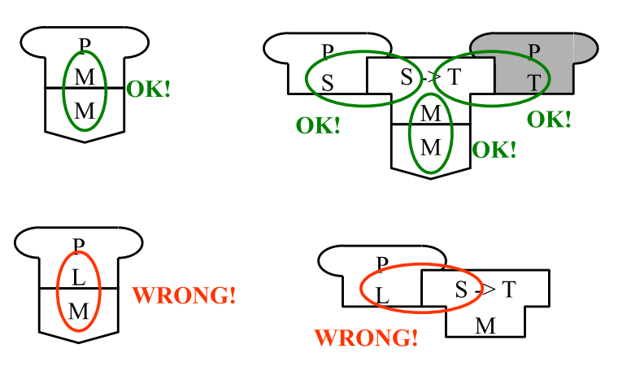
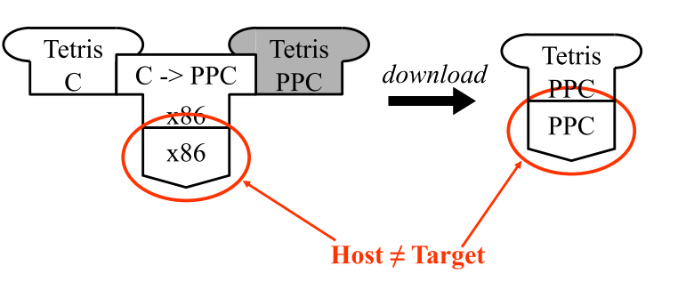
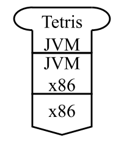
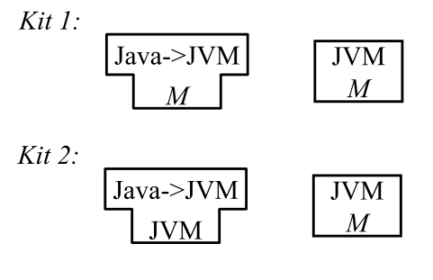

# Tombstone Diagrams

* Diagrams consisting out of a set of "puzzle pieces", we use to reason about language processores and programs
* Differnt kinds of pieces
* Combination rules (not all diagrams are well formed)

## Combination Rules

## Example

## Cross Compilation

A **cross compiler** is a compiler that runs on one machine (**host machine**), but emits code for another machine (**target machine**).

This is what happens when compiling an app for android on a x86 machine for example.

## Two Stage Compilation

**Two-stage translator**: a composition of two translators. The output of the first translator is provided as input for the second translator.

Generate C code from Java, compile the C code with C-compiler.

## Interpreters

**Interpreter**: A language processor implemented in software.

**Terminology:** **abstract (virtual) machine** versus **real machine**.

**Example**: The Java Virtual Machine

## Compiler vs Interpreter

**Compilers** offer advantages when:

* Programs are deployed in a production setting
* Programs are repetative
* The instructions of the programming language are complex

**Interpreters** are better choice when:

* In development/testing/debugging stage
* Programs are run once and then discarded
* The instructions of the language are simple
* The execution speed is overshadowed by other factors.

## Portable Compilers

Example:

It is easier to port Kit 2.