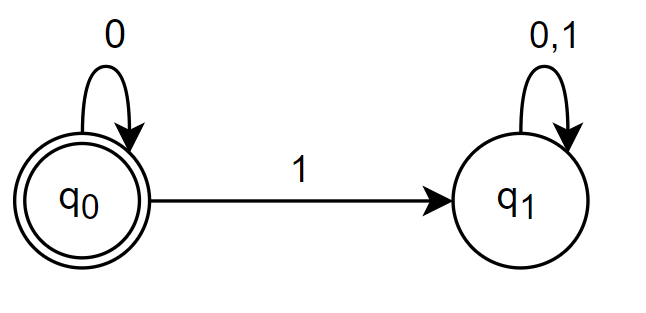

# Grundlæggende Sprogteori

Et **sprog** er en mændge af **strenge**.

## Alfabet

**Definition:** 

En endelig mængde af tegn.

**Notation:**

Skrives $\Sigma$

### Eksempler

​	$A=\{a,b,c,d,...,æ,ø,å\}$ 	(danske alfabet)

​	$B=\{0,1\}$ 					(binære alfabet)

​	ASCII-tegnene

## Streng

**Definition:**

Givet et alfabet $\Sigma$,
er en streng over $\Sigma$ er en endelig følge af tegn fra $\Sigma$ 

**Notation:**

Længden af en streng s betegnes $|s|$

### Eksempler:

Streng over A

​	$|abe|=3$

​	$|kpst|=4$

Streng over B

​	$|01001|=5​$

​	$|100|=3$

En lille streng:

​	$\varepsilon​$ 	(**den tomme streng**)

​	$|\varepsilon|=0$ 

## Sprog

**Definition:**

Givet et alfabet $\Sigma$, er et sprog over $\Sigma$ en endelig mængde af strenge over $\Sigma$ 

### Eksempler

Alfabet A:

​	$L_1=\{a,aa,bba\}$

​	$L_2=\{a,aa,aaa,...\}$

​	$L_3=Ø$		(det tomme sprog)

### $\Sigma^*$ - Sigma-stjerne

**Definition:**

Lad $\Sigma$ være et alfabet.

$\Sigma^*​$ er sproget bestående af *alle* strenge over $\Sigma​$

#### Eksempel

$\Sigma=\{0,1\}$

$\Sigma^*=\{\varepsilon,0,1,00,01,10,11,000,001,... \}​$

## Concatination

**Definition:**

Lad *u* og *v* være strenge over $\Sigma$

​	($u\in\Sigma^*,v\in\Sigma^*$)

Så er $u\circ v$ 	(skrives tit $uv$) 
strengen bestående af symbolerne i u efterfulgt af symbolerne i v

### Eksempler

$u=abc$

$v=hat$

$uv=abchat$

--

$u=kat​$

$v=\varepsilon$

$uv=kat$

## Husk!

Et sprog er bare en mængde af strenge.

Så vi kan bruge alle de sædvanlige mængdeoperation, **så længe de igen giver os et sprog.**

$L_1\cup L_2 :\{x|x\in L_1\or x \in L_2\}$

$L_1 \cap L_2 : \{x|x\in L_1 \and x\in L_2\}$

$L_1 -L_2: \{x|x \in L_1 \and x \notin L_2 \}$

Men f.eks.:

$L_1 \times L_2$ giver ingen mening

 

# Endelige automater

Man ledte efter en model ag neuroner i hjernen.

I datalogi anvendes endelige automater:

* I den fase af en compiler kaldet 'Leksikalske analyser' (lexer)

* I specifikation af systemer.

Endelige automater er simple algoritmer til sproggendkendelse.

"Givet w, har vi $w\in L​$?"

**Tilstand** er markeret af en cirkel.

**Transition** er markeret med en pil.

**Accepttilstand** er markeret med en ekstra cirkel.

**Definition**:

En endelig automat (DFA) er en 5-tupel

​	$(Q,\Sigma,q_0,\delta,F)$

$Q$ 	endelig mængde af tilfælde

$\Sigma​$ 	input alfabet

$q_0​$ 	starttilstand $q_0\in Q​$

$\delta$ 	overføringsfunktion

$F$ 	mængden af accepttilstande $F\subseteq Q$

### Overføringsfunktion

$\delta(q,a)=q_1​$

$\delta:Q\times \Sigma \rarr Q$

### Eksempel

$Q=\{q_0,q_1\}$

$\Sigma =\{0,1\}$

$q_0=q_0​$

$F=\{q_0\}$

| $\delta$ | 0     |   1   |
| -------- | ----- | :---: |
| $q_0$    | $q_0$ | $q_1$ |
| $q_1$    | $q_1$ | $q_1$ |

<!-- Indsæt definition for Accept https://youtu.be/VeM2Riy91SM?t=383 -->